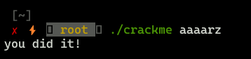

**Objective:** write keygen.

## **Decompiling and reversing with Ghidra**

1. Program checks if we provided appropriate number of parameters. If `argc=2` program enters the block where key is built, else we get info about appropriate usage.
2. Next, program generates checksum for "secret" by XORing every character of that word with its index. We can recreate this [checksum](#recreating-checksum).
3. In next step, we generate checksum for string provided by user in the same way as for "secret" string.
4. If checksums match we get appropriate result.


```c
  if (argc == 2) {
    sum1 = 0;
    index = 0;
    while( true ) {
      strlen = ::strlen("secret");
      if (strlen <= index) break;
      sum1 = sum1 + ((long)(int)"secret"[index] ^ index);
      index = index + 1;
    }
    iVar1 = strcmp(argv[1],"secret");
    if (iVar1 == 0) {
      printf("sorry...\n");
      uVar2 = 1;
    }
    else {
      sum2 = 0;
      index2 = 0;
      while( true ) {
        strlen = ::strlen(*(char **)(param_2 + 8));
        if (strlen <= index2) break;
        sum2 = sum2 + ((long)(int)argv[1][index2] ^ index2);
        index2 = index2 + 1;
      }
      if (sum1 == sum2) {
        printf("you did it!\n");
        uVar2 = 0;
      }
      else {
        printf("sorry...\n");
        uVar2 = 1;
      }
    }
  }

```

## **Recreating checksum**


```python
string = "secret"
checksum = 0
for i in range(len(string)):
    checksum += ord(string[i]) ^ i
print(f'{hex(chekcsum)}')
```

Checksum created for "secret" is 0x27b.

## **Finding valid solutions**

Since there are many solutions where checksum is 0x27b we can try to brute force the key (yeah I know kinda ugly way).

```c
#include <stdio.h>

int main(int argc, char const *argv[])
{   
    int begin = 97;
    int end = 123;
    int checksum = 0x27b;
    for (int a=begin; a<end; a++){
        for (int b=begin; b<end; b++){
            for (int c=begin; c<end; c++){
                for (int d=begin; d<end; d++){
                    for (int e=begin; e<end; e++){
                        for (int f=begin; f<end; f++){
                            if (((a^0)+(b^1)+(c^2)+(d^3)+(e^4)+(f^5))==checksum){
                                printf("%c%c%c%c%c%c\n",a,b,c,d,e,f);
                                return 0;
                            }

                        }
                    }
                }
            }
        }
    }
    return 0;
}
```

First valid solution we got is `aaaarz`



