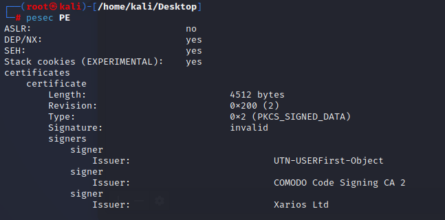

**Author:** adi7312

**Difficulty: medium**

### **Task 1**

Objective: determine the IP of the Windows VM that gets infected.

Firstly, we open the provided *mta2.pcap* file in Wireshark, as we can see, the IP 172.16.165.132 made a HTTP GET request, so we can indicate that probably this IP downloaded or executed malicious software.

`Answer: 172.16.165.132`

### **Task 2**

Objective: determine the MAC address of victim machine.

We can look closer to the HTTP packet from previous task, especially we want to look into *Ethernet II* sublist, where we can find information about destination and source MAC address.

`Answer: 00:0c:29:c5:b7:a1`

### **Task 3**

Objective: determine the IP address and port number that delivered the exploit kit and malware?

It will be much easier for us, when we use Brim app to determine that IP. So we run Brim and upload the pcap file. We got a lot of information so we need to filter it, so we choose "Suricata Alerts by Source and Destination" filter.

As we can see, the network traffic from 37.143.15.180 turn out to be malicious. Now we need to only from which port the malware was sent, again we will filter out the output, this time we wiil be looking for traffic with 37.143.15.180 IP. In command box we need to write:

    src_ip==37.143.15.180

Now we can answer to task's question:

`Answer: 37.143.15.180:51439`

### **Task 4**

Objective: determine the FQDNs that delivered exploit kit.

To find these FQDNs we will need NetworkMiner (specialized tool for network forensics), it has free version which is avaiable on the vendor's site. After installation we run that program and upload pcap file. Now we are lookig for out malicious IP (37.143.15.180).

As we can see `g.trinketking.com` and `h.trinketking.com` delivered FQDN. 

Answer: `g.trinketking.com,h.trinketking.com` 

### **Task 5**

Objective: What is IP address of compromised site?

To determine it we can use Wireshark. We go to Statistic -> Conversations and we filter ipv4. Now we sort the output by highest number of packets. Highest number of packets during conversation doesn't mean that the conversation is malicious, but it is high probability that during that conversation the malware had been downloaded.

`Answer: 192.30.138.146`

### **Task 6**

Objective: Determine FQDN of the compromised site.

We know the IP address of compromised site, so we only need to find it in wireshark.

As we can see in the graph abovev, after DNS querry response, the host connects to 192.30.138.146, so we can state that hijinksensue.com is the FQDN, which we were looking for.

`Answer: hijinksensue.com`

### **Task 7**

Objective: Determine the name of Exploitation Kit

Upload the pcap file to VirusTotal, next in the details section scroll down to "Suricata rules", as we can see the network trojan was detected, expand that and we should see that EK name is "Sweet Orange".

`Answer: Sweet Orange`

### **Task 8**

Objective: What is the redirect URL that points to the exploit kit landing page?

This task turned out to be a bit diffifcult, analysing traffic with Wireshark is in my opinion hard and really long. I used *packettotal.com* web app to analyze our pcap file, this site is really good, because it looks for suspicious and malicious network activity. When we provide mta2.pcap to this website we will almost immidiatelty get answer to our question.

Now we need to contacenate this red rectangles (Hostname and HTTP request) to get proper answer to this question

`static.charlotteretirementcommunities.com/k?tstmp=3701802802`

### **Task 9**

Objective: What is the IP address of the redirect URL that points to the exploit kit landing page?

In the packettotal.com we can see that answer is: `50.87.149.90`.

### **Task 10**

Objective: Extract the malware payload (PE file) from the PCAP. Determine MD5 hash of extracted file.

In Wireshark go to: File -> Export Objects -> HTTP... save the application/x-dosexec in your device and now upload the file to virustotal.com

`Answer: 1408275c2e2c8fe5e83227ba371ac6b3`

### **Task 11**

Objective: determine the CVE of exploited vulnerability.

When we search "CVE Sweet Orange" in Google, we will get immidiately the answer.

`Answer: CVE-2014-6332`

### **Task 12**

Objective: What is the mime-type of the file that took the longest time (duration) to be analyzed using Zeek?

In Brim we are looking for the longest timestamp.

Wihout any problem we can spot the mime-type.

`Answer: application/x-dosexec`

### **Task 13**

Objective: What was the referrer for the visited URI that returned the file "f.txt"?

In Brim we need to find packets related to *f.txt* file, later we need to find refer link.

`Answer: http://hijinksensue.com/assets/verts/hiveworks/ad1.html`

### **Task 14**

Objective: Determine the date of capture.

We can take a look any log and we can see that date is `23/11/2014`.

### **Task 15**

Objective: Determine the date of compilation of PE.

Go back to VirusTotal, where we analyzed PE file, go to details and scroll down to *Portable Executable Info*.

`Answer: 21/11/2014`

### **Task 16**

Objective: What is the name of the SSL certificate issuer that appeared only once?

In packettotal.com go to PKI category and search for name that appeared only once.

### **Task 17**

Objective: What were the two protection methods enabled during the compilation of the present PE file? Format: comma-separated in alphabetical order

This task is not related with traffic analysis but with malware analysis. To check protection methods we can use `pesec` tool on Kali Linux.

`Answer: DEP,SEH`
