# **Cyberdefenders - RE101**

## **Malware000**

**Tool:** rabin2, Cyberchef

Using rabin2 we are looking for interesting strings.


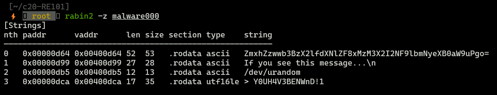


First string seems to be interesting since it is encoded in base64, let's decode that value.


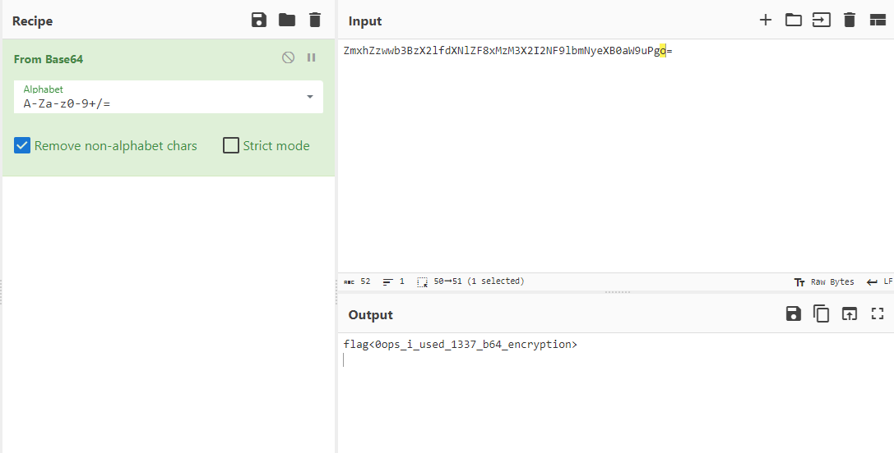


Decoded value is our flag, easy :).

## **just_some_js**

**Tool:** [deobfuscate.io](https://deobfuscate.io/), [JS online compiler](https://www.programiz.com/javascript/online-compiler/)

If we open just_some_js file we see some garbage, well it is obfuscated JS code, so we need to deobfuscate it. Let's use deobfuscate.io.


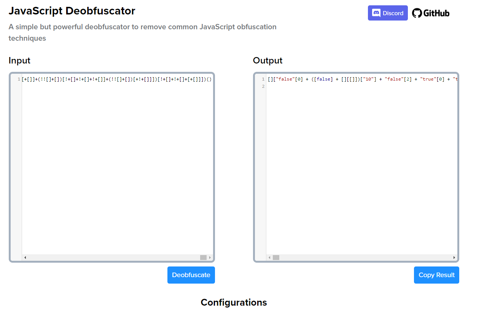


Still, it is not really readable, so let's try run it in JS online compiler.


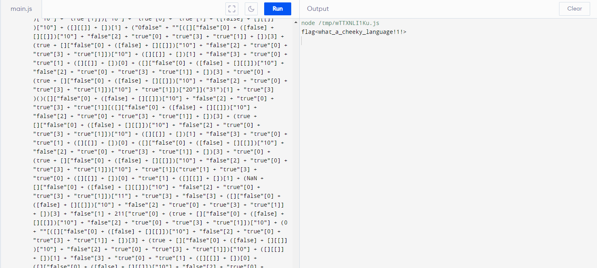


Finally, we got flag.


## **this_is_not_js**


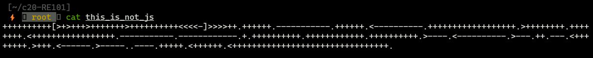


That strange giberish is brainfuck language. Let's put it on some brainfuck decoder.


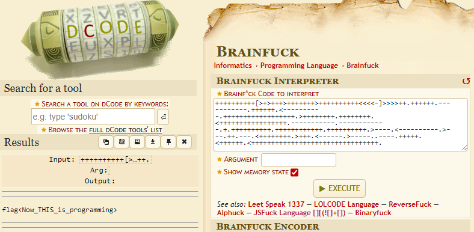


So far, so easy.


## **file.zip_broken**

**Tools:** ImHex

"I zipped flag.txt and encrypted it with the password "password", but I think the header got messed up... You can have the flag if you fix the file"

To fix this file, we need to uderstand the ZIP file header.


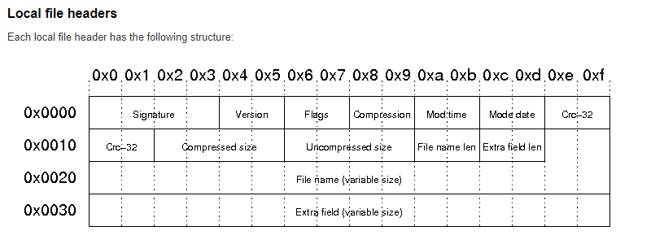


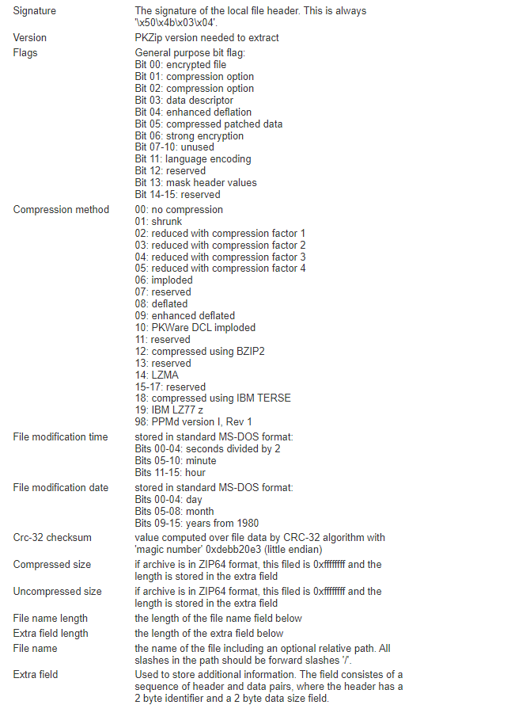


Now let's look at our file header.


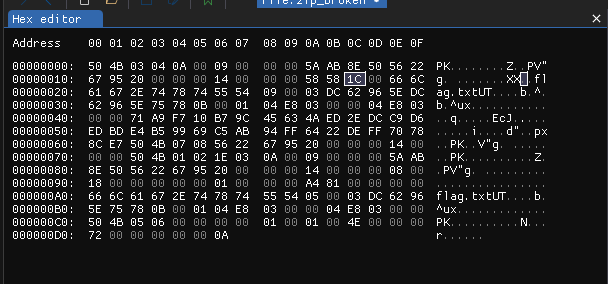


Signature seems legit, so there is no error in this section. However, in *file name length* section we see some strange value 0x5858 which is 22616 in decimal! So we need to change that 0x5858 to appropriate length (0x0008). 


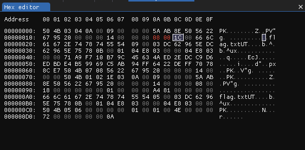

Now we can unzip file and read the flag.

**Flag:** `flag<R3ad_th3_spec>`

## **Malware101**

**Tools:** radare2


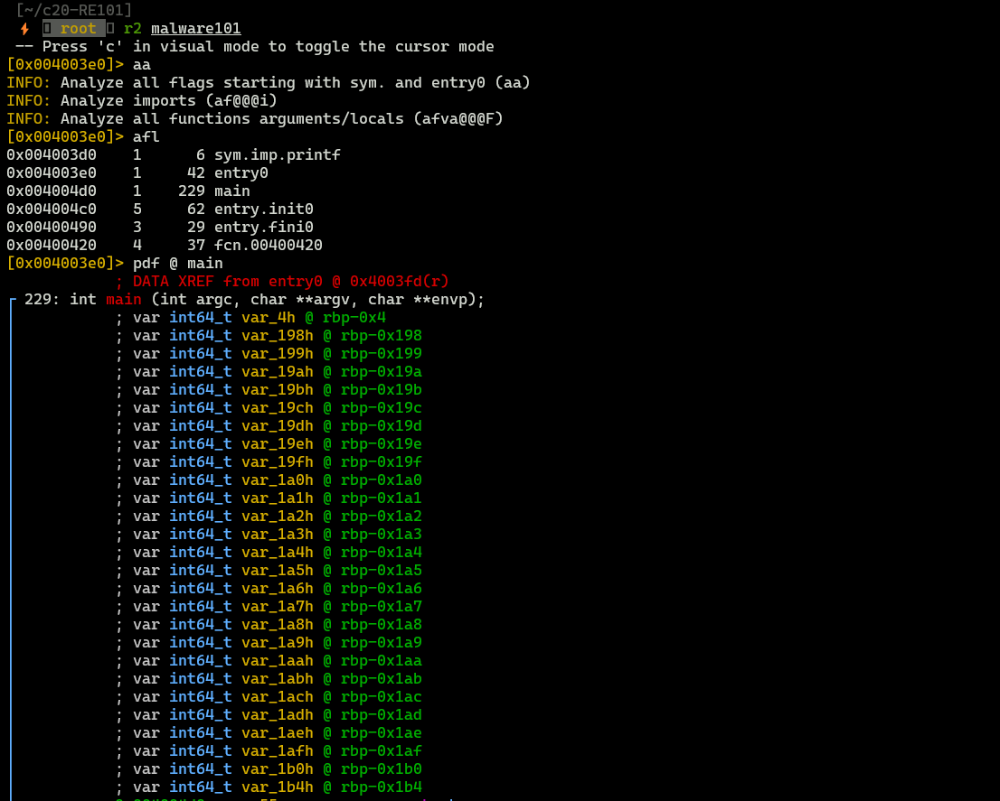


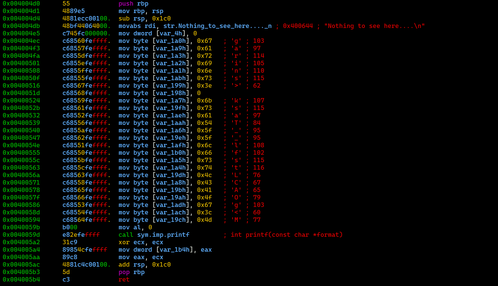


Analyzing assembly code we can recreate flag.

**Flag:** `flag<sTaCk_strings_LMAO>`

## **Malware 201**

### **Reversing and understaing code with Ghidra**


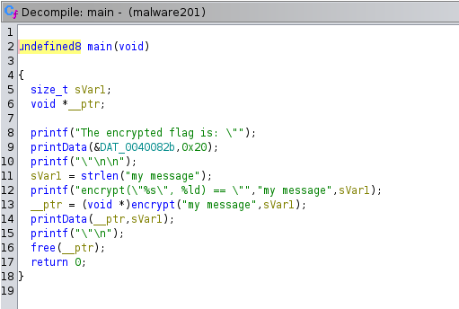


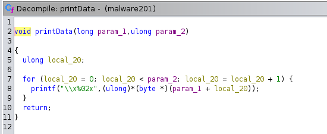


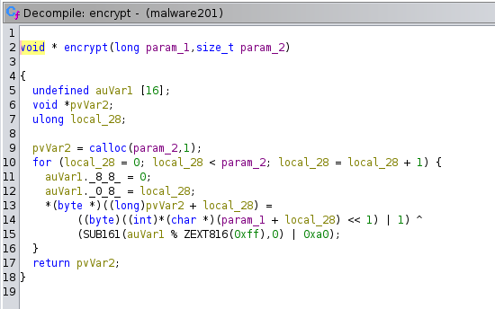


Since we know encrypted flag and encryption algorithm, we need to write decrypt() function to obtain final flag. 

### **Decryption**


```c
#include <stdio.h>

int main(int argc, char const *argv[])
{
    unsigned char encrypted[] = {0x6d,0x78,0x61,0x6c,0xdd,0x7e,0x65,0x7e,0x47,0x6a,0x4f,0xcc,0xf7,0xca,0x73,0x68,0x55,0x42,0x53,0xdc,0xd7,0xd4,0x6b,0xec,0xdb,0xd2,0xe1,0x1c,0x6d,0xde,0xd1,0xc2};
    unsigned char xorKey[] = {0xa0,0xa1,0xa2,0xa3,0xa4,0xa5,0xa6,0xa7,0xa8,0xa9,0xaa,0xab,0xac,0xad,0xae,0xaf,0xb0,0xb1,0xb2,0xb3,0xb4,0xb5,0xb6,0xb7,0xb8,0xb9,0xba,0xbb,0xbc,0xbd,0xbe,0xbf};
    size_t length = sizeof(encrypted);
    char decryptedChar;
    for (int i = 0; i < length; i++){
        decryptedChar = (encrypted[i] ^ xorKey[i]) >> 1;
        printf("%c",decryptedChar);
    }
    return 0;
}

```

**Output**: `flag<malwar3-3ncryp710n-15-Sh17>`