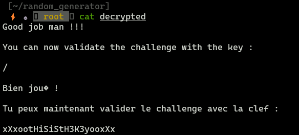

**Root-Me PRNG Challenge**

### Statement

Here is an archive containing an encrypted file, and the program which has been used for encryption. Your goal is to get back the file content.

Clue : according to our information, the file was encrypted during the month of december 2012.

## **Analyzing source code**

1. Let's start from `main()` function, we can see that we are seeding random generator with actual time.
2. Later, we are encrypt file with `crypt_file(FILE *in, FILE *out)` function, where we generate key with `genere_hey(void)` function.
3. Key generation algorithm is quite simple and we will reverse it in the near future.
4. In the end, we are finally encrypting file.

```c
#include <stdio.h>
#include <stdlib.h>
#include <string.h>
#include <time.h>

#define KEY_SIZE 32
#define BUFF_SIZE 1024

unsigned int holdrand = 0;

static void Srand (unsigned int seed) {
  holdrand = seed;
}

static int Rand (void) {
  return(((holdrand = holdrand * 214013L + 2531011L) >> 16) & 0x7fff);
}

char* genere_key(void) {
  int i;
  static char key[KEY_SIZE+1];
  const char charset[] = 
    "abcdefghijklmnopqrstuvwxyz"
    "ABCDEFGHIJKLMNOPQRSTUVWXYZ"
    "123456789";
  
  for(i = 0; i < KEY_SIZE; i++) {
    key[i] = charset[Rand() % (sizeof(charset) - 1)];
  }
  key[KEY_SIZE] = '\0';

  return key;
}

void crypt_buffer(unsigned char *buffer, size_t size, char *key) {
  size_t i;
  int j;

  j = 0;
  for(i = 0; i < size; i++) {
    if(j >= KEY_SIZE)
      j = 0;
    buffer[i] ^= key[j];
    j++;
  }
}

void crypt_file(FILE *in, FILE *out) {
  unsigned char buffer[BUFF_SIZE];
  char *key;
  size_t size;

  key = genere_key();

  printf("[+] Using key : %s\n", key);

  do {
    size = fread(buffer, 1, BUFF_SIZE, in);
    crypt_buffer(buffer, size, key);
    fwrite(buffer, 1, size, out);

  }while(size == BUFF_SIZE);  
}

int main(int argc, char **argv) {
  char path[128];
  FILE *in, *out;

  Srand(time(NULL));

  if(argc != 2) {
    printf("[-] Usage : %s <file>\n", argv[0]);
    return EXIT_FAILURE;
  }

  snprintf(path, sizeof(path)-1, "%s.crypt", argv[1]);

  if((in = fopen(argv[1], "r")) == NULL) {
    perror("[-] fopen (in) ");
    return EXIT_FAILURE;
  }

  if((out = fopen(path, "w")) == NULL) {
    perror("[-] fopen (out) ");
    return EXIT_FAILURE;
  }

  crypt_file(in, out);

  printf("[+] File %s crypted !\n", path);
  printf("[+] DONE.\n");
  return EXIT_SUCCESS;
}
```

The only entrophy source for that PRNG is timestamp, it is very vulnerable, because if we know the timestamp when file was encrypted, we can determine the key, which will decrypt file!

In context of this task, we need to know exact timestamp, let's use `stat` command to check modification date of that encrypted file.


Date is 05-12-2012 13:05:36, in unix time: 1354709136.


## **Decrypting**

```c
#include <stdio.h>
#include <stdint.h>

#define KEY_LENGTH 32
#define CHARSET_LENGTH 61


int decrypt(uint8_t srand) {
    FILE *cipherFile, *plainFile;
    uint8_t key[KEY_LENGTH];
    uint8_t charset[] = "abcdefghijklmnopqrstuvwxyzABCDEFGHIJKLMNOPQRSTUVWXYZ123456789";


    cipherFile = fopen("oDjbNkIoLpaMo.bz2.crypt", "rb");
    if (cipherFile == NULL) {
        printf("Error opening the cipher file.\n");
        return 0;
    }
    fseek(cipherFile, 0, SEEK_END);
    long fileSize = ftell(cipherFile);
    fseek(cipherFile, 0, SEEK_SET);
    uint8_t *cipher = (uint8_t *)malloc(fileSize);
    if (cipher == NULL) {
        printf("Memory allocation failed.\n");
        fclose(cipherFile);
        return 0;
    }
    fread(cipher, 1, fileSize, cipherFile);
    fclose(cipherFile);

    for (int i = 0; i < KEY_LENGTH; i++) {
        srand = (srand * 214013 + 2531011) & 0xFFFFFFFF;
        int ext = (srand >> 16) & 0x7FFF;
        key[i] = charset[ext % CHARSET_LENGTH];
    }

    uint8_t *bytearr = (uint8_t *)malloc(fileSize);
    for (long i = 0; i < fileSize; i++) {
        uint8_t c = key[i % KEY_LENGTH] ^ cipher[i];
        if (i == 0 && c != 66) {
            free(cipher);
            free(bytearr);
            return 0;
        }
        if (i == 1 && c != 90) {
            free(cipher);
            free(bytearr);
            return 0;
        }
        if (i == 2 && c != 104) {
            free(cipher);
            free(bytearr);
            return 0;
        }
        bytearr[i] = c;
    }

    char filename[20];
    sprintf(filename, "decrypted.bz2");
    plainFile = fopen(filename, "wb");
    if (plainFile == NULL) {
        printf("Error opening the plain file for writing.\n");
        free(cipher);
        free(bytearr);
        return 0;
    }
    fwrite(bytearr, 1, fileSize, plainFile);
    fclose(plainFile);

    free(cipher);
    free(bytearr);
    return 1;
}

int main(int argc, char const *argv[])
{
    uint8_t timestamp = 1354709136;
    decrypt(timestamp);
    return 0;
}

```

Now use `bzip2 -d <filename>` to decompress .bz2 file. Now we can `cat` it!



