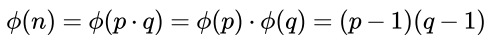
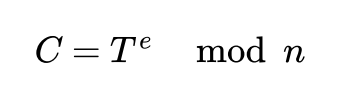
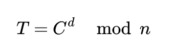
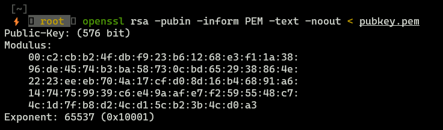
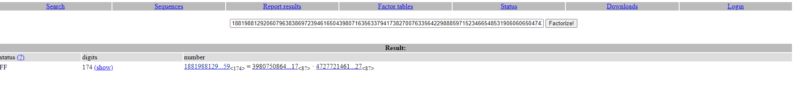
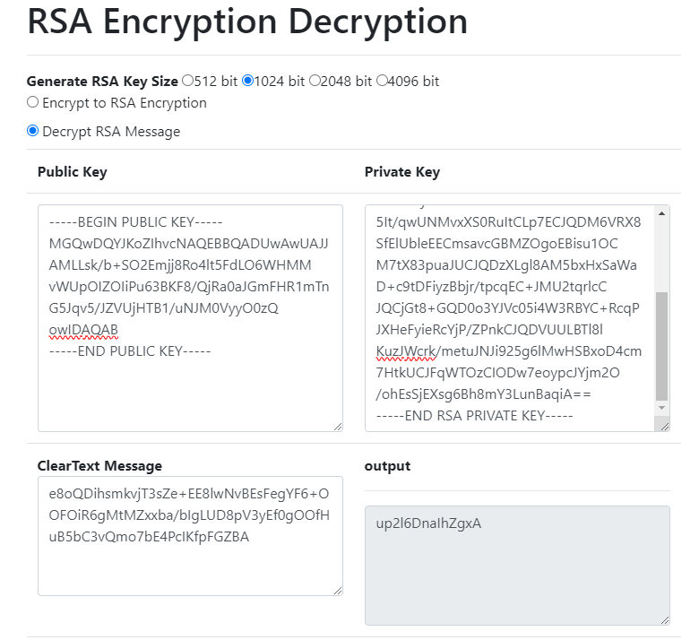

# **RootMe - RSA Factorisation**

### **Task Overview**

The validation password was encrypted using this public key (pubkey.pem).

```
Ciphertext :

e8oQDihsmkvjT3sZe+EE8lwNvBEsFegYF6+OOFOiR6gMtMZxxba/bIgLUD8pV3yEf0gOOfHuB5bC3vQmo7bE4PcIKfpFGZBA
```

## **RSA Overview**

RSA algorithm allows to:
* generate two related with each other keys: public key and private key.
* use that two keys during information exchange

Public key is used to encrypt message, private key is used to decrypt message.

### **Key generation**

1. Generate in secure way two big prime integers.
2. Calculate n = p*q
3. Calculate Euler's totient for n




 
6. Choose `e` which meets requirements: `1 < e < Euler's Totient` AND `GCD(e,Euler's Totient) = 1`. `e` is public key exponent.
7. Choose `d` such that: `d*e=1 mod Euler's Totient`. `d` is private key exponent.

Finally, we got:
* public key components `(e,n)`
* private key components `(d,n)`


### **Encryption**

As mentioned above, encryption is done with public key `(e,n)`. To encrypt plain text `T` and receive ciphertext `C` we need to perform below operation:





### **Decryption**

Decrypting is performed with private key `(d,n)`, to decrypt ciphertext `C` and receive plain text `T` we need to perfrom below operation:





## Theoretical solution

So, now we know how RSA cryptosystem works. We want to decrypt ciphertext `C`, to do that we need:

* Plain text `T`
* `n` - result of multiplaction of two big integers `p` and `q`
* `d` - private exponent

Author of that task gave us public key (so we have `n` and `e`) and plain text (`T`). The last thing we need is `d` number, which is component of private key. However we don't now that value, but we know that `d` is calculated according to formula: `d*e=1 mod Euler's Totient`. Unfortunately, we come up with next problem Euler's Totient value is unknown. But again, we can calculate it with formula mentioned [here](#key-generation). However this is not easy, because we need to know exact values of `p` and `q` which are factors o `n` value. We can try to factorise `n` value with algorithms such as:

* Rho-Pollard factorisation
* Feramt factorisation
* Shamir factorisation, etc.

In our case, this number is kinda big, so we will use factordb.com to get values of `p` and `q`. 

Enough of theory, let's go!


## Practictal solution

### **Getting `p` and `q`**

First of all, we need to get `(e,n)` values, we can do that with `openssl` tool.





So `e=65537` and `n=C2CBB24FDBF923B61268E3F11A3896DE4574B3BA58730CBD652938864E2223EEEB704A17CFD08D16B46891A61474759939C6E49AAFE7F2595548C74C1D7FB8D24CD15CB23B4CD0A3` (in hex, decimal value was too big to paste it here). Let's factorise `n`. 





* `p=398075086424064937397125500550386491199064362342526708406385189575946388957261768583317`
* `q=472772146107435302536223071973048224632914695302097116459852171130520711256363590397527`

### **Building private key**

We can write simple python script to determine private key.

```python
from Crypto.PublicKey import RSA
from Crypto.Util.number import inverse


def write_file(file_name, content):
    with open(file_name, "wb") as file:
        temp = file.write(content)

def calculate_d(e,p,q):
    eulers_totient = (p-1)(q-1)
    d = inverse(e, eulers_totient)
    return d

def buid_priv_key(n,e,d,p,q):
    key = RSA.construct((n, e, d, p, q))
    write_file("private.pem",key.export_key()) # writing key to file
    

if __name__ == '__main__':
    e = 65537
    n = 0xC2CBB24FDBF923B61268E3F11A3896DE4574B3BA58730CBD652938864E2223EEEB704A17CFD08D16B46891A61474759939C6E49AAFE7F2595548C74C1D7FB8D24CD15CB23B4CD0A3
    p = 398075086424064937397125500550386491199064362342526708406385189575946388957261768583317
    q = 472772146107435302536223071973048224632914695302097116459852171130520711256363590397527

    # calculating private component
    d = calculate_d(e,p,q)

    buid_priv_key(n,e,d,p,q)
```

### **Getting decrypted message**

I used https://8gwifi.org/rsafunctions.jsp to decrypt ciphertext.





And finally we got our flag!
