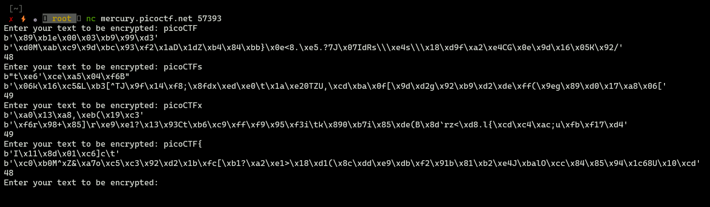
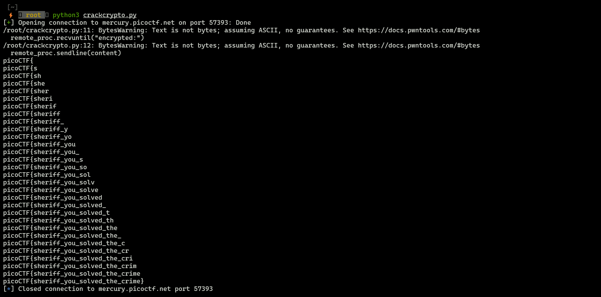

**picoCTF 2021- Compress and Attack**

There is a script:
```python

#!/usr/bin/python3 -u

import zlib
from random import randint
import os
from Crypto.Cipher import Salsa20

flag = open("./flag").read()


def compress(text):
    return zlib.compress(bytes(text.encode("utf-8")))

def encrypt(plaintext):
    secret = os.urandom(32)
    cipher = Salsa20.new(key=secret)
    return cipher.nonce + cipher.encrypt(plaintext)

def main():
    while True:
        usr_input = input("Enter your text to be encrypted: ")
        compressed_text = compress(flag + usr_input)
        encrypted = encrypt(compressed_text)

        nonce = encrypted[:8]
        encrypted_text =  encrypted[8:]
        print(nonce)
        print(encrypted_text)
        print(len(encrypted_text))

if __name__ == '__main__':
    main()
```

Data provided to that script are concatenated with flag, later there are compressed and encrypted.

What we know? 

* According to the hint flag contains only uppercase and lowercase letters, underscores, and curly braces
* We know that flag begins with `picoCTF{`


### Interacting with script





What's interesting if we provide the appropriate letter, the length doesn't change! We can leverage that to brute force our flag.

### Exploit


```python
from pwn import *
import string

valid_chars = string.ascii_letters + "_}"

known_part = "picoCTF{"

remote_proc = remote("mercury.picoctf.net","57393")

def calculate_oracle(content):
        remote_proc.recvuntil("encrypted:")
        remote_proc.sendline(content)
        remote_proc.recvline()
        remote_proc.recvline()
        return int(remote_proc.recvline().decode())

length = calculate_oracle(known_part)
print(known_part)

i = ""
while i != "}":
        for c in valid_chars:
                if calculate_oracle(known_part+c) == length:
                        known_part += c
                        i=c
                        print(known_part)
                        break
```



