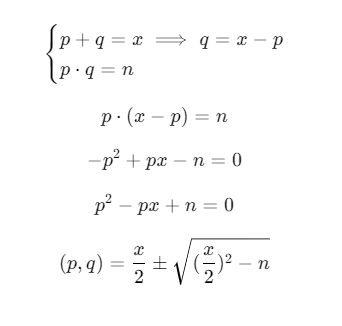

# **picoCTF - Sum-O-Primes**

Script used to generate ciphertext and RSA parameters:

```python
#!/usr/bin/python

from binascii import hexlify
from gmpy2 import mpz_urandomb, next_prime, random_state
import math
import os
import sys

if sys.version_info < (3, 9):
    import gmpy2
    math.gcd = gmpy2.gcd
    math.lcm = gmpy2.lcm

FLAG  = open('flag.txt').read().strip()
FLAG  = int(hexlify(FLAG.encode()), 16)
SEED  = int(hexlify(os.urandom(32)).decode(), 16)
STATE = random_state(SEED)

def get_prime(bits):
    return next_prime(mpz_urandomb(STATE, bits) | (1 << (bits - 1)))

p = get_prime(1024)
q = get_prime(1024)

x = p + q
n = p * q

e = 65537

m = math.lcm(p - 1, q - 1)
d = pow(e, -1, m)

c = pow(FLAG, e, n)

print(f'x = {x:x}')
print(f'n = {n:x}')
print(f'c = {c:x}')
```

Output:

```
x = 1429cf99b5dd5dde9f016...
n = 64fc90f5ca6db24f7bfc6...
c = 56ed81bbc149701110f0a...
```
## Solution

Since, the author gave us additionaly sum of `p` and `q` we can calculate these primes (`n` is product of `p` and `q`).





```python
from math import isqrt # dont use pow() from math lib
from Crypto.Util.number import inverse
x = 0x1429cf99b5dd5dde9f016095be650d5b0a9a73e648aa72324cb8eb05bd14c1b913539a97f5417474f6014de830ad6dee028dd8908e593b1e99c4cc88f400127214036e71112292e58a2ccffc48f57524aee90f9858d935c7a86297a90c7fe48b80f6c4e8df9eaae501ef40da7984502457255fbc8a9e1574ec6ba210be134f192
n = 0x64fc90f5ca6db24f7bfc6419de407596d29a9ecda526101b8d0eff2181e9b8ed1538a1cbabe4dfc5bcd899976e7739f8b448815b50db36a994c5b1df97981d562c663113fc5ee84f3206aecd18248fb4e9bddf205c8119e8437f7d6522e63d05bc357ae4969a4b3000b8226f8d142c23c4e38cdb0c385bf9564e8a115e4c52b7a2e3a9073a5d99d7bec3bca6452cf0c1b8d8b6b123cc6a6980cf14088d6a2bbb5ed36b85cb0003e535bd16d79ad54ff5b26e62f57de074654493d3a26a149786d5fbf61b42c9305092eb018aa3db3cb18b24f188ae520bd18acf9ffced09a2ba302a520f6e2bfd8eea9adc01eb8ee941181694a3ab493e1aa53fbbbf2851a591
ciphertext = 0x56ed81bbc149701110f0a15e2e6078ab926d74ee2c11b804ae4fad4333a25c247f38bb74867922438d10ce529b75f5ee5e29ce71d6f704cc0644f7e78d60a2af8921fbc49326280e3f0c00f2769e837363cbb05dc3f30bda8fdc94111fb025008eae562ae57029d5cfde6bdd09893a738187578d22f82a5f8769f093681662329f05b262c2054f91696a24f631ba8132f3d92ae7758c91fa9b5657e4944c5d5f93afb4af68908d004ae5f97071bcaceb7d0034297eeb897f972b44b0d7def52f46ee45d386a5e24ed613bf7e5177c6e10f69a3d3de0f0c30de0b15d360ee81da3d277a4acf47b6df389c24615884b692e604eba711fc28c34bc56227b8455705
e = 65537

def find_prime_factors():
    half_x = x>>1
    temp = isqrt((half_x)**2 - n)

    return (int(half_x - temp),int(half_x + temp))

def calculate_eulers_totient():
    factors = find_prime_factors()
    return (factors[0] - 1)*(factors[1]-1)

def build_d_component():
    phi = calculate_eulers_totient()
    return inverse(e,phi)

def decrypt():
    plaintext = pow(ciphertext, build_d_component(),n)
    return bytearray.fromhex(hex(plaintext)[2:])

print(decrypt())

```

**Output:**
```
bytearray(b'picoCTF{pl33z_n0_g1v3_c0ngru3nc3_0f_5qu4r35_24929c45}')
```


