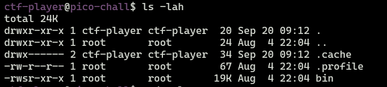

**picoCTF 2023 - VNE**

> Description: We've got a binary that can list directories as root, try it out !!


### Analyzing binary permissions





We can see that *bin* file has SUID bit set, so it will allow us to run this binary as root user.


### Running binary


It turns out that the binary uses some SECRET_DIR environment variable. Because we have SUID bit I set SECRET_DIR to /root.


```bash
ctf-player@pico-chall$ export SECRET_DIR=/root
```

As a result, we got content of /root directory.


We need to get content of `flag.txt` file, the only entrypoint to that binary is trough SECRET_DIR environment variable, let's try to perform some basic injection.


```bash
ctf-player@pico-chall$ export SECRET_DIR="/root; cat /root/flag.txt"
```


We got our flag!
