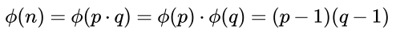
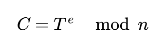
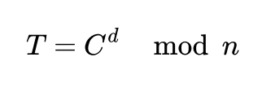

# **picoCTF 2021- Mind your Ps and Qs**


If you read writeup to 'RootMe - RSA Factorisation', you can skip below section :). 

## **RSA Overview**

RSA algorithm allows to:
* generate two related with each other keys: public key and private key.
* use that two keys during information exchange

Public key is used to encrypt message, private key is used to decrypt message.

### **Key generation**

1. Generate in secure way two big prime integers.
2. Calculate n = p*q
3. Calculate Euler's totient for n




 
6. Choose `e` which meets requirements: `1 < e < Euler's Totient` AND `GCD(e,Euler's Totient) = 1`. `e` is public key exponent.
7. Choose `d` such that: `d*e=1 mod Euler's Totient`. `d` is private key exponent.

Finally, we got:
* public key components `(e,n)`
* private key components `(d,n)`


### **Encryption**

As mentioned above, encryption is done with public key `(e,n)`. To encrypt plain text `T` and receive ciphertext `C` we need to perform below operation:





### **Decryption**

Decrypting is performed with private key `(d,n)`, to decrypt ciphertext `C` and receive plain text `T` we need to perfrom below operation:





## Task overview

We are provided with file `values`, which contains: ciphertext, big interger `n` and exponent `e`. Our task is to decrypt the ciphertext.


### Factorisation of `n`

I used factordb.com to check if `n` value was already cracked, and lucky for us, it was!

```
p = 1617549722683965197900599011412144490161 
q = 475693130177488446807040098678772442581573
```

Our objective for now is to determine value of private component `d`, however without knowing eulers totient, we can't do that. So now, using formula mentioned in [RSA Overview](#rsa-overview) we can calculate it, and then we can move on to `d` value.

### Exploit

```python
from Crypto.Util.number import inverse

p = 1617549722683965197900599011412144490161 
q = 475693130177488446807040098678772442581573
n = p*q
e = 65537
c = 8533139361076999596208540806559574687666062896040360148742851107661304651861689


def calculate_eulers_totient(p,q):
    return (p-1)*(q-1)

def calculate_d(eulers_totient,e):
    return inverse(e, eulers_totient)

def decrypt(c,d,n):
    return pow(c,d,n)

if __name__ == '__main__':
    eulers_totient = calculate_eulers_totient(p,q)
    d = calculate_d(eulers_totient, e)
    T = decrypt(c,d,n)
    print(bytearray.fromhex(hex(T)[2:]).decode())

```

Final flag: `picoCTF{sma11_N_n0_g0od_45369387}`


